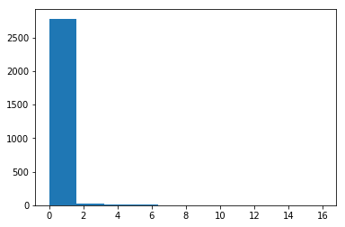

# Questions
* How do we transform text into numbers for processing? 
    * examples where columns are individual words
        * BOW - word counts in a document (row of data)
        * TFIDF - tfidf scores per word in a document (row of data)
    * embeddings
        * word embeddings
            * each word becomes it's own vector 
            * turns documents into matrices
            * context of words
        * sentence embeddings
            * each sentence becomes a vector  
        * character embeddings
            * each character becomes a vector 
    * BERT/ERNIE modeling
        * [Link here](https://medium.com/syncedreview/baidus-ernie-2-0-beats-bert-and-xlnet-on-nlp-benchmarks-51a8c21aa433_)

# Text Classification - Lab

## Introduction

In this lab, we'll use everything we've learned so far to build a model that can classify a text document as one of many possible classes!

## Objectives

You will be able to:

- Perform classification using a text dataset, using sensible preprocessing, tokenization, and feature engineering scheme 
- Use scikit-learn text vectorizers to fit and transform text data into a format to be used in a ML model 


# Getting Started

For this lab, we'll be working with the classic **_Newsgroups Dataset_**, which is available as a training data set in `sklearn.datasets`. This dataset contains many different articles that fall into 1 of 20 possible classes. Our goal will be to build a classifier that can accurately predict the class of an article based on the features we create from the article itself!

Let's get started. Run the cell below to import everything we'll need for this lab. 

# Keyterms 
* stopwords - words that are most common that are noise (the, a, an)


```python
import nltk
from nltk.corpus import stopwords
import string
from nltk import word_tokenize, FreqDist
from sklearn.feature_extraction.text import TfidfVectorizer
from sklearn.feature_extraction.text import CountVectorizer
from sklearn.metrics import accuracy_score
from sklearn.datasets import fetch_20newsgroups
from sklearn.ensemble import RandomForestClassifier
from sklearn.naive_bayes import MultinomialNB
import pandas as pd
import numpy as np
np.random.seed(0)
```

Now, we need to fetch our dataset. Run the cell below to download all the newsgroups articles and their corresponding labels. If this is the first time working with this dataset, scikit-learn will need to download all of the articles from an external repository -- the cell below may take a little while to run. 

The actual dataset is quite large. To save us from extremely long runtimes, we'll work with only a subset of the classes. Here is a list of all the possible classes:


For this lab, we'll only work with the following five:

* `'alt.atheism'`
* `'comp.windows.x'`
* `'rec.sport.hockey'`
* `'sci.crypt'`
* `'talk.politics.guns'`

In the cell below:

* Create a list called `categories` that contains the five newsgroups classes listed above, as strings 
* Get the training set by calling `fetch_20newsgroups()` and passing in the following parameters:
    * `subset='train'`
    * `categories=categories`
    * `remove=('headers', 'footers', 'quotes')` -- this is so that the model can't overfit to metadata included in the articles that sometimes acts as a dead-giveaway as to what class the article belongs to  
* Get the testing set as well by passing in the same parameters, with the exception of `subset='test` 


```python
categories = ['alt.atheism', 'comp.windows.x', 'rec.sport.hockey', 'sci.crypt', 'talk.politics.guns']
newsgroups_train = fetch_20newsgroups(subset='train', categories=categories, remove=('headers', 'footers', 'quotes'))
newsgroups_test = fetch_20newsgroups(subset='test', categories=categories, remove=('headers', 'footers', 'quotes'))
```

    Downloading 20news dataset. This may take a few minutes.
    Downloading dataset from https://ndownloader.figshare.com/files/5975967 (14 MB)


Great! Let's break apart the data and the labels, and then inspect the class names to see what the actual newsgroups are.

In the cell below:

* Grab the data from `newsgroups_train.data` and store it in the appropriate variable  
* Grab the labels from `newsgroups_train.target` and store it in the appropriate variable  
* Grab the label names from `newsgroups_train.target_names` and store it in the appropriate variable  
* Display the `label_names` so that we can see the different classes of articles that we're working with, and confirm that we grabbed the right ones  


```python
df_train = pd.DataFrame()
df_train['article'] = newsgroups_train.data
df_train['label'] = newsgroups_train.target
df_train.head()
```


<div>
<style scoped>
    .dataframe tbody tr th:only-of-type {
        vertical-align: middle;
    }

    .dataframe tbody tr th {
        vertical-align: top;
    }

    .dataframe thead th {
        text-align: right;
    }
</style>
<table border="1" class="dataframe">
  <thead>
    <tr style="text-align: right;">
      <th></th>
      <th>article</th>
      <th>label</th>
    </tr>
  </thead>
  <tbody>
    <tr>
      <td>0</td>
      <td>Note: These trial updates are summarized from ...</td>
      <td>4</td>
    </tr>
    <tr>
      <td>1</td>
      <td></td>
      <td>3</td>
    </tr>
    <tr>
      <td>2</td>
      <td>I'm trying to create a button that has both a ...</td>
      <td>1</td>
    </tr>
    <tr>
      <td>3</td>
      <td>Hi. I've just finished reading S414, and have ...</td>
      <td>4</td>
    </tr>
    <tr>
      <td>4</td>
      <td>\nUnfortunately your phrasing is ambiguous.  R...</td>
      <td>0</td>
    </tr>
  </tbody>
</table>
</div>


```python
df_test = pd.DataFrame()
df_test['article'] = newsgroups_test.data
df_test['label'] = newsgroups_test.target
df_test.head()
```


<div>
<style scoped>
    .dataframe tbody tr th:only-of-type {
        vertical-align: middle;
    }

    .dataframe tbody tr th {
        vertical-align: top;
    }

    .dataframe thead th {
        text-align: right;
    }
</style>
<table border="1" class="dataframe">
  <thead>
    <tr style="text-align: right;">
      <th></th>
      <th>article</th>
      <th>label</th>
    </tr>
  </thead>
  <tbody>
    <tr>
      <td>0</td>
      <td>[ ... ]</td>
      <td>4</td>
    </tr>
    <tr>
      <td>1</td>
      <td>\nonce upon a time, that's exactly what they w...</td>
      <td>4</td>
    </tr>
    <tr>
      <td>2</td>
      <td>\nWhile I have respect for John's ability and ...</td>
      <td>1</td>
    </tr>
    <tr>
      <td>3</td>
      <td>\nInteresting development.  Especially since t...</td>
      <td>4</td>
    </tr>
    <tr>
      <td>4</td>
      <td>\nI read it when it first came out, and the co...</td>
      <td>0</td>
    </tr>
  </tbody>
</table>
</div>


```python
data = newsgroups_train.data
target = newsgroups_train.target
label_names = newsgroups_train.target_names
label_names
```


    ['alt.atheism',
     'comp.windows.x',
     'rec.sport.hockey',
     'sci.crypt',
     'talk.politics.guns']


```python
for e, t in zip(data[:5], target):
    print(label_names[t])
    print(e)
    print("-"*100)
    print(" new document")
    print("-"*100)
```

    talk.politics.guns
    Note: These trial updates are summarized from reports in the
    _Idaho Statesman_ and the local NBC affiliate television
    station, KTVB Channel 7.
    
    Randy Weaver/Kevin Harris trial update: Day 4.
    
    Friday, April 16, 1993 was the fourth day of the trial.
    
    Synopsis: Defense attorney Gerry Spence cross-examined agent
    Cooper under repeated objections from prosecutor Ronald
    Howen.  Spence moved for a mistrial but was denied.
    
    The day was marked by a caustic cross-examination of Deputy
    Marshal Larry Cooper by defense attorney Gerry Spence.  Although
    Spence has not explicitly stated so, one angle of his stategy
    must involve destroying the credibility of agent Cooper.  Cooper is
    the government's only eyewitness to the death of agent Degan.
    Spence attacked Cooper's credibility by pointing out discrepancies
    between Cooper's statements last September and those made in court.
    Cooper conceded that, "You have all these things compressed into
    a few seconds...It's difficult to remember what went on first."
    
    Cooper acknowledged that he carried a "9mm Colt Commando submachine
    gun with a silenced barrel." [I thought a Colt Commando was a revolver!]
    Cooper continued by stating that the federal agents had no specific
    plans to use the weapon when they started to kill Weaver's dog.
    
    When Spence asked how seven cartridges could be fired by Degan's
    M-16 rifle when Degan was apparently dead, Cooper could not say for
    sure that Degan did not return fire before going down.
    
    Spence continued by asking with how many agents (and to what extent)
    had Cooper discussed last August's events, Cooper responded, "If
    you're implying that we got our story together, you're wrong,
    counselor."  Spence continued to advance the defense's version of
    the events: Namely, that a marshal had started the shooting by
    killing the Weaver's dog.  Cooper disagreed.
    
    Assistant U.S. Attorney Ronald Howen repeatedly objected to Spence's
    virulent cross-examination of agent Cooper, arguing that the questions
    were repetitive and Spence was wasting time.  Howen also complained 
    that Spence was improperly using a cross-examination to advance the
    defense's version of the events.  U.S. District Judge Edward Lodge
    sustained many of the objections; however, both lawyers persisted
    until Judge Lodge had the jury leave the room and proceded to
    admonish both attorneys.  "I'm not going to play games with either
    counsel.  This has been a personality problem from day 1, so start
    acting like professionals."
    
    Spence told the judge that, "When all the evidence is in, we'll see
    that ... his [agent Larry Cooper] testimony is not credible, that
    he was panicked and cannot remember the sequence of events." 
    Spence continued, "We're going to find...that there is a very unlikely
    similarity - almost as if it had come out of a cookie cutter - between
    the testimony of Mr. Cooper and the other witnesses."
    
    Spence then moved for a mistrial on the grounds that Howen's repeated
    objections would prevent a fair trial, "We can't have a fair trial if the
    jury believes I'm some sort of charlatan, if the jury believes I'm
    bending the rules or engaging in some delaying tactic or that I'm
    violating court orders."
    
    Judge Lodge called the notion that his repeated sustainings of Howen's
    objections had somehow prejudiced the jury was "preposterous" and
    denied the motion for a mistrial.  Lodge did tell Howen to restrict
    his comments when objecting.
    
    The trial resumed with the prosecution calling FBI Special Agent Greg
    Rampton.  The prosecution's purpose was simply to introduce five
    weapons found in the cabin as evidence: However, the defense seized
    on the opportunity to further address Cooper's credibility.
    
    Defense attorney Ellison Matthews (Harris' other attorney) questioned
    Rampton about the dog.  Rampton stated that there were no specific
    plans to kill the Weaver's dog without being detected.  Matthews then
    had Rampton read  a Septtember 15, 1992 transcript in which Rampton
    had said that Cooper had said that the purpose of the silenced weapon
    was to kill the dog without being detected, if the dog chased them.
    Rampton then acknowledged that he believed that Cooper had said that,
    but he could not remember when.  He then stated that, "I did not conduct
    the primary interview with Deputy Cooper, but I have had conversations
    with him since the interview was conducted."
    ----------------------------------------------------------------------------------------------------
     new document
    ----------------------------------------------------------------------------------------------------
    sci.crypt
    
    ----------------------------------------------------------------------------------------------------
     new document
    ----------------------------------------------------------------------------------------------------
    comp.windows.x
    I'm trying to create a button that has both a label and a bitmap using
    the MenuButton widget.  Is this possible?  Right now, all I get is the
    bitmap -- no sign of the label.
    
    Any help would be appreciated.
    
    
    ----------------------------------------------------------------------------------------------------
     new document
    ----------------------------------------------------------------------------------------------------
    talk.politics.guns
    Hi. I've just finished reading S414, and have several questions about
    the Brady bills (S414 and HR1025).
    
    1. _Are_ these the current versions of the Brady bill?
         What is the status of these bills?  I've heard they're "in committee".
         How close is that to being made law?
    
    2. S414 and HR1025 seem fairly similar.  Are there any important
       differences I missed?
    
    3. S414 seems to have some serious loopholes:
      A. S414 doesn't specify an "appeals" process to wrongful denial during
         the waiting period, other than a civil lawsuit(?)  (S414 has an appeals
         process once the required instant background check system is established,
         but not before).
      B. the police are explicitly NOT liable for mistakes in denying/approving
         using existing records (so who would I sue in "A" above to have an
         inaccurate record corrected?)
      C. S414 includes an exception-to-waiting-period clause for if a person
         can convince the local Chief Law-Enforcement Officer (CLEO) of an
         immediate threat to his or her life, or life of a household member.
         But S414 doesn't say exactly what is considered a "threat", nor does
         it place a limit on how long the CLEO takes to issue an exception
         statement.
    True?  Have I misunderstood?  Any other 'holes?
    
    4. With just S414, what's to stop a person with a "clean" record from
       buying guns, grinding off the serial numbers, and selling them to crooks?
       At minimum, what additional laws are needed to prevent this?
    
       'Seems at min. a "gun counting" scheme would be needed
       (e.g., "John Doe owns N guns").  So, if S414 passes, I wouldn't be surprised
       to see legislation for stricter, harder-to-forge I.D.'s plus national gun
       registration, justified by a need to make the Brady bill work.
    
    Please comment.  I'm mainly interested in specific problems with the current
    legislation--I don't mean to start a general discussion of the merits
    of any/all waiting-period bills ever proposed.
    ----------------------------------------------------------------------------------------------------
     new document
    ----------------------------------------------------------------------------------------------------
    alt.atheism
    
    Unfortunately your phrasing is ambiguous.  Re-writing more carefully, we have
    (at least) two possibilities.  The first:
    
    Things called "Mercedes" are cars
    That girl is called "Mercedes"
    Therefore that girl is a car
    
    That is entirely valid as a piece of logical deduction.  It is not sound,
    because the first statement is false.  Similarly, I would hold that Jim's
    example is valid but not sound.
    
    Another possible interpretation of what you wrote is:
    
    There exists at least one car called "Mercedes"
    That girl is called "Mercedes"
    Therefore that girl is a car
    
    -- which isn't valid.
    
    ----------------------------------------------------------------------------------------------------
     new document
    ----------------------------------------------------------------------------------------------------


```python

```


```python

```


```python
np.bincount(target)
```


    array([480, 593, 600, 595, 546])


Finally, let's check the shape of `data` to see what our data looks like. We can do this by checking the `.shape` attribute of `newsgroups_train.filenames`.

Do this now in the cell below.


```python
newsgroups_train.filenames.shape
```


    (2814,)


Our dataset contains 2,814 different articles spread across the five classes we chose. 

### Cleaning and Preprocessing Our Data

Now that we have our data, the fun part begins. We'll need to begin by preprocessing and cleaning our text data. As you've seen throughout this section, preprocessing text data is a bit more challenging that working with more traditional data types because there's no clear-cut answer for exactly what sort of preprocessing and cleaning we need to do. Before we can begin cleaning and preprocessing our text data, we need to make some decisions about things such as:

* Do we remove stop words or not?
* Do we stem or lemmatize our text data, or leave the words as is?
* Is basic tokenization enough, or do we need to support special edge cases through the use of regex?
* Do we use the entire vocabulary, or just limit the model to a subset of the most frequently used words? If so, how many?
* Do we engineer other features, such as bigrams, or POS tags, or Mutual Information Scores?
* What sort of vectorization should we use in our model? Boolean Vectorization? Count Vectorization? TF-IDF? More advanced vectorization strategies such as Word2Vec?


These are all questions that we'll need to think about pretty much anytime we begin working with text data. 

Let's get right into it. We'll start by getting a list of all of the english stopwords, and concatenating them with a list of all the punctuation. 

In the cell below:

* Get all the english stopwords from `nltk` 
* Get all of the punctuation from `string.punctuation`, and convert it to a list 
* Add the two lists together. Name the result `stopwords_list` 
* Create another list containing various types of empty strings and ellipses, such as `["''", '""', '...', '``']`. Add this to our `stopwords_list`, so that we won't have tokens that are only empty quotes and such  

# We need to clean our text 
* removing stop words
* removing punctuation
* removing weird characters
* getting our text in a similar case


```python
import string
```


```python
string.ascii_letters, string.ascii_lowercase, string.ascii_uppercase, string.digits, string.punctuation, string.hexdigits
```


    ('abcdefghijklmnopqrstuvwxyzABCDEFGHIJKLMNOPQRSTUVWXYZ',
     'abcdefghijklmnopqrstuvwxyz',
     'ABCDEFGHIJKLMNOPQRSTUVWXYZ',
     '0123456789',
     '!"#$%&\'()*+,-./:;<=>?@[\\]^_`{|}~',
     '0123456789abcdefABCDEF')


```python
stopwords_list = stopwords.words('english')
stopwords_list += ["'s", "'m"]
punctuation_list = list(string.punctuation)
punctuation_list += ["''", '""', '...', '``']
stopwords_list, punctuation_list
```


    (['i',
      'me',
      'my',
      'myself',
      'we',
      'our',
      'ours',
      'ourselves',
      'you',
      "you're",
      "you've",
      "you'll",
      "you'd",
      'your',
      'yours',
      'yourself',
      'yourselves',
      'he',
      'him',
      'his',
      'himself',
      'she',
      "she's",
      'her',
      'hers',
      'herself',
      'it',
      "it's",
      'its',
      'itself',
      'they',
      'them',
      'their',
      'theirs',
      'themselves',
      'what',
      'which',
      'who',
      'whom',
      'this',
      'that',
      "that'll",
      'these',
      'those',
      'am',
      'is',
      'are',
      'was',
      'were',
      'be',
      'been',
      'being',
      'have',
      'has',
      'had',
      'having',
      'do',
      'does',
      'did',
      'doing',
      'a',
      'an',
      'the',
      'and',
      'but',
      'if',
      'or',
      'because',
      'as',
      'until',
      'while',
      'of',
      'at',
      'by',
      'for',
      'with',
      'about',
      'against',
      'between',
      'into',
      'through',
      'during',
      'before',
      'after',
      'above',
      'below',
      'to',
      'from',
      'up',
      'down',
      'in',
      'out',
      'on',
      'off',
      'over',
      'under',
      'again',
      'further',
      'then',
      'once',
      'here',
      'there',
      'when',
      'where',
      'why',
      'how',
      'all',
      'any',
      'both',
      'each',
      'few',
      'more',
      'most',
      'other',
      'some',
      'such',
      'no',
      'nor',
      'not',
      'only',
      'own',
      'same',
      'so',
      'than',
      'too',
      'very',
      's',
      't',
      'can',
      'will',
      'just',
      'don',
      "don't",
      'should',
      "should've",
      'now',
      'd',
      'll',
      'm',
      'o',
      're',
      've',
      'y',
      'ain',
      'aren',
      "aren't",
      'couldn',
      "couldn't",
      'didn',
      "didn't",
      'doesn',
      "doesn't",
      'hadn',
      "hadn't",
      'hasn',
      "hasn't",
      'haven',
      "haven't",
      'isn',
      "isn't",
      'ma',
      'mightn',
      "mightn't",
      'mustn',
      "mustn't",
      'needn',
      "needn't",
      'shan',
      "shan't",
      'shouldn',
      "shouldn't",
      'wasn',
      "wasn't",
      'weren',
      "weren't",
      'won',
      "won't",
      'wouldn',
      "wouldn't",
      "'s",
      "'m"],
     ['!',
      '"',
      '#',
      '$',
      '%',
      '&',
      "'",
      '(',
      ')',
      '*',
      '+',
      ',',
      '-',
      '.',
      '/',
      ':',
      ';',
      '<',
      '=',
      '>',
      '?',
      '@',
      '[',
      '\\',
      ']',
      '^',
      '_',
      '`',
      '{',
      '|',
      '}',
      '~',
      "''",
      '""',
      '...',
      '``'])


Great! We'll leave these alone for now, until we're ready to remove stop words after the tokenization step. 

Next, let's try tokenizing our dataset. In order to save ourselves some time, we'll write a function to clean our dataset, and then use Python's built-in `map()` function to clean every article in the dataset at the same time. 

In the cell below, complete the `process_article()` function. This function should:

* Take in one parameter, `article` 
* Tokenize the article using the appropriate function from `nltk` 
* Lowercase every token, remove any stopwords found in `stopwords_list` from the tokenized article, and return the results 

# The next thing we need to is to separate all our words in a document


```python
def process_article(article,stopwords_list=stopwords_list, punctuation_list=punctuation_list, replace_list=None):
    tokens = nltk.word_tokenize(article) # splitting our doc into individual words 
    if stopwords_list:
        tokens = [token.lower() for token in tokens if token.lower() not in stopwords_list]
    if punctuation_list:
        tokens = [token.lower() for token in tokens if token.lower() not in punctuation_list]
    tokens = [token.strip("_") for token in tokens]
    return tokens    
```


```python
process_article(doc0, stopwords_list=stopwords_list, punctuation_list=punctuation_list)
```


    ['note',
     'trial',
     'updates',
     'summarized',
     'reports',
     'idaho',
     'statesman',
     'local',
     'nbc',
     'affiliate',
     'television',
     'station',
     'ktvb',
     'channel',
     '7',
     'randy',
     'weaver/kevin',
     'harris',
     'trial',
     'update',
     'day',
     '4',
     'friday',
     'april',
     '16',
     '1993',
     'fourth',
     'day',
     'trial',
     'synopsis',
     'defense',
     'attorney',
     'gerry',
     'spence',
     'cross-examined',
     'agent',
     'cooper',
     'repeated',
     'objections',
     'prosecutor',
     'ronald',
     'howen',
     'spence',
     'moved',
     'mistrial',
     'denied',
     'day',
     'marked',
     'caustic',
     'cross-examination',
     'deputy',
     'marshal',
     'larry',
     'cooper',
     'defense',
     'attorney',
     'gerry',
     'spence',
     'although',
     'spence',
     'explicitly',
     'stated',
     'one',
     'angle',
     'stategy',
     'must',
     'involve',
     'destroying',
     'credibility',
     'agent',
     'cooper',
     'cooper',
     'government',
     'eyewitness',
     'death',
     'agent',
     'degan',
     'spence',
     'attacked',
     'cooper',
     'credibility',
     'pointing',
     'discrepancies',
     'cooper',
     'statements',
     'last',
     'september',
     'made',
     'court',
     'cooper',
     'conceded',
     'things',
     'compressed',
     'seconds',
     'difficult',
     'remember',
     'went',
     'first',
     'cooper',
     'acknowledged',
     'carried',
     '9mm',
     'colt',
     'commando',
     'submachine',
     'gun',
     'silenced',
     'barrel',
     'thought',
     'colt',
     'commando',
     'revolver',
     'cooper',
     'continued',
     'stating',
     'federal',
     'agents',
     'specific',
     'plans',
     'use',
     'weapon',
     'started',
     'kill',
     'weaver',
     'dog',
     'spence',
     'asked',
     'seven',
     'cartridges',
     'could',
     'fired',
     "degan's",
     'm-16',
     'rifle',
     'degan',
     'apparently',
     'dead',
     'cooper',
     'could',
     'say',
     'sure',
     'degan',
     'return',
     'fire',
     'going',
     'spence',
     'continued',
     'asking',
     'many',
     'agents',
     'extent',
     'cooper',
     'discussed',
     'last',
     'august',
     'events',
     'cooper',
     'responded',
     "'re",
     'implying',
     'got',
     'story',
     'together',
     "'re",
     'wrong',
     'counselor',
     'spence',
     'continued',
     'advance',
     'defense',
     'version',
     'events',
     'namely',
     'marshal',
     'started',
     'shooting',
     'killing',
     'weaver',
     'dog',
     'cooper',
     'disagreed',
     'assistant',
     'u.s.',
     'attorney',
     'ronald',
     'howen',
     'repeatedly',
     'objected',
     "spence's",
     'virulent',
     'cross-examination',
     'agent',
     'cooper',
     'arguing',
     'questions',
     'repetitive',
     'spence',
     'wasting',
     'time',
     'howen',
     'also',
     'complained',
     'spence',
     'improperly',
     'using',
     'cross-examination',
     'advance',
     'defense',
     'version',
     'events',
     'u.s.',
     'district',
     'judge',
     'edward',
     'lodge',
     'sustained',
     'many',
     'objections',
     'however',
     'lawyers',
     'persisted',
     'judge',
     'lodge',
     'jury',
     'leave',
     'room',
     'proceded',
     'admonish',
     'attorneys',
     'going',
     'play',
     'games',
     'either',
     'counsel',
     'personality',
     'problem',
     'day',
     '1',
     'start',
     'acting',
     'like',
     'professionals',
     'spence',
     'told',
     'judge',
     'evidence',
     "'ll",
     'see',
     'agent',
     'larry',
     'cooper',
     'testimony',
     'credible',
     'panicked',
     'remember',
     'sequence',
     'events',
     'spence',
     'continued',
     "'re",
     'going',
     'find',
     'unlikely',
     'similarity',
     'almost',
     'come',
     'cookie',
     'cutter',
     'testimony',
     'mr.',
     'cooper',
     'witnesses',
     'spence',
     'moved',
     'mistrial',
     'grounds',
     'howen',
     'repeated',
     'objections',
     'would',
     'prevent',
     'fair',
     'trial',
     'ca',
     "n't",
     'fair',
     'trial',
     'jury',
     'believes',
     'sort',
     'charlatan',
     'jury',
     'believes',
     "i'm",
     'bending',
     'rules',
     'engaging',
     'delaying',
     'tactic',
     "i'm",
     'violating',
     'court',
     'orders',
     'judge',
     'lodge',
     'called',
     'notion',
     'repeated',
     'sustainings',
     "howen's",
     'objections',
     'somehow',
     'prejudiced',
     'jury',
     'preposterous',
     'denied',
     'motion',
     'mistrial',
     'lodge',
     'tell',
     'howen',
     'restrict',
     'comments',
     'objecting',
     'trial',
     'resumed',
     'prosecution',
     'calling',
     'fbi',
     'special',
     'agent',
     'greg',
     'rampton',
     'prosecution',
     'purpose',
     'simply',
     'introduce',
     'five',
     'weapons',
     'found',
     'cabin',
     'evidence',
     'however',
     'defense',
     'seized',
     'opportunity',
     'address',
     'cooper',
     'credibility',
     'defense',
     'attorney',
     'ellison',
     'matthews',
     'harris',
     'attorney',
     'questioned',
     'rampton',
     'dog',
     'rampton',
     'stated',
     'specific',
     'plans',
     'kill',
     'weaver',
     'dog',
     'without',
     'detected',
     'matthews',
     'rampton',
     'read',
     'septtember',
     '15',
     '1992',
     'transcript',
     'rampton',
     'said',
     'cooper',
     'said',
     'purpose',
     'silenced',
     'weapon',
     'kill',
     'dog',
     'without',
     'detected',
     'dog',
     'chased',
     'rampton',
     'acknowledged',
     'believed',
     'cooper',
     'said',
     'could',
     'remember',
     'stated',
     'conduct',
     'primary',
     'interview',
     'deputy',
     'cooper',
     'conversations',
     'since',
     'interview',
     'conducted']


Now that we have this function, let's go ahead and preprocess our data, and then move into exploring our dataset. 

In the cell below:

* Use Python's `map()` function and pass in two parameters: the `process_article` function and the `data`. Make sure to wrap the whole map statement in a `list()`.

**_Note:_** Running this cell may take a minute or two!


```python
processed_data = list(map(process_article, data))
```

Great. Now, let's inspect the first article in `processed_data` to see how it looks. 

Do this now in the cell below.


```python
processed_data[0]
```


    ['note',
     'trial',
     'updates',
     'summarized',
     'reports',
     'idaho',
     'statesman',
     'local',
     'nbc',
     'affiliate',
     'television',
     'station',
     'ktvb',
     'channel',
     '7',
     'randy',
     'weaver/kevin',
     'harris',
     'trial',
     'update',
     'day',
     '4',
     'friday',
     'april',
     '16',
     '1993',
     'fourth',
     'day',
     'trial',
     'synopsis',
     'defense',
     'attorney',
     'gerry',
     'spence',
     'cross-examined',
     'agent',
     'cooper',
     'repeated',
     'objections',
     'prosecutor',
     'ronald',
     'howen',
     'spence',
     'moved',
     'mistrial',
     'denied',
     'day',
     'marked',
     'caustic',
     'cross-examination',
     'deputy',
     'marshal',
     'larry',
     'cooper',
     'defense',
     'attorney',
     'gerry',
     'spence',
     'although',
     'spence',
     'explicitly',
     'stated',
     'one',
     'angle',
     'stategy',
     'must',
     'involve',
     'destroying',
     'credibility',
     'agent',
     'cooper',
     'cooper',
     'government',
     'eyewitness',
     'death',
     'agent',
     'degan',
     'spence',
     'attacked',
     'cooper',
     'credibility',
     'pointing',
     'discrepancies',
     'cooper',
     'statements',
     'last',
     'september',
     'made',
     'court',
     'cooper',
     'conceded',
     'things',
     'compressed',
     'seconds',
     'difficult',
     'remember',
     'went',
     'first',
     'cooper',
     'acknowledged',
     'carried',
     '9mm',
     'colt',
     'commando',
     'submachine',
     'gun',
     'silenced',
     'barrel',
     'thought',
     'colt',
     'commando',
     'revolver',
     'cooper',
     'continued',
     'stating',
     'federal',
     'agents',
     'specific',
     'plans',
     'use',
     'weapon',
     'started',
     'kill',
     'weaver',
     'dog',
     'spence',
     'asked',
     'seven',
     'cartridges',
     'could',
     'fired',
     "degan's",
     'm-16',
     'rifle',
     'degan',
     'apparently',
     'dead',
     'cooper',
     'could',
     'say',
     'sure',
     'degan',
     'return',
     'fire',
     'going',
     'spence',
     'continued',
     'asking',
     'many',
     'agents',
     'extent',
     'cooper',
     'discussed',
     'last',
     'august',
     'events',
     'cooper',
     'responded',
     "'re",
     'implying',
     'got',
     'story',
     'together',
     "'re",
     'wrong',
     'counselor',
     'spence',
     'continued',
     'advance',
     'defense',
     'version',
     'events',
     'namely',
     'marshal',
     'started',
     'shooting',
     'killing',
     'weaver',
     'dog',
     'cooper',
     'disagreed',
     'assistant',
     'u.s.',
     'attorney',
     'ronald',
     'howen',
     'repeatedly',
     'objected',
     "spence's",
     'virulent',
     'cross-examination',
     'agent',
     'cooper',
     'arguing',
     'questions',
     'repetitive',
     'spence',
     'wasting',
     'time',
     'howen',
     'also',
     'complained',
     'spence',
     'improperly',
     'using',
     'cross-examination',
     'advance',
     'defense',
     'version',
     'events',
     'u.s.',
     'district',
     'judge',
     'edward',
     'lodge',
     'sustained',
     'many',
     'objections',
     'however',
     'lawyers',
     'persisted',
     'judge',
     'lodge',
     'jury',
     'leave',
     'room',
     'proceded',
     'admonish',
     'attorneys',
     'going',
     'play',
     'games',
     'either',
     'counsel',
     'personality',
     'problem',
     'day',
     '1',
     'start',
     'acting',
     'like',
     'professionals',
     'spence',
     'told',
     'judge',
     'evidence',
     "'ll",
     'see',
     'agent',
     'larry',
     'cooper',
     'testimony',
     'credible',
     'panicked',
     'remember',
     'sequence',
     'events',
     'spence',
     'continued',
     "'re",
     'going',
     'find',
     'unlikely',
     'similarity',
     'almost',
     'come',
     'cookie',
     'cutter',
     'testimony',
     'mr.',
     'cooper',
     'witnesses',
     'spence',
     'moved',
     'mistrial',
     'grounds',
     'howen',
     'repeated',
     'objections',
     'would',
     'prevent',
     'fair',
     'trial',
     'ca',
     "n't",
     'fair',
     'trial',
     'jury',
     'believes',
     'sort',
     'charlatan',
     'jury',
     'believes',
     "i'm",
     'bending',
     'rules',
     'engaging',
     'delaying',
     'tactic',
     "i'm",
     'violating',
     'court',
     'orders',
     'judge',
     'lodge',
     'called',
     'notion',
     'repeated',
     'sustainings',
     "howen's",
     'objections',
     'somehow',
     'prejudiced',
     'jury',
     'preposterous',
     'denied',
     'motion',
     'mistrial',
     'lodge',
     'tell',
     'howen',
     'restrict',
     'comments',
     'objecting',
     'trial',
     'resumed',
     'prosecution',
     'calling',
     'fbi',
     'special',
     'agent',
     'greg',
     'rampton',
     'prosecution',
     'purpose',
     'simply',
     'introduce',
     'five',
     'weapons',
     'found',
     'cabin',
     'evidence',
     'however',
     'defense',
     'seized',
     'opportunity',
     'address',
     'cooper',
     'credibility',
     'defense',
     'attorney',
     'ellison',
     'matthews',
     'harris',
     'attorney',
     'questioned',
     'rampton',
     'dog',
     'rampton',
     'stated',
     'specific',
     'plans',
     'kill',
     'weaver',
     'dog',
     'without',
     'detected',
     'matthews',
     'rampton',
     'read',
     'septtember',
     '15',
     '1992',
     'transcript',
     'rampton',
     'said',
     'cooper',
     'said',
     'purpose',
     'silenced',
     'weapon',
     'kill',
     'dog',
     'without',
     'detected',
     'dog',
     'chased',
     'rampton',
     'acknowledged',
     'believed',
     'cooper',
     'said',
     'could',
     'remember',
     'stated',
     'conduct',
     'primary',
     'interview',
     'deputy',
     'cooper',
     'conversations',
     'since',
     'interview',
     'conducted']


Now, let's move onto exploring the dataset a bit more. Let's start by getting the total vocabulary size of the training dataset. We can do this by creating a `set` object and then using it's `.update()` method to iteratively add each article. Since it's a set, it will only contain unique words, with no duplicates. 

In the cell below:

* Create a `set()` object called `total_vocab` 
* Iterate through each tokenized article in `processed_data` and add it to the set using the set's `.update()` method 
* Once all articles have been added, get the total number of unique words in our training set by taking the length of the set 


```python
total_vocab = set()
for doc in processed_data:
    total_vocab.update(doc)
len(total_vocab)
```


    46735


### Exploring Data With Frequency Distributions

Great -- our processed dataset contains 46,990 unique words! 

Next, let's create a frequency distribution to see which words are used the most! 

In order to do this, we'll need to concatenate every article into a single list, and then pass this list to `FreqDist()`. 

In the cell below:

* Create an empty list called `articles_concat` 
* Iterate through `processed_data` and add every article it contains to `articles_concat` 
* Pass `articles_concat` as input to `FreqDist()`  
* Display the top 200 most used words  


```python
articles_concat = []
for article in processed_data:
    articles_concat += article
```


```python
articles_freqdist = FreqDist(articles_concat)
articles_freqdist.most_common(200)
```


    [('--', 29501),
     ('x', 4845),
     ("n't", 2933),
     ('1', 2531),
     ('would', 1986),
     ('0', 1975),
     ('one', 1760),
     ('2', 1664),
     ('people', 1243),
     ('use', 1148),
     ('get', 1068),
     ('like', 1037),
     ('file', 1024),
     ('3', 1005),
     ('also', 875),
     ('key', 869),
     ('4', 866),
     ('could', 853),
     ('know', 817),
     ('think', 814),
     ('time', 781),
     ('may', 732),
     ('even', 711),
     ('new', 706),
     ('first', 678),
     ('5', 676),
     ('*/', 674),
     ('system', 673),
     ('well', 671),
     ('information', 646),
     ('make', 644),
     ('right', 639),
     ('see', 636),
     ('many', 635),
     ('two', 633),
     ('/*', 611),
     ('good', 608),
     ('used', 600),
     ('7', 594),
     ('government', 589),
     ('way', 572),
     ('available', 568),
     ('window', 568),
     ('db', 553),
     ('much', 540),
     ('encryption', 537),
     ('6', 537),
     ('using', 527),
     ('say', 523),
     ('gun', 520),
     ('number', 519),
     ('program', 515),
     ('us', 511),
     ('team', 498),
     ('must', 484),
     ('law', 478),
     ('since', 449),
     ('need', 444),
     ('game', 439),
     ('chip', 437),
     ('something', 435),
     ('8', 427),
     ('want', 422),
     ('god', 419),
     ('server', 417),
     ("'ve", 416),
     ('public', 408),
     ('year', 401),
     ('set', 396),
     ('ca', 392),
     ('find', 391),
     ('please', 386),
     ('point', 385),
     ('without', 384),
     ('n', 384),
     ('might', 382),
     ('said', 379),
     ('believe', 379),
     ('read', 378),
     ('go', 377),
     ('take', 377),
     ('really', 376),
     ('c', 375),
     ('version', 374),
     ('anyone', 371),
     ('second', 370),
     ('list', 367),
     ('code', 367),
     ('work', 363),
     ('another', 362),
     ('keys', 362),
     ("'re", 361),
     ('example', 359),
     ('clipper', 358),
     ('play', 357),
     ('problem', 356),
     ('things', 353),
     ('data', 353),
     ('made', 348),
     ('sure', 345),
     ('widget', 345),
     ('however', 344),
     ('case', 343),
     ('still', 342),
     ('back', 341),
     ('entry', 341),
     ('hockey', 340),
     ('last', 339),
     ('10', 339),
     ("'d", 335),
     ('let', 333),
     ('better', 332),
     ('25', 331),
     ('part', 330),
     ('security', 327),
     ('output', 327),
     ('probably', 324),
     ('subject', 323),
     ('line', 321),
     ('privacy', 321),
     ('question', 320),
     ('going', 319),
     ('period', 315),
     ('name', 313),
     ('state', 312),
     ('course', 311),
     ('anonymous', 307),
     ('9', 305),
     ('years', 302),
     ('look', 301),
     ('files', 300),
     ('got', 299),
     ('true', 299),
     ('control', 298),
     ('fact', 294),
     ('long', 293),
     ('every', 291),
     ('application', 291),
     ('season', 290),
     ("'ll", 289),
     ('someone', 285),
     ('source', 284),
     ('possible', 283),
     ('help', 282),
     ('message', 280),
     ('55.0', 279),
     ('never', 277),
     ('games', 276),
     ('thing', 276),
     ('following', 274),
     ('send', 273),
     ('try', 271),
     ('general', 270),
     ('best', 270),
     ('motif', 270),
     ('email', 269),
     ('run', 269),
     ('rather', 268),
     ('actually', 265),
     ('several', 264),
     ('thanks', 264),
     ('little', 264),
     ('means', 264),
     ('either', 263),
     ('give', 263),
     ('note', 262),
     ('keep', 262),
     ('put', 262),
     ('different', 261),
     ('guns', 259),
     ('enough', 259),
     ('given', 256),
     ('far', 255),
     ('come', 254),
     ('group', 253),
     ('seems', 252),
     ('around', 250),
     ('person', 249),
     ('order', 249),
     ('call', 248),
     ('anything', 247),
     ('e', 247),
     ('next', 246),
     ('support', 246),
     ('least', 244),
     ('section', 240),
     ('internet', 238),
     ('power', 236),
     ('open', 235),
     ('sun', 235),
     ('etc', 234),
     ('world', 233),
     ('user', 231),
     ('mail', 231),
     ('real', 230),
     ('rights', 229),
     ('great', 229),
     ('nhl', 227),
     ('12', 227),
     ('include', 226)]


At first glance, none of these words seem very informative -- for most of the words represented here, it would be tough to guess if a given word is used equally among all five classes, or is disproportionately represented among a single class. This makes sense, because this frequency distribution represents all the classes combined. This tells us that these words are probably the least important, as they are most likely words that are used across multiple classes, thereby providing our model with little actual signal as to what class they belong to. This tells us that we probably want to focus on words that appear heavily in articles from a given class, but rarely appear in articles from other classes. You may recall from previous lessons that this is exactly where **_TF-IDF Vectorization_** really shines!

### Vectorizing with TF-IDF

Although NLTK does provide functionality for vectorizing text documents with TF-IDF, we'll make use of scikit-learn's TF-IDF vectorizer, because we already have experience with it, and because it's a bit easier to use, especially when the models we'll be feeding the vectorized data into are from scikit-learn, meaning that we don't have to worry about doing any extra processing to ensure they play nicely together. 

Recall that in order to use scikit-learn's `TfidfVectorizer()`, we need to pass in the data as raw text documents -- the `TfidfVectorizer()` handles the count vectorization process on it's own, and then fits and transforms the data into TF-IDF format. 

This means that we need to:

* Import `TfidfVectorizer` from `sklearn.feature_extraction.text` and instantiate `TfidfVectorizer()` 
* Call the vectorizer object's `.fit_transform()` method and pass in our `data` as input. Store the results in `tf_idf_data_train` 
* Also create a vectorized version of our testing data, which can be found in `newsgroups_test.data`. Store the results in `tf_idf_data_test`. 


**_NOTE:_** When transforming the test data, use the `.transform()` method, not the `.fit_transform()` method, as the vectorizer has already been fit to the training data. 


```python
df_train.head()
```


<div>
<style scoped>
    .dataframe tbody tr th:only-of-type {
        vertical-align: middle;
    }

    .dataframe tbody tr th {
        vertical-align: top;
    }

    .dataframe thead th {
        text-align: right;
    }
</style>
<table border="1" class="dataframe">
  <thead>
    <tr style="text-align: right;">
      <th></th>
      <th>article</th>
      <th>label</th>
    </tr>
  </thead>
  <tbody>
    <tr>
      <td>0</td>
      <td>Note: These trial updates are summarized from ...</td>
      <td>4</td>
    </tr>
    <tr>
      <td>1</td>
      <td></td>
      <td>3</td>
    </tr>
    <tr>
      <td>2</td>
      <td>I'm trying to create a button that has both a ...</td>
      <td>1</td>
    </tr>
    <tr>
      <td>3</td>
      <td>Hi. I've just finished reading S414, and have ...</td>
      <td>4</td>
    </tr>
    <tr>
      <td>4</td>
      <td>\nUnfortunately your phrasing is ambiguous.  R...</td>
      <td>0</td>
    </tr>
  </tbody>
</table>
</div>


```python
df_train['cleaned_article'] = df_train.article.apply(process_article)
df_train.head()
```


<div>
<style scoped>
    .dataframe tbody tr th:only-of-type {
        vertical-align: middle;
    }

    .dataframe tbody tr th {
        vertical-align: top;
    }

    .dataframe thead th {
        text-align: right;
    }
</style>
<table border="1" class="dataframe">
  <thead>
    <tr style="text-align: right;">
      <th></th>
      <th>article</th>
      <th>label</th>
      <th>cleaned_article</th>
    </tr>
  </thead>
  <tbody>
    <tr>
      <td>0</td>
      <td>Note: These trial updates are summarized from ...</td>
      <td>4</td>
      <td>[note, trial, updates, summarized, reports, id...</td>
    </tr>
    <tr>
      <td>1</td>
      <td></td>
      <td>3</td>
      <td>[]</td>
    </tr>
    <tr>
      <td>2</td>
      <td>I'm trying to create a button that has both a ...</td>
      <td>1</td>
      <td>[trying, create, button, label, bitmap, using,...</td>
    </tr>
    <tr>
      <td>3</td>
      <td>Hi. I've just finished reading S414, and have ...</td>
      <td>4</td>
      <td>[hi, 've, finished, reading, s414, several, qu...</td>
    </tr>
    <tr>
      <td>4</td>
      <td>\nUnfortunately your phrasing is ambiguous.  R...</td>
      <td>0</td>
      <td>[unfortunately, phrasing, ambiguous, re-writin...</td>
    </tr>
  </tbody>
</table>
</div>


```python
df_train['cleaned_article_string'] = df_train.cleaned_article.apply(lambda x: " ".join(x))
df_train.head()
```


<div>
<style scoped>
    .dataframe tbody tr th:only-of-type {
        vertical-align: middle;
    }

    .dataframe tbody tr th {
        vertical-align: top;
    }

    .dataframe thead th {
        text-align: right;
    }
</style>
<table border="1" class="dataframe">
  <thead>
    <tr style="text-align: right;">
      <th></th>
      <th>article</th>
      <th>label</th>
      <th>cleaned_article</th>
      <th>cleaned_article_string</th>
    </tr>
  </thead>
  <tbody>
    <tr>
      <td>0</td>
      <td>Note: These trial updates are summarized from ...</td>
      <td>4</td>
      <td>[note, trial, updates, summarized, reports, id...</td>
      <td>note trial updates summarized reports idaho st...</td>
    </tr>
    <tr>
      <td>1</td>
      <td></td>
      <td>3</td>
      <td>[]</td>
      <td></td>
    </tr>
    <tr>
      <td>2</td>
      <td>I'm trying to create a button that has both a ...</td>
      <td>1</td>
      <td>[trying, create, button, label, bitmap, using,...</td>
      <td>trying create button label bitmap using menubu...</td>
    </tr>
    <tr>
      <td>3</td>
      <td>Hi. I've just finished reading S414, and have ...</td>
      <td>4</td>
      <td>[hi, 've, finished, reading, s414, several, qu...</td>
      <td>hi 've finished reading s414 several questions...</td>
    </tr>
    <tr>
      <td>4</td>
      <td>\nUnfortunately your phrasing is ambiguous.  R...</td>
      <td>0</td>
      <td>[unfortunately, phrasing, ambiguous, re-writin...</td>
      <td>unfortunately phrasing ambiguous re-writing ca...</td>
    </tr>
  </tbody>
</table>
</div>


# BOW model


```python
count_vec = CountVectorizer()
```


```python
word_count_vecs = count_vec.fit_transform(df_train['cleaned_article_string'], y=df_train['label'])
```


```python
word_count_vecs.todense().shape
```


    (2814, 36291)


```python
word_count_vecs.todense()[5, 23006]
```


    2


```python
count_vec.vocabulary_
```


    {'note': 23000,
     'trial': 32260,
     'updates': 33168,
     'summarized': 30748,
     'reports': 27209,
     'idaho': 16935,
     'statesman': 30185,
     'local': 20044,
     'nbc': 22503,
     'affiliate': 4745,
     'television': 31420,
     'station': 30192,
     'ktvb': 19222,
     'channel': 8337,
     'randy': 26495,
     'weaver': 34257,
     'kevin': 18881,
     'harris': 16004,
     'update': 33166,
     'day': 10596,
     'friday': 14636,
     'april': 5541,
     '16': 1347,
     '1993': 1558,
     'fourth': 14518,
     'synopsis': 31091,
     'defense': 10839,
     'attorney': 5959,
     'gerry': 15121,
     'spence': 29914,
     'cross': 10100,
     'examined': 13289,
     'agent': 4799,
     'cooper': 9729,
     'repeated': 27172,
     'objections': 23258,
     'prosecutor': 25828,
     'ronald': 27791,
     'howen': 16604,
     'moved': 22009,
     'mistrial': 21631,
     'denied': 10997,
     'marked': 20804,
     'caustic': 8109,
     'examination': 13286,
     'deputy': 11069,
     'marshal': 20843,
     'larry': 19429,
     'although': 5080,
     'explicitly': 13469,
     'stated': 30178,
     'one': 23529,
     'angle': 5264,
     'stategy': 30179,
     'must': 22245,
     'involve': 17970,
     'destroying': 11169,
     'credibility': 10018,
     'government': 15449,
     'eyewitness': 13580,
     'death': 10665,
     'degan': 10881,
     'attacked': 5928,
     'pointing': 25063,
     'discrepancies': 11543,
     'statements': 30182,
     'last': 19441,
     'september': 28789,
     'made': 20540,
     'court': 9894,
     'conceded': 9292,
     'things': 31665,
     'compressed': 9247,
     'seconds': 28625,
     'difficult': 11360,
     'remember': 27103,
     'went': 34321,
     'first': 14137,
     'acknowledged': 4481,
     'carried': 8023,
     '9mm': 4120,
     'colt': 9014,
     'commando': 9063,
     'submachine': 30582,
     'gun': 15712,
     'silenced': 29239,
     'barrel': 6391,
     'thought': 31701,
     'revolver': 27505,
     'continued': 9623,
     'stating': 30191,
     'federal': 13878,
     'agents': 4800,
     'specific': 29870,
     'plans': 24925,
     'use': 33239,
     'weapon': 34245,
     'started': 30161,
     'kill': 18972,
     'dog': 11830,
     'asked': 5762,
     'seven': 28865,
     'cartridges': 8037,
     'could': 9852,
     'fired': 14123,
     'rifle': 27582,
     'apparently': 5460,
     'dead': 10643,
     'say': 28334,
     'sure': 30884,
     'return': 27447,
     'fire': 14116,
     'going': 15365,
     'asking': 5763,
     'many': 20751,
     'extent': 13538,
     'discussed': 11558,
     'august': 6006,
     'events': 13224,
     'responded': 27351,
     're': 26607,
     'implying': 17196,
     'got': 15427,
     'story': 30392,
     'together': 31932,
     'wrong': 34785,
     'counselor': 9857,
     'advance': 4679,
     'version': 33624,
     'namely': 22418,
     'shooting': 29077,
     'killing': 18980,
     'disagreed': 11462,
     'assistant': 5818,
     'repeatedly': 27173,
     'objected': 23254,
     'virulent': 33764,
     'arguing': 5621,
     'questions': 26289,
     'repetitive': 27180,
     'wasting': 34164,
     'time': 31824,
     'also': 5062,
     'complained': 9193,
     'improperly': 17233,
     'using': 33257,
     'district': 11704,
     'judge': 18579,
     'edward': 12413,
     'lodge': 20068,
     'sustained': 30949,
     'however': 16606,
     'lawyers': 19504,
     'persisted': 24588,
     'jury': 18633,
     'leave': 19587,
     'room': 27800,
     'proceded': 25626,
     'admonish': 4648,
     'attorneys': 5960,
     'play': 24947,
     'games': 14919,
     'either': 12499,
     'counsel': 9856,
     'personality': 24595,
     'problem': 25621,
     'start': 30157,
     'acting': 4518,
     'like': 19858,
     'professionals': 25676,
     'told': 31938,
     'evidence': 13243,
     'll': 19997,
     'see': 28652,
     'testimony': 31531,
     'credible': 10019,
     'panicked': 24118,
     'sequence': 28795,
     'find': 14079,
     'unlikely': 32996,
     'similarity': 29263,
     'almost': 5040,
     'come': 9039,
     'cookie': 9721,
     'cutter': 10328,
     'mr': 22062,
     'witnesses': 34593,
     'grounds': 15625,
     'would': 34735,
     'prevent': 25511,
     'fair': 13694,
     'ca': 7769,
     'believes': 6625,
     'sort': 29769,
     'charlatan': 8373,
     'bending': 6659,
     'rules': 27967,
     'engaging': 12810,
     'delaying': 10906,
     'tactic': 31185,
     'violating': 33739,
     'orders': 23666,
     'called': 7843,
     'notion': 23021,
     'sustainings': 30950,
     'somehow': 29725,
     'prejudiced': 25416,
     'preposterous': 25437,
     'motion': 21965,
     'tell': 31422,
     'restrict': 27385,
     'comments': 9082,
     'objecting': 23255,
     'resumed': 27401,
     'prosecution': 25826,
     'calling': 7847,
     'fbi': 13836,
     'special': 29858,
     'greg': 15574,
     'rampton': 26482,
     'purpose': 26052,
     'simply': 29283,
     'introduce': 17890,
     'five': 14160,
     'weapons': 34247,
     'found': 14506,
     'cabin': 7773,
     'seized': 28682,
     'opportunity': 23606,
     'address': 4587,
     'ellison': 12583,
     'matthews': 20953,
     'questioned': 26284,
     'without': 34588,
     'detected': 11188,
     'read': 26622,
     'septtember': 28790,
     '15': 1292,
     '1992': 1557,
     'transcript': 32146,
     'said': 28182,
     'chased': 8392,
     'believed': 6621,
     'conduct': 9362,
     'primary': 25547,
     'interview': 17859,
     'conversations': 9690,
     'since': 29298,
     'conducted': 9363,
     'trying': 32367,
     'create': 9996,
     'button': 7653,
     'label': 19312,
     'bitmap': 6884,
     'menubutton': 21238,
     'widget': 34457,
     'possible': 25221,
     'right': 27591,
     'get': 15126,
     'sign': 29214,
     'help': 16192,
     'appreciated': 5510,
     'hi': 16279,
     've': 33537,
     'finished': 14099,
     'reading': 26630,
     's414': 28085,
     'several': 28869,
     'brady': 7270,
     'bills': 6829,
     'hr1025': 16642,
     'are': 5599,
     'current': 10292,
     'versions': 33625,
     'bill': 6817,
     'status': 30207,
     'heard': 16113,
     'committee': 9105,
     'close': 8810,
     'law': 19485,
     'seem': 28661,
     'fairly': 13700,
     'similar': 29261,
     'important': 17201,
     'differences': 11352,
     'missed': 21607,
     'seems': 28665,
     'serious': 28818,
     'loopholes': 20133,
     'specify': 29877,
     'appeals': 5465,
     'process': 25636,
     'wrongful': 34787,
     'denial': 10995,
     'waiting': 34054,
     'period': 24540,
     'civil': 8645,
     'lawsuit': 19500,
     'required': 27259,
     'instant': 17684,
     'background': 6231,
     'check': 8411,
     'system': 31105,
     'established': 13121,
     'police': 25085,
     'liable': 19762,
     'mistakes': 21626,
     'denying': 11021,
     'approving': 5528,
     'existing': 13396,
     'records': 26782,
     'sue': 30690,
     'inaccurate': 17260,
     'record': 26777,
     'corrected': 9799,
     'includes': 17305,
     'exception': 13309,
     'to': 31915,
     'clause': 8719,
     'person': 24591,
     'convince': 9713,
     'chief': 8468,
     'enforcement': 12797,
     'officer': 23408,
     'cleo': 8748,
     'immediate': 17122,
     'threat': 31714,
     'life': 19832,
     'household': 16591,
     'member': 21200,
     'exactly': 13280,
     'considered': 9500,
     'place': 24894,
     'limit': 19876,
     'long': 20108,
     'takes': 31209,
     'issue': 18100,
     'statement': 30181,
     'true': 32340,
     'misunderstood': 21637,
     'holes': 16436,
     'stop': 30369,
     'clean': 8725,
     'buying': 7669,
     'guns': 15723,
     'grinding': 15606,
     'serial': 28814,
     'numbers': 23124,
     'selling': 28711,
     'crooks': 10094,
     'minimum': 21508,
     'additional': 4582,
     'laws': 19499,
     'needed': 22567,
     'min': 21483,
     'counting': 9874,
     'scheme': 28415,
     'john': 18475,
     'doe': 11824,
     'owns': 23954,
     'passes': 24283,
     'surprised': 30901,
     'legislation': 19634,
     'stricter': 30457,
     'harder': 15970,
     'forge': 14420,
     'plus': 25012,
     'national': 22454,
     'registration': 26941,
     'justified': 18641,
     'need': 22566,
     'make': 20627,
     'work': 34689,
     'please': 24969,
     'comment': 9073,
     'mainly': 20606,
     'interested': 17791,
     'problems': 25623,
     'mean': 21111,
     'general': 15043,
     'discussion': 11561,
     'merits': 21264,
     'any': 5382,
     'all': 4985,
     'ever': 13227,
     'proposed': 25804,
     'unfortunately': 32904,
     'phrasing': 24740,
     'ambiguous': 5109,
     'writing': 34780,
     'carefully': 7990,
     'least': 19584,
     'two': 32482,
     'possibilities': 25219,
     'mercedes': 21245,
     'cars': 8031,
     'girl': 15218,
     'therefore': 31637,
     'car': 7975,
     'entirely': 12894,
     'valid': 33444,
     'piece': 24779,
     'logical': 20086,
     'deduction': 10790,
     'sound': 29778,
     'false': 13726,
     'similarly': 29264,
     'hold': 16428,
     'jim': 18413,
     'example': 13295,
     'another': 5327,
     'interpretation': 17835,
     'wrote': 34791,
     'exists': 13397,
     'seal': 28586,
     'team': 31340,
     'six': 29342,
     'handled': 15914,
     'delta': 10939,
     'force': 14388,
     'batf': 6439,
     'enough': 12854,
     'equipment': 13002,
     'men': 21220,
     'good': 15391,
     'intel': 17737,
     'poor': 25133,
     'planning': 24924,
     'fucked': 14726,
     'even': 13218,
     'basic': 6419,
     'military': 21451,
     'sense': 28754,
     'excuses': 13344,
     'justify': 18643,
     'body': 7077,
     'counts': 9879,
     'fall': 13715,
     'upon': 33184,
     'deaf': 10649,
     'ears': 12296,
     'shown': 29131,
     'shitty': 29056,
     'leadership': 19551,
     'despite': 11153,
     'people': 24499,
     'better': 6741,
     'exclusive': 13337,
     'armor': 5657,
     'targets': 31269,
     'nothing': 23006,
     'private': 25589,
     'army': 5667,
     'swear': 30986,
     'oath': 23233,
     'uphold': 33178,
     'constitution': 9541,
     'know': 19090,
     'document': 11811,
     'stipulates': 30330,
     'highest': 16297,
     'land': 19386,
     'charges': 8365,
     'that': 31575,
     'whole': 34429,
     'reason': 26678,
     'yeah': 35911,
     'related': 27010,
     'flame': 14189,
     'bait': 6292,
     'paying': 24377,
     'price': 25531,
     'mind': 21487,
     'sight': 29207,
     'think': 31666,
     'pay': 24374,
     'may': 20988,
     'live': 19974,
     'fear': 13858,
     'making': 20637,
     'stray': 30426,
     'shot': 29099,
     'fine': 14085,
     'dandy': 10490,
     'revel': 27464,
     'guy': 15749,
     'target': 31266,
     'supposed': 30865,
     'safety': 28170,
     'chicken': 8466,
     'shit': 29051,
     'rear': 26673,
     'war': 34107,
     'drugs': 12066,
     'catchy': 8075,
     'term': 31485,
     'continuation': 9620,
     'policy': 25090,
     'century': 8225,
     'gotten': 15433,
     'convinced': 9714,
     'rights': 27598,
     'worth': 34731,
     'vibes': 33667,
     'cut': 10322,
     'net': 22642,
     'access': 4403,
     'well': 34310,
     'forms': 14460,
     'expression': 13515,
     'nervous': 22629,
     'able': 4314,
     'influence': 17504,
     'freedom': 14601,
     'liberty': 19786,
     'country': 9877,
     'unbiased': 32745,
     'judiciary': 18588,
     'include': 17301,
     'count': 9858,
     'file': 14032,
     'civic': 8643,
     'improvement': 17237,
     'sacrificed': 28141,
     'vain': 33433,
     'estate': 13126,
     'defecit': 10823,
     'reduction': 26843,
     'learn': 19575,
     'protects': 25844,
     'protect': 25836,
     'everybody': 13232,
     'equally': 12989,
     'collective': 8973,
     'boot': 7141,
     'throat': 31729,
     'perhaps': 24535,
     'mature': 20957,
     'realize': 26654,
     'talking': 31226,
     'next': 22735,
     'smiley': 29550,
     'hesitate': 16253,
     'meant': 21119,
     'seriously': 28819,
     'deserved': 11117,
     'small': 29525,
     'anyway': 5392,
     'consulted': 9565,
     'congress': 9431,
     'industry': 17439,
     'on': 23522,
     'discussions': 11562,
     'encryption': 12756,
     'issues': 18102,
     'expect': 13424,
     'intensify': 17758,
     'carry': 8028,
     'review': 27480,
     'briefed': 7370,
     'members': 21202,
     'leaders': 19550,
     'decisions': 10722,
     'initiative': 17579,
     'playing': 24954,
     'politics': 25100,
     'talk': 31223,
     'cpsr': 9943,
     'academia': 4380,
     'public': 25967,
     'internet': 17824,
     'users': 33254,
     'top': 31991,
     'down': 11940,
     'design': 11121,
     'democracy': 10962,
     'whose': 34439,
     'state': 30177,
     'chip': 8490,
     'manufacturers': 20745,
     'administration': 4622,
     'unable': 32702,
     'technological': 31363,
     'solution': 29711,
     'willing': 34497,
     'legal': 19620,
     'remedies': 27101,
     'powerful': 25279,
     'devices': 11249,
     'fundamental': 14765,
     'question': 26281,
     'broad': 7402,
     'bs': 7461,
     'wonderfulness': 34654,
     'key': 18887,
     'escrow': 13087,
     'saying': 28335,
     'threatens': 31718,
     'effective': 12437,
     'prohibit': 25710,
     'outright': 23836,
     'countries': 9876,
     'effectively': 12438,
     'done': 11879,
     'provide': 25873,
     'easily': 12305,
     'compromised': 9260,
     'jq': 18543,
     'every': 13231,
     'american': 5128,
     'matter': 20948,
     'entitled': 12900,
     'unbreakable': 32748,
     'commercial': 9084,
     'product': 25663,
     'maybe': 20991,
     'cra': 9951,
     'cryptographic': 10173,
     'amendment': 5122,
     'tension': 31473,
     'created': 10000,
     'assessment': 5805,
     'or': 23645,
     'proposition': 25807,
     'rather': 26541,
     'concerns': 9316,
     'fact': 13665,
     'harmoniously': 15994,
     'balanced': 6302,
     'reasoned': 26683,
     'approach': 5515,
     'clipper': 8792,
     'techniques': 31361,
     'nice': 22774,
     'lullaby': 20261,
     'soothed': 29754,
     'repeat': 27171,
     'appears': 5471,
     'looks': 20125,
     'pretty': 25504,
     'convincing': 9716,
     'justice': 18635,
     'department': 11027,
     'stole': 30355,
     'case': 8043,
     'tracking': 32097,
     'modified': 21792,
     'distributed': 11697,
     'friendly': 14641,
     'suchlike': 30676,
     'agencies': 4795,
     'around': 5670,
     'world': 34709,
     'eg': 12456,
     'canadian': 7894,
     'mounties': 21990,
     'course': 9890,
     'doubt': 11917,
     'swore': 31032,
     'scout': 28502,
     'honor': 16493,
     'backdoors': 6222,
     'kind': 18995,
     'intelligence': 17746,
     'want': 34103,
     'swamped': 30973,
     'terabytes': 31483,
     'traffic': 32115,
     'anybody': 5383,
     'generated': 15052,
     'server': 28828,
     'windows': 34523,
     'nt': 23091,
     'share': 28947,
     'config': 9386,
     'tricks': 32278,
     'necessary': 22555,
     'thanks': 31570,
     'information': 17522,
     'thousands': 31706,
     'tens': 31471,
     'arithmetic': 5638,
     'skipjack': 29399,
     '80': 3564,
     'keys': 18917,
     'let': 19711,
     'assume': 5834,
     'brute': 7456,
     'engine': 12814,
     'hypothesized': 16807,
     'des': 11092,
     'microsecond': 21390,
     'per': 24509,
     'million': 21466,
     'chips': 8496,
     '10': 520,
     '12': 1046,
     'trials': 32261,
     'second': 28619,
     '38': 2269,
     '000': 1,
     'years': 35914,
     'running': 27987,
     'nanosecond': 22428,
     'build': 7523,
     'machine': 20498,
     'much': 22126,
     'pernicious': 24563,
     'building': 7527,
     'test': 31518,
     '40': 2390,
     'half': 15854,
     'easy': 12313,
     'gives': 15230,
     'break': 7309,
     'weeks': 34276,
     'messages': 21271,
     'involving': 17974,
     'phone': 24724,
     'xor': 35321,
     'files': 14044,
     'notice': 23010,
     'xoring': 35324,
     'truely': 32343,
     'random': 26490,
     'bit': 6877,
     'strings': 30473,
     'allows': 5024,
     'arbitrary': 5568,
     'number': 23122,
     'sk': 29363,
     'escrowed': 13088,
     'hand': 15898,
     'three': 31720,
     'encoding': 12735,
     'match': 20909,
     'pattern': 24351,
     'fewer': 13968,
     'cooperating': 9731,
     'cracking': 9958,
     'agency': 4796,
     'benefit': 6666,
     'robert': 27718,
     'eachus': 12275,
     'consider': 9494,
     'absolutely': 4351,
     'impossible': 17214,
     'media': 21146,
     'guilty': 15700,
     'hypocrisy': 16802,
     'film': 14055,
     'california': 7831,
     'traded': 32102,
     'political': 25096,
     'support': 30856,
     'assault': 5784,
     'ban': 6324,
     'exempting': 13367,
     'entertainment': 12882,
     'batman': 6443,
     'comic': 9051,
     'book': 7126,
     'seduction': 28651,
     'produced': 25658,
     'tool': 31980,
     'control': 9667,
     'organizations': 23692,
     'carries': 8025,
     'back': 6218,
     'page': 24046,
     'ad': 4550,
     'terminator': 31493,
     'ii': 17031,
     'video': 33685,
     'game': 14918,
     'extolling': 13548,
     'numerous': 23131,
     'varied': 33490,
     'sophisticated': 29757,
     'available': 6083,
     'player': 24951,
     'arthur': 5708,
     'ochs': 23349,
     'sulzberger': 30741,
     'publisher': 25978,
     'ny': 23155,
     'times': 31832,
     'oldest': 23478,
     'incessant': 17289,
     'grinders': 15605,
     'concealed': 9289,
     'handgun': 15907,
     'still': 30313,
     'completely': 9207,
     'incredible': 17349,
     'folks': 14345,
     'aphorism': 5423,
     'took': 31977,
     'article': 5712,
     'prankster': 25321,
     'clinton': 8776,
     'bites': 6883,
     'proud': 25860,
     'bu': 7478,
     'alumnus': 5088,
     'list': 19947,
     'players': 24952,
     'nhl': 22756,
     'keep': 18831,
     'eye': 13575,
     'progress': 25703,
     'lot': 20161,
     'terriers': 31506,
     'graduating': 15487,
     'year': 35912,
     'hope': 16518,
     'soon': 29746,
     'somebody': 29721,
     'post': 25224,
     'send': 28744,
     'appreciate': 5509,
     'graduated': 15485,
     'refered': 26869,
     'moral': 21902,
     'hav': 16046,
     'chimps': 8484,
     'except': 13306,
     'redefine': 26812,
     'everything': 13237,
     'whatever': 34364,
     'promises': 25743,
     'broken': 7415,
     'excuse': 13343,
     'ready': 26636,
     'christ': 8540,
     'known': 19101,
     'crosman': 10099,
     'air': 4876,
     'assumptions': 5839,
     'glock': 15274,
     'multiple': 22166,
     'safties': 28173,
     'looking': 20124,
     'shop': 29081,
     'friends': 14643,
     'glocks': 15276,
     'always': 5091,
     'knocked': 19087,
     'trigger': 32287,
     'supposedly': 30867,
     'properly': 25784,
     'damn': 10476,
     'thing': 31664,
     'ask': 5761,
     'quote': 26331,
     'sources': 29790,
     'ton': 31961,
     'magazines': 20552,
     'and': 5224,
     'rec': 26709,
     'articles': 5713,
     'laying': 19510,
     'boy': 7243,
     'simple': 29274,
     'someone': 29727,
     'getting': 15151,
     'ass': 5774,
     'wonder': 34650,
     'everyone': 13235,
     'little': 19969,
     'way': 34190,
     'reply': 27199,
     'stuff': 30530,
     'anymore': 5387,
     'point': 25057,
     'yes': 35928,
     'something': 29732,
     'bad': 6258,
     'interfering': 17800,
     'methods': 21306,
     'trick': 32272,
     'manufacture': 20742,
     'sell': 28709,
     'import': 17199,
     'far': 13767,
     'less': 19702,
     'die': 11333,
     'hunting': 16754,
     'allowed': 5022,
     'big': 6796,
     'bulky': 7536,
     'require': 27258,
     'reloading': 27064,
     'shots': 29102,
     'shoot': 29074,
     'animal': 5273,
     'anyways': 5393,
     'assumes': 5836,
     'moving': 22016,
     'oilers': 23452,
     'win': 34510,
     'heck': 16141,
     'deserve': 11116,
     'mvp': 22272,
     'suggest': 30711,
     'kelly': 18850,
     'buchberger': 7484,
     'instead': 17689,
     'dave': 10566,
     'manson': 20735,
     'brutal': 7453,
     'pick': 24763,
     'star': 30151,
     'notwithstanding': 23031,
     'biggest': 6799,
     'surprise': 30900,
     'higher': 16296,
     'expectations': 13426,
     'due': 12128,
     'breakthrough': 7324,
     'really': 26661,
     'raise': 26459,
     'suggestion': 30714,
     'shjon': 29057,
     'podein': 25045,
     'callups': 7853,
     'cape': 7940,
     'breton': 7345,
     'quite': 26317,
     'depth': 11066,
     'chart': 8386,
     'stable': 30086,
     'prospects': 25834,
     'impact': 17147,
     'goals': 15340,
     '33': 2162,
     'decent': 10706,
     'third': 31672,
     'line': 19896,
     'seemingly': 28664,
     'doomed': 11891,
     'minor': 21519,
     'league': 19557,
     'oblivion': 23276,
     'coaching': 8885,
     'staff': 30098,
     'likens': 19866,
     'style': 30549,
     'tonelli': 31963,
     'full': 14749,
     'roster': 27835,
     'disappointment': 11473,
     'name': 22416,
     'dumped': 12152,
     'lousy': 20177,
     'production': 25664,
     'nicholls': 22779,
     'gilchrist': 15200,
     'tikkanen': 31811,
     'shayne': 28970,
     'corson': 9827,
     'mellanby': 21189,
     'andrew': 5242,
     'scott': 28496,
     'idacom': 16934,
     'hp': 16614,
     'com': 9023,
     'telecom': 31399,
     'division': 11737,
     '403': 2403,
     '462': 2526,
     '0666': 381,
     'ext': 13524,
     '253': 1866,
     'message': 21270,
     'nist': 22839,
     'comes': 9042,
     'following': 14351,
     'csrc': 10213,
     'ncsl': 22523,
     'gov': 15440,
     'announcement': 5298,
     'computer': 9275,
     'telnet': 31427,
     '25': 1858,
     'elided': 12557,
     'brevity': 7348,
     'interesting': 17792,
     'dorothy': 11904,
     'denning': 11003,
     'mitch': 21641,
     'kapor': 18761,
     'marc': 20764,
     'rotenberg': 27846,
     'ron': 27789,
     'rivest': 27654,
     'bidzos': 6791,
     'others': 23767,
     'rsa': 27906,
     'tis': 31870,
     ...}


```python
first_word = list(count_vec.vocabulary_.keys())[0]
first_word
```


    'note'


```python

```


    23000


```python
def get_word_vec(word):
    index = count_vec.vocabulary_[word]
    return word_count_vecs[:, index].todense().reshape(-1, 1)
```


```python
get_word_vec(first_word).shape, df_train.shape
```


    ((2814, 1), (2814, 4))


```python
df_train[first_word] = get_word_vec(first_word)
df_train.head()
```


<div>
<style scoped>
    .dataframe tbody tr th:only-of-type {
        vertical-align: middle;
    }

    .dataframe tbody tr th {
        vertical-align: top;
    }

    .dataframe thead th {
        text-align: right;
    }
</style>
<table border="1" class="dataframe">
  <thead>
    <tr style="text-align: right;">
      <th></th>
      <th>article</th>
      <th>label</th>
      <th>cleaned_article</th>
      <th>cleaned_article_string</th>
      <th>note</th>
    </tr>
  </thead>
  <tbody>
    <tr>
      <td>0</td>
      <td>Note: These trial updates are summarized from ...</td>
      <td>4</td>
      <td>[note, trial, updates, summarized, reports, id...</td>
      <td>note trial updates summarized reports idaho st...</td>
      <td>1</td>
    </tr>
    <tr>
      <td>1</td>
      <td></td>
      <td>3</td>
      <td>[]</td>
      <td></td>
      <td>0</td>
    </tr>
    <tr>
      <td>2</td>
      <td>I'm trying to create a button that has both a ...</td>
      <td>1</td>
      <td>[trying, create, button, label, bitmap, using,...</td>
      <td>trying create button label bitmap using menubu...</td>
      <td>0</td>
    </tr>
    <tr>
      <td>3</td>
      <td>Hi. I've just finished reading S414, and have ...</td>
      <td>4</td>
      <td>[hi, 've, finished, reading, s414, several, qu...</td>
      <td>hi 've finished reading s414 several questions...</td>
      <td>0</td>
    </tr>
    <tr>
      <td>4</td>
      <td>\nUnfortunately your phrasing is ambiguous.  R...</td>
      <td>0</td>
      <td>[unfortunately, phrasing, ambiguous, re-writin...</td>
      <td>unfortunately phrasing ambiguous re-writing ca...</td>
      <td>0</td>
    </tr>
  </tbody>
</table>
</div>


```python
import matplotlib.pyplot as plt
plt.hist(df_train['note'])
plt.show()
```





```python
mnb = MultinomialNB()
```


```python
mnb.fit(word_count_vecs, df_train['label'])
```


    MultinomialNB(alpha=1.0, class_prior=None, fit_prior=True)


## Can I predict the test label(s)?


```python
df_test.head(2)
```


<div>
<style scoped>
    .dataframe tbody tr th:only-of-type {
        vertical-align: middle;
    }

    .dataframe tbody tr th {
        vertical-align: top;
    }

    .dataframe thead th {
        text-align: right;
    }
</style>
<table border="1" class="dataframe">
  <thead>
    <tr style="text-align: right;">
      <th></th>
      <th>article</th>
      <th>label</th>
    </tr>
  </thead>
  <tbody>
    <tr>
      <td>0</td>
      <td>[ ... ]</td>
      <td>4</td>
    </tr>
    <tr>
      <td>1</td>
      <td>\nonce upon a time, that's exactly what they w...</td>
      <td>4</td>
    </tr>
  </tbody>
</table>
</div>


```python
df_test['cleaned_article'] = df_test['article'].apply(process_article)
df_test.head(2)
```


<div>
<style scoped>
    .dataframe tbody tr th:only-of-type {
        vertical-align: middle;
    }

    .dataframe tbody tr th {
        vertical-align: top;
    }

    .dataframe thead th {
        text-align: right;
    }
</style>
<table border="1" class="dataframe">
  <thead>
    <tr style="text-align: right;">
      <th></th>
      <th>article</th>
      <th>label</th>
      <th>cleaned_article</th>
    </tr>
  </thead>
  <tbody>
    <tr>
      <td>0</td>
      <td>[ ... ]</td>
      <td>4</td>
      <td>[]</td>
    </tr>
    <tr>
      <td>1</td>
      <td>\nonce upon a time, that's exactly what they w...</td>
      <td>4</td>
      <td>[upon, time, exactly, would, done, everyone, c...</td>
    </tr>
  </tbody>
</table>
</div>


```python
df_test['cleaned_article_string'] = df_test.cleaned_article.apply(lambda x: ' '.join(x))
df_test.head(2)
```


<div>
<style scoped>
    .dataframe tbody tr th:only-of-type {
        vertical-align: middle;
    }

    .dataframe tbody tr th {
        vertical-align: top;
    }

    .dataframe thead th {
        text-align: right;
    }
</style>
<table border="1" class="dataframe">
  <thead>
    <tr style="text-align: right;">
      <th></th>
      <th>article</th>
      <th>label</th>
      <th>cleaned_article</th>
      <th>cleaned_article_string</th>
    </tr>
  </thead>
  <tbody>
    <tr>
      <td>0</td>
      <td>[ ... ]</td>
      <td>4</td>
      <td>[]</td>
      <td></td>
    </tr>
    <tr>
      <td>1</td>
      <td>\nonce upon a time, that's exactly what they w...</td>
      <td>4</td>
      <td>[upon, time, exactly, would, done, everyone, c...</td>
      <td>upon time exactly would done everyone could go...</td>
    </tr>
  </tbody>
</table>
</div>


```python
test_word_vecs = count_vec.transform(df_test['cleaned_article_string'])
```

### Now that the test data has been conditioned properly I can test the Multi NB model


```python
mnb.score(test_word_vecs, df_test['label'])
```


    0.8654564869193807


```python

```


```python

```


```python

```


```python

```


```python

```


```python

```


```python

```

### TFIDF (term frequency inverse document frequency)
* some people use it for classification
* I use it for finding stopwords
    * low tfidf scores are stopwords


```python
from sklearn.feature_extraction.text import TfidfVectorizer
```


```python
vectorizer = TfidfVectorizer()
```


```python
cleaned_data = list(map(str.lower, data))
cleaned_test = list(map(str.lower, newsgroups_test.data))
```


```python
tf_idf_data_train = vectorizer.fit_transform(cleaned_data)
```


```python
tf_idf_data_test = vectorizer.transform(cleaned_test)
```


```python
tf_idf_data_train.todense()[0, 5517]
```


    0.04139319070174413


```python
vectorizer.vocabulary_['and']
```


    5517


```python
mnb2 = MultinomialNB()
```


```python
mnb2.fit(tf_idf_data_train, df_train['label'])
```


    MultinomialNB(alpha=1.0, class_prior=None, fit_prior=True)


```python
mnb2.score(tf_idf_data_test,df_test['label'])
```


    0.8126001067805659


# How can we find stopwords using tfidf? 


```python
df_train.head()
```


<div>
<style scoped>
    .dataframe tbody tr th:only-of-type {
        vertical-align: middle;
    }

    .dataframe tbody tr th {
        vertical-align: top;
    }

    .dataframe thead th {
        text-align: right;
    }
</style>
<table border="1" class="dataframe">
  <thead>
    <tr style="text-align: right;">
      <th></th>
      <th>article</th>
      <th>label</th>
      <th>cleaned_article</th>
      <th>cleaned_article_string</th>
      <th>note</th>
    </tr>
  </thead>
  <tbody>
    <tr>
      <td>0</td>
      <td>Note: These trial updates are summarized from ...</td>
      <td>4</td>
      <td>[note, trial, updates, summarized, reports, id...</td>
      <td>note trial updates summarized reports idaho st...</td>
      <td>1</td>
    </tr>
    <tr>
      <td>1</td>
      <td></td>
      <td>3</td>
      <td>[]</td>
      <td></td>
      <td>0</td>
    </tr>
    <tr>
      <td>2</td>
      <td>I'm trying to create a button that has both a ...</td>
      <td>1</td>
      <td>[trying, create, button, label, bitmap, using,...</td>
      <td>trying create button label bitmap using menubu...</td>
      <td>0</td>
    </tr>
    <tr>
      <td>3</td>
      <td>Hi. I've just finished reading S414, and have ...</td>
      <td>4</td>
      <td>[hi, 've, finished, reading, s414, several, qu...</td>
      <td>hi 've finished reading s414 several questions...</td>
      <td>0</td>
    </tr>
    <tr>
      <td>4</td>
      <td>\nUnfortunately your phrasing is ambiguous.  R...</td>
      <td>0</td>
      <td>[unfortunately, phrasing, ambiguous, re-writin...</td>
      <td>unfortunately phrasing ambiguous re-writing ca...</td>
      <td>0</td>
    </tr>
  </tbody>
</table>
</div>


```python
corpus = [' '.join(df_train['cleaned_article_string'])]
```


```python
tfidf2 = TfidfVectorizer()
```


```python
vecs = tfidf2.fit_transform(corpus)
```


```python
vecs.todense()
```


    matrix([[0.02682013, 0.02399049, 0.00012303, ..., 0.00012303, 0.00012303,
             0.00012303]])


```python
ten_percentile = np.percentile(vecs.todense(), 10)
```


```python
word_indices = np.where(vecs.todense()<=ten_percentile)[1]
```


```python
index_vocab = {v:k for k, v in tfidf2.vocabulary_.items()}
index_vocab
```


    {23000: 'note',
     32260: 'trial',
     33168: 'updates',
     30748: 'summarized',
     27209: 'reports',
     16935: 'idaho',
     30185: 'statesman',
     20044: 'local',
     22503: 'nbc',
     4745: 'affiliate',
     31420: 'television',
     30192: 'station',
     19222: 'ktvb',
     8337: 'channel',
     26495: 'randy',
     34257: 'weaver',
     18881: 'kevin',
     16004: 'harris',
     33166: 'update',
     10596: 'day',
     14636: 'friday',
     5541: 'april',
     1347: '16',
     1558: '1993',
     14518: 'fourth',
     31091: 'synopsis',
     10839: 'defense',
     5959: 'attorney',
     15121: 'gerry',
     29914: 'spence',
     10100: 'cross',
     13289: 'examined',
     4799: 'agent',
     9729: 'cooper',
     27172: 'repeated',
     23258: 'objections',
     25828: 'prosecutor',
     27791: 'ronald',
     16604: 'howen',
     22009: 'moved',
     21631: 'mistrial',
     10997: 'denied',
     20804: 'marked',
     8109: 'caustic',
     13286: 'examination',
     11069: 'deputy',
     20843: 'marshal',
     19429: 'larry',
     5080: 'although',
     13469: 'explicitly',
     30178: 'stated',
     23529: 'one',
     5264: 'angle',
     30179: 'stategy',
     22245: 'must',
     17970: 'involve',
     11169: 'destroying',
     10018: 'credibility',
     15449: 'government',
     13580: 'eyewitness',
     10665: 'death',
     10881: 'degan',
     5928: 'attacked',
     25063: 'pointing',
     11543: 'discrepancies',
     30182: 'statements',
     19441: 'last',
     28789: 'september',
     20540: 'made',
     9894: 'court',
     9292: 'conceded',
     31665: 'things',
     9247: 'compressed',
     28625: 'seconds',
     11360: 'difficult',
     27103: 'remember',
     34321: 'went',
     14137: 'first',
     4481: 'acknowledged',
     8023: 'carried',
     4120: '9mm',
     9014: 'colt',
     9063: 'commando',
     30582: 'submachine',
     15712: 'gun',
     29239: 'silenced',
     6391: 'barrel',
     31701: 'thought',
     27505: 'revolver',
     9623: 'continued',
     30191: 'stating',
     13878: 'federal',
     4800: 'agents',
     29870: 'specific',
     24925: 'plans',
     33239: 'use',
     34245: 'weapon',
     30161: 'started',
     18972: 'kill',
     11830: 'dog',
     5762: 'asked',
     28865: 'seven',
     8037: 'cartridges',
     9852: 'could',
     14123: 'fired',
     27582: 'rifle',
     5460: 'apparently',
     10643: 'dead',
     28334: 'say',
     30884: 'sure',
     27447: 'return',
     14116: 'fire',
     15365: 'going',
     5763: 'asking',
     20751: 'many',
     13538: 'extent',
     11558: 'discussed',
     6006: 'august',
     13224: 'events',
     27351: 'responded',
     26607: 're',
     17196: 'implying',
     15427: 'got',
     30392: 'story',
     31932: 'together',
     34785: 'wrong',
     9857: 'counselor',
     4679: 'advance',
     33624: 'version',
     22418: 'namely',
     29077: 'shooting',
     18980: 'killing',
     11462: 'disagreed',
     5818: 'assistant',
     27173: 'repeatedly',
     23254: 'objected',
     33764: 'virulent',
     5621: 'arguing',
     26289: 'questions',
     27180: 'repetitive',
     34164: 'wasting',
     31824: 'time',
     5062: 'also',
     9193: 'complained',
     17233: 'improperly',
     33257: 'using',
     11704: 'district',
     18579: 'judge',
     12413: 'edward',
     20068: 'lodge',
     30949: 'sustained',
     16606: 'however',
     19504: 'lawyers',
     24588: 'persisted',
     18633: 'jury',
     19587: 'leave',
     27800: 'room',
     25626: 'proceded',
     4648: 'admonish',
     5960: 'attorneys',
     24947: 'play',
     14919: 'games',
     12499: 'either',
     9856: 'counsel',
     24595: 'personality',
     25621: 'problem',
     30157: 'start',
     4518: 'acting',
     19858: 'like',
     25676: 'professionals',
     31938: 'told',
     13243: 'evidence',
     19997: 'll',
     28652: 'see',
     31531: 'testimony',
     10019: 'credible',
     24118: 'panicked',
     28795: 'sequence',
     14079: 'find',
     32996: 'unlikely',
     29263: 'similarity',
     5040: 'almost',
     9039: 'come',
     9721: 'cookie',
     10328: 'cutter',
     22062: 'mr',
     34593: 'witnesses',
     15625: 'grounds',
     34735: 'would',
     25511: 'prevent',
     13694: 'fair',
     7769: 'ca',
     6625: 'believes',
     29769: 'sort',
     8373: 'charlatan',
     6659: 'bending',
     27967: 'rules',
     12810: 'engaging',
     10906: 'delaying',
     31185: 'tactic',
     33739: 'violating',
     23666: 'orders',
     7843: 'called',
     23021: 'notion',
     30950: 'sustainings',
     29725: 'somehow',
     25416: 'prejudiced',
     25437: 'preposterous',
     21965: 'motion',
     31422: 'tell',
     27385: 'restrict',
     9082: 'comments',
     23255: 'objecting',
     27401: 'resumed',
     25826: 'prosecution',
     7847: 'calling',
     13836: 'fbi',
     29858: 'special',
     15574: 'greg',
     26482: 'rampton',
     26052: 'purpose',
     29283: 'simply',
     17890: 'introduce',
     14160: 'five',
     34247: 'weapons',
     14506: 'found',
     7773: 'cabin',
     28682: 'seized',
     23606: 'opportunity',
     4587: 'address',
     12583: 'ellison',
     20953: 'matthews',
     26284: 'questioned',
     34588: 'without',
     11188: 'detected',
     26622: 'read',
     28790: 'septtember',
     1292: '15',
     1557: '1992',
     32146: 'transcript',
     28182: 'said',
     8392: 'chased',
     6621: 'believed',
     9362: 'conduct',
     25547: 'primary',
     17859: 'interview',
     9690: 'conversations',
     29298: 'since',
     9363: 'conducted',
     32367: 'trying',
     9996: 'create',
     7653: 'button',
     19312: 'label',
     6884: 'bitmap',
     21238: 'menubutton',
     34457: 'widget',
     25221: 'possible',
     27591: 'right',
     15126: 'get',
     29214: 'sign',
     16192: 'help',
     5510: 'appreciated',
     16279: 'hi',
     33537: 've',
     14099: 'finished',
     26630: 'reading',
     28085: 's414',
     28869: 'several',
     7270: 'brady',
     6829: 'bills',
     16642: 'hr1025',
     5599: 'are',
     10292: 'current',
     33625: 'versions',
     6817: 'bill',
     30207: 'status',
     16113: 'heard',
     9105: 'committee',
     8810: 'close',
     19485: 'law',
     28661: 'seem',
     13700: 'fairly',
     29261: 'similar',
     17201: 'important',
     11352: 'differences',
     21607: 'missed',
     28665: 'seems',
     28818: 'serious',
     20133: 'loopholes',
     29877: 'specify',
     5465: 'appeals',
     25636: 'process',
     34787: 'wrongful',
     10995: 'denial',
     34054: 'waiting',
     24540: 'period',
     8645: 'civil',
     19500: 'lawsuit',
     27259: 'required',
     17684: 'instant',
     6231: 'background',
     8411: 'check',
     31105: 'system',
     13121: 'established',
     25085: 'police',
     19762: 'liable',
     21626: 'mistakes',
     11021: 'denying',
     5528: 'approving',
     13396: 'existing',
     26782: 'records',
     30690: 'sue',
     17260: 'inaccurate',
     26777: 'record',
     9799: 'corrected',
     17305: 'includes',
     13309: 'exception',
     31915: 'to',
     8719: 'clause',
     24591: 'person',
     9713: 'convince',
     8468: 'chief',
     12797: 'enforcement',
     23408: 'officer',
     8748: 'cleo',
     17122: 'immediate',
     31714: 'threat',
     19832: 'life',
     16591: 'household',
     21200: 'member',
     13280: 'exactly',
     9500: 'considered',
     24894: 'place',
     19876: 'limit',
     20108: 'long',
     31209: 'takes',
     18100: 'issue',
     30181: 'statement',
     32340: 'true',
     21637: 'misunderstood',
     16436: 'holes',
     30369: 'stop',
     8725: 'clean',
     7669: 'buying',
     15723: 'guns',
     15606: 'grinding',
     28814: 'serial',
     23124: 'numbers',
     28711: 'selling',
     10094: 'crooks',
     21508: 'minimum',
     4582: 'additional',
     19499: 'laws',
     22567: 'needed',
     21483: 'min',
     9874: 'counting',
     28415: 'scheme',
     18475: 'john',
     11824: 'doe',
     23954: 'owns',
     24283: 'passes',
     30901: 'surprised',
     19634: 'legislation',
     30457: 'stricter',
     15970: 'harder',
     14420: 'forge',
     25012: 'plus',
     22454: 'national',
     26941: 'registration',
     18641: 'justified',
     22566: 'need',
     20627: 'make',
     34689: 'work',
     24969: 'please',
     9073: 'comment',
     20606: 'mainly',
     17791: 'interested',
     25623: 'problems',
     21111: 'mean',
     15043: 'general',
     11561: 'discussion',
     21264: 'merits',
     5382: 'any',
     4985: 'all',
     13227: 'ever',
     25804: 'proposed',
     32904: 'unfortunately',
     24740: 'phrasing',
     5109: 'ambiguous',
     34780: 'writing',
     7990: 'carefully',
     19584: 'least',
     32482: 'two',
     25219: 'possibilities',
     21245: 'mercedes',
     8031: 'cars',
     15218: 'girl',
     31637: 'therefore',
     7975: 'car',
     12894: 'entirely',
     33444: 'valid',
     24779: 'piece',
     20086: 'logical',
     10790: 'deduction',
     29778: 'sound',
     13726: 'false',
     29264: 'similarly',
     16428: 'hold',
     18413: 'jim',
     13295: 'example',
     5327: 'another',
     17835: 'interpretation',
     34791: 'wrote',
     13397: 'exists',
     28586: 'seal',
     31340: 'team',
     29342: 'six',
     15914: 'handled',
     10939: 'delta',
     14388: 'force',
     6439: 'batf',
     12854: 'enough',
     13002: 'equipment',
     21220: 'men',
     15391: 'good',
     17737: 'intel',
     25133: 'poor',
     24924: 'planning',
     14726: 'fucked',
     13218: 'even',
     6419: 'basic',
     21451: 'military',
     28754: 'sense',
     13344: 'excuses',
     18643: 'justify',
     7077: 'body',
     9879: 'counts',
     13715: 'fall',
     33184: 'upon',
     10649: 'deaf',
     12296: 'ears',
     29131: 'shown',
     29056: 'shitty',
     19551: 'leadership',
     11153: 'despite',
     24499: 'people',
     6741: 'better',
     13337: 'exclusive',
     5657: 'armor',
     31269: 'targets',
     23006: 'nothing',
     25589: 'private',
     5667: 'army',
     30986: 'swear',
     23233: 'oath',
     33178: 'uphold',
     9541: 'constitution',
     19090: 'know',
     11811: 'document',
     30330: 'stipulates',
     16297: 'highest',
     19386: 'land',
     8365: 'charges',
     31575: 'that',
     34429: 'whole',
     26678: 'reason',
     35911: 'yeah',
     27010: 'related',
     14189: 'flame',
     6292: 'bait',
     24377: 'paying',
     25531: 'price',
     21487: 'mind',
     29207: 'sight',
     31666: 'think',
     24374: 'pay',
     20988: 'may',
     19974: 'live',
     13858: 'fear',
     20637: 'making',
     30426: 'stray',
     29099: 'shot',
     14085: 'fine',
     10490: 'dandy',
     27464: 'revel',
     15749: 'guy',
     31266: 'target',
     30865: 'supposed',
     28170: 'safety',
     8466: 'chicken',
     29051: 'shit',
     26673: 'rear',
     34107: 'war',
     12066: 'drugs',
     8075: 'catchy',
     31485: 'term',
     9620: 'continuation',
     25090: 'policy',
     8225: 'century',
     15433: 'gotten',
     9714: 'convinced',
     27598: 'rights',
     34731: 'worth',
     33667: 'vibes',
     10322: 'cut',
     22642: 'net',
     4403: 'access',
     34310: 'well',
     14460: 'forms',
     13515: 'expression',
     22629: 'nervous',
     4314: 'able',
     17504: 'influence',
     14601: 'freedom',
     19786: 'liberty',
     9877: 'country',
     32745: 'unbiased',
     18588: 'judiciary',
     17301: 'include',
     9858: 'count',
     14032: 'file',
     8643: 'civic',
     17237: 'improvement',
     28141: 'sacrificed',
     33433: 'vain',
     13126: 'estate',
     10823: 'defecit',
     26843: 'reduction',
     19575: 'learn',
     25844: 'protects',
     25836: 'protect',
     13232: 'everybody',
     12989: 'equally',
     8973: 'collective',
     7141: 'boot',
     31729: 'throat',
     24535: 'perhaps',
     20957: 'mature',
     26654: 'realize',
     31226: 'talking',
     22735: 'next',
     29550: 'smiley',
     16253: 'hesitate',
     21119: 'meant',
     28819: 'seriously',
     11117: 'deserved',
     29525: 'small',
     5392: 'anyway',
     9565: 'consulted',
     9431: 'congress',
     17439: 'industry',
     23522: 'on',
     11562: 'discussions',
     12756: 'encryption',
     18102: 'issues',
     13424: 'expect',
     17758: 'intensify',
     8028: 'carry',
     27480: 'review',
     7370: 'briefed',
     21202: 'members',
     19550: 'leaders',
     10722: 'decisions',
     17579: 'initiative',
     24954: 'playing',
     25100: 'politics',
     31223: 'talk',
     9943: 'cpsr',
     4380: 'academia',
     25967: 'public',
     17824: 'internet',
     33254: 'users',
     31991: 'top',
     11940: 'down',
     11121: 'design',
     10962: 'democracy',
     34439: 'whose',
     30177: 'state',
     8490: 'chip',
     20745: 'manufacturers',
     4622: 'administration',
     32702: 'unable',
     31363: 'technological',
     29711: 'solution',
     34497: 'willing',
     19620: 'legal',
     27101: 'remedies',
     25279: 'powerful',
     11249: 'devices',
     14765: 'fundamental',
     26281: 'question',
     7402: 'broad',
     7461: 'bs',
     34654: 'wonderfulness',
     18887: 'key',
     13087: 'escrow',
     28335: 'saying',
     31718: 'threatens',
     12437: 'effective',
     25710: 'prohibit',
     23836: 'outright',
     9876: 'countries',
     12438: 'effectively',
     11879: 'done',
     25873: 'provide',
     12305: 'easily',
     9260: 'compromised',
     18543: 'jq',
     13231: 'every',
     5128: 'american',
     20948: 'matter',
     12900: 'entitled',
     32748: 'unbreakable',
     9084: 'commercial',
     25663: 'product',
     20991: 'maybe',
     9951: 'cra',
     10173: 'cryptographic',
     5122: 'amendment',
     31473: 'tension',
     10000: 'created',
     5805: 'assessment',
     23645: 'or',
     25807: 'proposition',
     26541: 'rather',
     9316: 'concerns',
     13665: 'fact',
     15994: 'harmoniously',
     6302: 'balanced',
     26683: 'reasoned',
     5515: 'approach',
     8792: 'clipper',
     31361: 'techniques',
     22774: 'nice',
     20261: 'lullaby',
     29754: 'soothed',
     27171: 'repeat',
     5471: 'appears',
     20125: 'looks',
     25504: 'pretty',
     9716: 'convincing',
     18635: 'justice',
     11027: 'department',
     30355: 'stole',
     8043: 'case',
     32097: 'tracking',
     21792: 'modified',
     11697: 'distributed',
     14641: 'friendly',
     30676: 'suchlike',
     4795: 'agencies',
     5670: 'around',
     34709: 'world',
     12456: 'eg',
     7894: 'canadian',
     21990: 'mounties',
     9890: 'course',
     11917: 'doubt',
     31032: 'swore',
     28502: 'scout',
     16493: 'honor',
     6222: 'backdoors',
     18995: 'kind',
     17746: 'intelligence',
     34103: 'want',
     30973: 'swamped',
     31483: 'terabytes',
     32115: 'traffic',
     5383: 'anybody',
     15052: 'generated',
     28828: 'server',
     34523: 'windows',
     23091: 'nt',
     28947: 'share',
     9386: 'config',
     32278: 'tricks',
     22555: 'necessary',
     31570: 'thanks',
     17522: 'information',
     31706: 'thousands',
     31471: 'tens',
     5638: 'arithmetic',
     29399: 'skipjack',
     3564: '80',
     18917: 'keys',
     19711: 'let',
     5834: 'assume',
     7456: 'brute',
     12814: 'engine',
     16807: 'hypothesized',
     11092: 'des',
     21390: 'microsecond',
     24509: 'per',
     21466: 'million',
     8496: 'chips',
     520: '10',
     1046: '12',
     32261: 'trials',
     28619: 'second',
     2269: '38',
     1: '000',
     35914: 'years',
     27987: 'running',
     22428: 'nanosecond',
     7523: 'build',
     20498: 'machine',
     22126: 'much',
     24563: 'pernicious',
     7527: 'building',
     31518: 'test',
     2390: '40',
     15854: 'half',
     12313: 'easy',
     15230: 'gives',
     7309: 'break',
     34276: 'weeks',
     21271: 'messages',
     17974: 'involving',
     24724: 'phone',
     35321: 'xor',
     14044: 'files',
     23010: 'notice',
     35324: 'xoring',
     32343: 'truely',
     26490: 'random',
     6877: 'bit',
     30473: 'strings',
     5024: 'allows',
     5568: 'arbitrary',
     23122: 'number',
     29363: 'sk',
     13088: 'escrowed',
     15898: 'hand',
     31720: 'three',
     12735: 'encoding',
     20909: 'match',
     24351: 'pattern',
     13968: 'fewer',
     9731: 'cooperating',
     9958: 'cracking',
     4796: 'agency',
     6666: 'benefit',
     27718: 'robert',
     12275: 'eachus',
     9494: 'consider',
     4351: 'absolutely',
     17214: 'impossible',
     21146: 'media',
     15700: 'guilty',
     16802: 'hypocrisy',
     14055: 'film',
     7831: 'california',
     32102: 'traded',
     25096: 'political',
     30856: 'support',
     5784: 'assault',
     6324: 'ban',
     13367: 'exempting',
     12882: 'entertainment',
     6443: 'batman',
     9051: 'comic',
     7126: 'book',
     28651: 'seduction',
     25658: 'produced',
     31980: 'tool',
     9667: 'control',
     23692: 'organizations',
     8025: 'carries',
     6218: 'back',
     24046: 'page',
     4550: 'ad',
     31493: 'terminator',
     17031: 'ii',
     33685: 'video',
     14918: 'game',
     13548: 'extolling',
     23131: 'numerous',
     33490: 'varied',
     29757: 'sophisticated',
     6083: 'available',
     24951: 'player',
     5708: 'arthur',
     23349: 'ochs',
     30741: 'sulzberger',
     25978: 'publisher',
     23155: 'ny',
     31832: 'times',
     23478: 'oldest',
     17289: 'incessant',
     15605: 'grinders',
     9289: 'concealed',
     15907: 'handgun',
     30313: 'still',
     9207: 'completely',
     17349: 'incredible',
     14345: 'folks',
     5423: 'aphorism',
     31977: 'took',
     5712: 'article',
     25321: 'prankster',
     8776: 'clinton',
     6883: 'bites',
     25860: 'proud',
     7478: 'bu',
     5088: 'alumnus',
     19947: 'list',
     24952: 'players',
     22756: 'nhl',
     18831: 'keep',
     13575: 'eye',
     25703: 'progress',
     20161: 'lot',
     31506: 'terriers',
     15487: 'graduating',
     35912: 'year',
     16518: 'hope',
     29746: 'soon',
     29721: 'somebody',
     25224: 'post',
     28744: 'send',
     5509: 'appreciate',
     15485: 'graduated',
     26869: 'refered',
     21902: 'moral',
     16046: 'hav',
     8484: 'chimps',
     13306: 'except',
     26812: 'redefine',
     13237: 'everything',
     34364: 'whatever',
     25743: 'promises',
     7415: 'broken',
     13343: 'excuse',
     26636: 'ready',
     8540: 'christ',
     19101: 'known',
     10099: 'crosman',
     4876: 'air',
     5839: 'assumptions',
     15274: 'glock',
     22166: 'multiple',
     28173: 'safties',
     20124: 'looking',
     29081: 'shop',
     14643: 'friends',
     15276: 'glocks',
     5091: 'always',
     19087: 'knocked',
     32287: 'trigger',
     30867: 'supposedly',
     25784: 'properly',
     10476: 'damn',
     31664: 'thing',
     5761: 'ask',
     26331: 'quote',
     29790: 'sources',
     31961: 'ton',
     20552: 'magazines',
     5224: 'and',
     26709: 'rec',
     5713: 'articles',
     19510: 'laying',
     7243: 'boy',
     29274: 'simple',
     29727: 'someone',
     15151: 'getting',
     5774: 'ass',
     34650: 'wonder',
     13235: 'everyone',
     19969: 'little',
     34190: 'way',
     27199: 'reply',
     30530: 'stuff',
     5387: 'anymore',
     25057: 'point',
     35928: 'yes',
     29732: 'something',
     6258: 'bad',
     17800: 'interfering',
     21306: 'methods',
     32272: 'trick',
     20742: 'manufacture',
     28709: 'sell',
     17199: 'import',
     13767: 'far',
     19702: 'less',
     11333: 'die',
     16754: 'hunting',
     5022: 'allowed',
     6796: 'big',
     7536: 'bulky',
     27258: 'require',
     27064: 'reloading',
     29102: 'shots',
     29074: 'shoot',
     5273: 'animal',
     5393: 'anyways',
     5836: 'assumes',
     22016: 'moving',
     23452: 'oilers',
     34510: 'win',
     16141: 'heck',
     11116: 'deserve',
     22272: 'mvp',
     30711: 'suggest',
     18850: 'kelly',
     7484: 'buchberger',
     17689: 'instead',
     10566: 'dave',
     20735: 'manson',
     7453: 'brutal',
     24763: 'pick',
     30151: 'star',
     23031: 'notwithstanding',
     6799: 'biggest',
     30900: 'surprise',
     16296: 'higher',
     13426: 'expectations',
     12128: 'due',
     7324: 'breakthrough',
     26661: 'really',
     26459: 'raise',
     30714: 'suggestion',
     29057: 'shjon',
     25045: 'podein',
     7853: 'callups',
     7940: 'cape',
     7345: 'breton',
     26317: 'quite',
     11066: 'depth',
     8386: 'chart',
     30086: 'stable',
     25834: 'prospects',
     17147: 'impact',
     15340: 'goals',
     2162: '33',
     10706: 'decent',
     31672: 'third',
     19896: 'line',
     28664: 'seemingly',
     11891: 'doomed',
     21519: 'minor',
     19557: 'league',
     23276: 'oblivion',
     8885: 'coaching',
     30098: 'staff',
     19866: 'likens',
     30549: 'style',
     31963: 'tonelli',
     14749: 'full',
     27835: 'roster',
     11473: 'disappointment',
     22416: 'name',
     12152: 'dumped',
     20177: 'lousy',
     25664: 'production',
     22779: 'nicholls',
     15200: 'gilchrist',
     31811: 'tikkanen',
     28970: 'shayne',
     9827: 'corson',
     21189: 'mellanby',
     5242: 'andrew',
     28496: 'scott',
     16934: 'idacom',
     16614: 'hp',
     9023: 'com',
     31399: 'telecom',
     11737: 'division',
     2403: '403',
     2526: '462',
     381: '0666',
     13524: 'ext',
     1866: '253',
     21270: 'message',
     22839: 'nist',
     9042: 'comes',
     14351: 'following',
     10213: 'csrc',
     22523: 'ncsl',
     15440: 'gov',
     5298: 'announcement',
     9275: 'computer',
     31427: 'telnet',
     1858: '25',
     12557: 'elided',
     7348: 'brevity',
     17792: 'interesting',
     11904: 'dorothy',
     11003: 'denning',
     21641: 'mitch',
     18761: 'kapor',
     20764: 'marc',
     27846: 'rotenberg',
     27789: 'ron',
     27654: 'rivest',
     6791: 'bidzos',
     23767: 'others',
     27906: 'rsa',
     31870: 'tis',
     ...}


```python
for index in word_indices:
    print(index_vocab[index])
```

    0000
    00000093
    000000e5
    000005102000
    00000510200001
    00000ee5
    000010af
    0001mpc
    0005895485
    0010
    001319
    0020
    0024
    0030
    0040000d
    0058
    0065
    0066
    0068
    0075
    008
    0088
    0096b294
    00xkv
    010
    010256
    0115
    012
    012011
    013939
    014t4
    015
    016
    01720
    01730
    018
    0188
    01880
    0195
    01h5
    02026
    021
    02142
    02174
    0223
    025258
    02903
    030
    03083
    0314
    032828
    034
    035
    036
    038
    0404
    0418
    042
    0435
    0440
    045
    0458
    0483
    04e
    04glvr8a
    050524
    0511
    0530
    05qnf
    05rov
    0600h
    062
    0639
    0646
    065
    06561
    0714
    071791
    072
    073
    074
    077
    07748
    07834
    0785
    0837
    0853
    0854
    0881
    08817
    08854
    08h
    092
    0936
    094
    0962
    097
    099
    0_
    0_35r
    0_e8
    0a
    0as
    0b800h
    0b9w
    0bjg
    0bs
    0bsjom
    0c_
    0c_l
    0ct1t
    0e
    0e0
    0eg6g
    0er
    0ga
    0gn
    0gx
    0h6o481w8h1t2
    0hyx
    0i1dg
    0i91n
    0im
    0ja
    0jd
    0jp
    0k5
    0ki
    0ks
    0lq
    0m6
    0mis
    0mjx9
    0nds8
    0niy
    0np34
    0nt
    0nu
    0p7
    0pn
    0pz
    0r
    0rdf
    0rljas
    0s7l
    0s8
    0sw
    0sy3
    0t0tl_b
    0tgm7
    0v7fs
    0v9g
    0vfhtw8s
    0vuzc
    0vx48
    0wa
    0wc
    0wh
    0x10
    0x21
    0x400000
    0x500043
    0x70016000
    0xa8
    0xbe
    0xd0000d
    0xe0000d
    0xf776a96c
    0xffffffff
    0xj
    0xs
    0y0
    0ycf
    0z6m
    0zbozv
    0zu
    1000ff00
    1000ff01
    1000ff02
    1000ff03
    1000ff04
    1000ff05
    1000ff06
    1000ff07
    1000ff08
    1000ff09
    1000ff0a
    1000ff0b
    1000ff0c
    1000ff0d
    1000ff0e
    1000ff0f
    1000ff10
    1000ff11
    1000ff12
    1000ff13
    1000ff14
    1000ffa8
    1000ffa9
    100100101111
    10018
    1004
    100492
    100512
    100573
    100bhp
    100h
    100mb
    100x
    101356
    1014
    1018
    1022
    1032
    10367
    103895
    103d
    103th
    1041
    1047
    1052
    1060
    10666
    1070
    1084
    1086
    1087
    1088
    1090
    1092
    10930
    1094
    1097
    109mb
    109th
    10a
    10mb
    10mhz
    10x
    11003
    11004
    1105
    1106
    1108642
    1112
    11150
    1120
    1127
    1129
    11300
    1134
    1136
    1144
    1151
    1152
    1170
    1172
    1173
    117441
    117807
    11800
    1181
    1182
    1183
    11838
    1187
    118jheoyo
    11b
    11qm9
    12002
    12003
    12012
    1204
    1207
    120mb
    120th
    1210
    1211
    1212
    1215
    1217
    1219
    1220am
    1225
    1227
    1230
    1230am
    1233
    1234
    1236
    1237
    1238
    1240
    1240am
    1241
    1242
    1245
    1247
    12500
    1253
    1254
    1255
    1261
    1266
    1268
    1271
    1272
    1279
    1280am
    1282
    1286
    1288
    1290
    1294
    1296
    1297
    1298
    1299
    12pt
    12t
    1305
    1307
    1309
    130o8kp3j
    1310
    1313
    1315
    1316
    1318
    1319
    1320
    1320am
    1324
    1325
    1328
    1335
    1338
    1340
    1343
    1348
    1353
    1355
    1356
    1360
    1362
    1368
    1369
    1370
    1371
    1372
    1373
    1376
    137g
    1380
    1383
    1389
    1397
    1398
    13a
    13b
    13c
    13hzj
    13kbit
    13m
    13s0
    13y
    13zy
    1401
    140195
    1404
    1407
    140953
    140mb
    1417
    14171
    1418
    14215
    14226
    14228
    1426
    14262
    1428
    1430am
    1435
    1436
    1437
    14372
    1438
    1440
    1444
    1445
    1446
    1448
    1452
    1453
    1456
    1458
    1460am
    1461
    1467
    1471
    1472
    1479
    14801
    1481
    1483
    1484
    1490
    1491
    1492
    1495
    14e6
    1500
    1500s
    1501
    15010
    1504
    1508
    1509
    1512
    1514
    1516
    151914
    1520
    152140
    15219
    15228
    1529
    1530
    1531
    1533
    1534
    1538
    1545
    154620
    1550
    1554
    1559
    155b
    1572fs
    1575
    1593
    15a
    15i6x
    15inch
    15k
    15mill
    15xne
    15yjt
    1600x1200
    1603
    160450
    1609
    1615
    1620
    1627
    1632
    16330
    163729
    1647
    1650
    1653
    1658123
    1673
    1684
    1689
    16a
    16b
    16eopo5
    16mb
    16ram
    16s
    17048
    1707
    172734
    1731
    1732
    1749
    1750
    17538
    1760s
    1763
    1777
    177cm
    1781
    1785
    1795
    17g8
    17i
    1806
    1808
    1812
    1813
    1821
    182924
    1867
    1877
    18800
    1887
    1888
    18940
    1896
    18965
    1897
    1898
    18fnix
    18fq
    1903
    1914
    1916
    1918
    19200
    1925529
    1927
    1927a1
    1928
    1929ee
    192z
    1936
    1937
    193z
    1940s
    1942
    1943
    1946
    1948
    194927
    1951
    1953
    1955
    1956
    1957
    19580
    1959
    1962
    1963
    1970s
    1990s
    1991exp
    19930322
    1993apr12
    1993apr15
    1993apr8
    1993apr9
    1993mar21
    1994symposium
    1996
    19i
    19kzy
    1_bc
    1_i
    1_krh82sai
    1af049f
    1b4
    1b5
    1b6edxsyj
    1c5
    1c8
    1cgf
    1d889
    1e
    1e2p
    1e7
    1ef1
    1egkl2n4
    1f_2_2b
    1fi5
    1g5
    1gf
    1gk
    1hh3n
    1hm
    1ho
    1hy3
    1i4j
    1i_ej
    1ia
    1ilph9
    1jb01ka
    1jc
    1jr
    1jx3
    1kg
    1l
    1l6e
    1lo
    1mqq
    1nic
    1njaba
    1of
    1p
    1p_changes
    1pg8
    1pk
    1pm
    1q_v
    1qa
    1qi83b
    1qjahh
    1qk
    1qkftjinnoij
    1qvabj
    1qvjh9innh4l
    1qvos8
    1r1om5
    1r24us
    1r3
    1r3jgbinn35i
    1r4
    1r72
    1ra
    1rd
    1rfr
    1rq
    1sg
    1swl
    1t9
    1tt
    1ukap
    1uol
    1v
    1v1
    1vk
    1whz
    1wn5
    1x0
    1xmic
    1xx
    1xxm7
    1xz6gonganhsz
    1y
    1y739fhv3p
    1y_0
    1yf
    1yqxf
    1ysv
    1yv
    1z3
    1z4
    1zc
    1zj
    200000
    2000x2000
    2002
    2008
    200mb
    2010
    2027
    202c
    20305
    20407
    204334504108
    20515
    2057
    2067815294
    2067815406
    2076
    2086
    20k
    20m
    20mb
    20mbit
    20pv1
    20s
    211216
    211244
    2113
    2124
    212mb
    2146
    21738
    2178
    2182
    2186
    2194
    2197
    21k_d
    21rbz
    2203
    22070
    2213
    2215
    22151
    22161
    2219
    2230
    223936
    2240
    22403
    2246
    224z
    2252
    225z
    226z
    2272
    227z
    2282
    228z
    229z
    22a
    22f
    22i
    22p
    23016
    2304
    2306
    230z
    2311
    231z
    232z
    2337
    2340
    2346
    2373
    2384
    2400
    2406
    2430
    2435
    2458
    2459
    2461
    2468
    2470
    2475
    2494
    24mv
    250k
    250th
    2518
    25c
    25w
    2600
    2623a
    2639
    264
    2649
    2651
    269
    26h
    26qz_l
    2706
    27470
    2750
    2777
    27799
    27a
    27wmi
    2800455
    281
    2810
    2813
    2837
    284
    2849
    2861
    28800
    2888
    28883
    28g
    28g8a8rme_73
    28jb
    290
    2901
    2902
    2903
    2937
    2973
    298
    29887
    29th
    29wlz
    29y
    2_
    2_7jp95w0
    2_l7
    2_n7k
    2_patch_version3
    2a52
    2a5v6aom
    2a9w
    2b5d3
    2b_wnh
    2bsd
    2c
    2c7
    2cm
    2dc4
    2ef221
    2ema4t
    2eqb
    2exf
    2fdwrw
    2fk
    2h7
    2hca
    2hj
    2hl
    2i
    2i8s
    2ic5v
    2ij
    2ilmb1
    2ix
    2j
    2j0i
    2j5
    2jn
    2jvl2
    2k
    2k2
    2k7
    2kcps
    2kzh5jvf
    2l0c
    2l5s
    2l7e
    2lrmsou0
    2m5eoi2w
    2meg
    2msv
    2my
    2n2
    2na
    2nz
    2oa
    2oe
    2og
    2ogq1
    2p0
    2ph
    2q8
    2qb
    2qsq
    2r
    2rjys
    2rs
    2ry2eg2em
    2s
    2s7
    2sbg
    2src
    2sya8f
    2tp
    2ubdt
    2utbi
    2v
    2v4
    2v_wq
    2vjag
    2w
    2wh
    2wre
    2x2
    2x3n
    2xihi
    2xj
    2xn
    2xt
    2y7y
    2yol
    2yp
    2z1si
    2z2
    2zhr6rff
    2zv93
    3005
    300dpi
    30366
    304
    3057
    3060
    307
    3073
    3079
    307th
    3084
    3088
    3097
    30edt
    30f
    30k
    30th
    315_
    3168
    317
    317g5
    3184
    31mar199321091163
    3233
    324
    326
    3265
    3268
    327
    3270
    32767
    3282
    3293
    32940
    32945
    32fam
    32k
    32kb
    32l
    32u
    32u__rm1ywk
    32v7
    32x32
    33069
    3311
    33278
    3333
    3338
    335105
    3358
    337
    3371
    337q7
    339
    3399
    33_
    33v
    34020
    3407
    342
    3425
    3440
    3451
    3464
    347
    3481
    3484
    349851
    34_
    34cep
    34j
    34qcej9dji
    3511
    3515
    3536
    354
    355
    3566
    358
    35a
    35c3
    35m
    35p
    36079
    3614
    3615
    363
    3641
    367
    3691
    36f6
    3700
    3714
    3732523
    3733
    3735
    376
    3778
    37831
    378ev
    379
    37k
    37oe1
    37th
    37vu6ew
    3802
    3840
    386sx
    38o1
    38q3kb
    38th
    390
    391
    393
    3999
    39e7wfl2qdf
    39haa
    39r
    3_
    3_7
    3aem7
    3b4
    3bfr
    3bg6u
    3bp
    3bx
    3c9
    3com
    3ctp
    3dcv
    3df2
    3dk8h4
    3dm
    3do
    3dplot
    3e4gry5
    3e5
    3ee
    3ejv
    3ep2u
    3ev
    3ext
    3fxf3id
    3g
    3hjy7yi
    3hw
    3i3pi4q
    3ib5yz
    3j
    3jc
    3k5yg
    3kbyte
    3kk
    3ku
    3l3
    3lbc
    3lks
    3lq
    3ma
    3nl
    3nx9ib
    3o
    3obhd
    3p93
    3p94mh6a70g
    3ph
    3pm
    3pr98
    3pts
    3pw9
    3q
    3qw
    3r_js
    3riyr27
    3s
    3sf
    3t
    3t34
    3t5nye
    3tpm
    3u
    3uexj
    3wnv
    3y
    3y98bt3o2
    3zd
    3zj
    3zkba
    4000bps
    40039
    400fps
    4014
    403019
    4040
    4059
    406
    4079
    4089968285
    40950
    40b08
    40k
    40mb
    40mhz
    40ppg
    40s
    40shg
    40ylxvqgb
    4107
    411
    4122
    4125
    412531
    413
    41449
    415l
    415q
    41h
    41zf65m
    420
    420002
    420251
    422
    4227
    423
    424
    4252
    426
    426534
    426868
    42833
    429
    42cx
    42iim
    42xx
    43214
    4323
    4365
    4366
    4375
    439
    43v
    43y
    440
    4400
    4401
    44240
    445
    4466
    4469
    4474
    4478
    4483
    4485
    4488
    44f7
    44k
    44kla4uue
    44l2g
    44st
    4500
    451
    4534
    459
    45f
    45h
    45kb
    460
    4600
    461
    461005
    462131
    4625
    463
    464to
    465
    466
    468
    4684
    4685
    4686
    46fw
    46ti
    470
    471
    474
    475
    4755
    477
    4770
    478
    47803
    4781
    4784
    478f
    47907
    480
    483
    48309
    4833
    484
    48427t
    486dx
    486dx50
    486s
    487
    48700
    4894
    4897
    48d4r
    48o0
    48th
    490
    4900
    4929
    4947
    4960
    497
    498
    4999
    499997
    49ers
    49k
    49m
    49z
    4_dy
    4_wbguff
    4a29
    4aa
    4ar
    4b2s
    4b5
    4bw1
    4c
    4c00h
    4c6v
    4cn
    4coqfp
    4dx
    4e_
    4ed40jc2q0v
    4edt
    4ef
    4ex
    4ezb
    4fsb
    4g
    4g3
    4g579
    4gg
    4h
    4hq
    4i9
    4j64cmr
    4j8
    4j9uxdd
    4jtj
    4k0
    4l7
    4lr
    4lt5
    4mb
    4mbyte
    4meg
    4mps
    4n
    4njb
    4non
    4nv
    4ogf
    4pdk3
    4ph
    4pr
    4pxw
    4q0
    4qb6
    4qk5sf
    4r0
    4r0b
    4r2cw3gw_7
    4rh
    4rilkn4d
    4rl
    4sl7u
    4smf
    4sq5
    4ssi5n0
    4t
    4ta
    4tb
    4tm
    4tn
    4tx6qjgc69buqrzatmqutkovnvx
    4ulxi_n
    4um
    4uv
    4uvxz
    4vkwm
    4w
    4wehw5
    4x4
    4x4s
    4xw
    4y
    4y_8
    4yx
    4yz
    4z9_a
    4zm
    4zt
    4zxm
    500k
    502
    5025
    5037
    5046
    506
    5088
    50s
    511
    5111
    51341
    5151
    5160
    517aqs6
    518
    519
    5199
    51r
    5200
    522
    522422
    524
    526
    5261
    5273
    529
    52mlnv
    52wf
    52y
    530a
    532
    535
    535l
    536
    537
    53701
    53766
    538
    5397
    53p1
    53u
    5400
    5434
    543mb
    544mbps
    54i
    54l
    54m592lttt3
    54un
    550
    5500
    5501
    5511
    552
    554
    55455
    555
    5555
    5560074
    558
    5581
    5590
    55mf7
    55ndu5v4
    55okfgds
    55ox
    55x
    55xm6
    55yb
    560022
    5620
    5627
    565
    5650
    566
    56ixb
    56l2
    56m
    56pvv
    56qqsw
    5700
    5702
    5705
    57069
    5714
    573
    5739
    5765
    5781
    579
    57l
    57rep1zw
    5801
    5807
    5840
    5841
    585
    587055
    5871
    5874
    588
    5888
    589
    5897
    58mb
    58z
    590
    5900
    594
    595
    5950
    596
    597
    598
    599
    5996
    59amfz
    59d
    59q
    5_
    5_ee
    5a4z
    5agc
    5at2
    5b4
    5bj1bc
    5bv9h
    5c
    5c6b
    5c_0y
    5dt
    5dy3dxu5
    5e
    5e4
    5e5j
    5f_o
    5g6t
    5g8
    5ga
    5gk18
    5h_en
    5hr
    5i8tjsc
    5itwfoo
    5iu4c0
    5iz
    5j1ibn
    5ja
    5ke
    5ki
    5kls2
    5ld3
    5lib
    5lj1
    5lyv
    5m6j
    5mbit
    5mi1
    5min
    5n_
    5nuzy
    5o
    5o8
    5on4
    5p
    5p4bd
    5py
    5q5x
    5r0
    5r7
    5rbmo
    5rot
    5s61pl
    5sjhih
    5t
    5t5
    5tb35k
    5tm
    5tr
    5u2
    5u8
    5ub
    5ub62u
    5upg0
    5vawmz
    5vg
    5vsh3
    5wc
    5whl
    5wn
    5wom
    5ws
    5wu
    5x4rhwv99
    5x7
    5xi7u
    5xq
    5xu
    5xv
    5yiei4z2
    5zgm
    5zjz_zgg
    6000s
    600f
    600k
    601
    602
    6021
    6034
    6047
    6050
    60515
    606
    606111
    607
    6079
    608
    609
    60z
    610
    610am
    6142
    6161
    61651
    61801
    61820
    6192
    61p5
    61px2_ja
    61r
    61st
    6209
    622
    625
    6250
    6250bpi
    627
    62mm
    62s
    62tau
    630252
    631
    6310
    6317
    632
    633t5
    6347
    636s
    637
    6372
    637r
    638o
    63d3e4
    63ltu
    63v
    640
    6406
    64079
    640k
    640kb
    643
    6430
    6436
    644
    645h
    646
    647
    64kbps
    650
    6502
    651
    654
    655
    65536
    6555
    656
    657
    658
    658svh
    659bxzit
    65b
    65b8
    65eg6d
    6601
    6651
    6654
    667
    6677
    668
    66th
    66vx
    6700
    670am
    673
    676
    677
    6776
    67e7
    67n
    67n03
    6809
    680x0
    681
    6829
    684
    6842
    68588
    689
    68c7
    68e
    68k
    68m
    690am
    6911
    69149
    6917
    6920
    6932
    6947
    6969
    6970
    698
    699
    69gl6mz
    69k
    6a6lf0ok
    6acs8ib
    6ag
    6aor
    6b
    6b3u6
    6bip
    6bm2fkv4
    6bug
    6c3l
    6ci
    6cx
    6d_mqsx
    6dj5l7m66im2
    6dkf
    6e5
    6ejc
    6f
    6fq
    6fuv2zr1
    6fww9
    6fx
    6g8
    6gp26f
    6h
    6h7
    6i_
    6ihsh1
    6ilek9pmf
    6j
    6je
    6jf_
    6jg7la
    6jimpzn9n
    6jv
    6k
    6kg
    6l
    6ldu
    6m044
    6m6_4
    6mkb
    6ml14
    6mr
    6n
    6n35
    6n63v
    6n7
    6nn
    6onhvk
    6ozw0o
    6p8
    6q3ijra
    6q8
    6r
    6r4
    6r6823f
    6rf
    6rl
    6s8
    6se
    6t
    6ujha
    6ut3azjw944u8z9t_d
    6uyqi5q_2
    6vg_f
    6w0
    6w400udk
    6xh
    6xrq
    6y5
    6yuah3
    6z
    6ze
    6zux
    6zy6k
    6zyhszg6v
    7007
    700am
    701
    7013
    702
    704
    70521
    70611
    707
    7070
    709
    70a
    70cjyim3
    70y
    710
    7100
    711
    7119
    712
    715
    71571
    7169
    717
    718
    719
    71w
    720k
    721
    7215
    722
    7222
    7237
    725
    7251
    7263
    727
    7274
    7298
    72e
    7300
    731
    733980580
    733987668
    734610425
    7351
    736
    737
    7380
    740
    741
    74145
    7416jva
    742
    743
    745
    7457
    7462
    748
    7507
    751
    752
    7550
    756
    757
    7595925
    7599209
    760
    7619
    762
    7700
    771
    772
    7720435
    7723
    773
    7741
    776
    776141
    7767
    779
    7791
    7793
    7795966
    77ce
    7801
    78148
    782
    7825
    783
    7868
    787
    78714
    78752
    790154
    792
    7927
    7944
    795
    797
    79qfw6
    7a
    7a821
    7am
    7b9
    7bc
    7bt
    7c7
    7cn
    7dd
    7dicw2
    7do8
    7dsvyirvs
    7e5zf
    7ecw
    7eig
    7en40
    7fn
    7gptmm
    7h7
    7i
    7icf
    7iem51
    7ik
    7j1vyl
    7j6
    7jb
    7jc
    7jjm5x
    7jy
    7k
    7k6ca
    7k8
    7kz
    7l4e
    7lc6
    7ltvtmvtu66nz6sbbpw9qkbjarby
    7m
    7m61
    7mn
    7n5
    7ot
    7p
    7pk3yjt
    7pqnkod
    7q
    7q1
    7qhg2df
    7qj
    7qjcrj
    7r
    7rhn
    7rts
    7sa1v
    7t2
    7t2t5
    7th0
    7ti
    7u197w6
    7vk
    7vkd1
    7vqxiir3r4g_fy
    7w
    7w6
    7x
    7x0
    7x981
    7xc
    7xpdd
    7xpvta6
    7xx
    7yhdyi
    7z
    7zivo
    8001
    800k
    800mb
    80332
    8063
    807
    8080
    8081
    8086
    80mb
    80mflops
    80x86
    810
    811kaj20
    812
    814
    8141
    815
    816344
    8174
    817481
    81lmy
    81wv4
    8200
    8204
    821
    8285
    82a1
    82f0
    82ivnp1
    82sdexj
    82t
    830
    8300
    833
    8337
    833spd_6n
    834
    836
    83g
    83k
    840
    8400
    84058
    840t
    842
    8441
    845
    8456
    846
    849
    84euf
    852
    853
    855
    85j4
    86086
    863
    865
    8680
    8700
    872522
    8729
    8744
    8754
    877
    8778
    87i
    87jf8
    8805
    8806
    8811
    8833
    8850
    8880
    8881
    88gpfj5q
    88k
    88mb
    88wj4l
    894dl
    8953
    8958
    8960
    898
    8999
    8a1lvl2
    8a2
    8aohonj024n
    8bdi
    8bf
    8bits
    8bmff
    8cfiyn
    8cg
    8cm
    8d04
    8d6
    8dp
    8ds
    8e
    8ea
    8ef
    8ew
    8ewd5hn7
    8ft
    8glb
    8gn6a
    8h
    8h2a
    8h7y
    8hb0nsr
    8hbx
    8i
    8i7q2ok
    8ih
    8ivf
    8j
    8j4the
    8j8bk8
    8jdf
    8jx
    8jyj
    8km6
    8kmaryd0z
    8lv
    8m
    8m_v
    8mgo
    8mm
    8mv
    8ns6
    8ot
    8oyq
    8p4v
    8pz
    8qbx
    8qkou
    8r9w9d
    8rdw
    8rhh
    8si
    8sivy6
    8sl1m
    8swg
    8t1m
    8utj0ht654
    8uzd
    8v07ef
    8vf
    8vmuk
    8wf
    8wtpb
    8xbd
    8yaxh2
    8yl
    8yr
    8yt5kq
    8z
    90045
    9009
    900x900
    9031
    9033
    90405
    905
    9050
    906
    90hig
    90s
    90z32
    9100
    910309
    9119
    9133
    9135
    914
    9155
    91605
    917
    9191
    91aj
    91fv
    91st
    9205
    92057
    9206
    9222
    9247
    92654
    9293comp
    9293conf
    930314
    9304190956
    9304212346
    93101
    93110
    93111
    9322
    9336u
    9337
    936
    9361
    936era
    93apr18174241
    93e
    93go
    94065
    94086
    94132
    94402
    94403
    94501
    94540
    94555
    94577
    94588
    94596
    946
    94604
    9468
    94720
    948era
    9497
    94j9fu4vtjb9rr
    94o
    95014
    95051
    95060
    95061
    9515k
    9525
    953
    95472
    958nmi
    959
    95e
    95jvafk
    9600
    9619
    96816
    9692
    9693
    96f
    96q
    96v
    970am
    971201
    973
    9740
    9785
    9794
    97pl4
    97tkf
    97y4
    98195
    982992
    9851
    98p1an
    98u9
    991
    99352
    9937175
    99i
    99twb
    9_e
    9a2
    9as
    9ay
    9b
    9bbs
    9bi
    9bj
    9bv9oke
    9c2g
    9cz
    9e9ans
    9elzv
    9eo5u8
    9epwv
    9fdqb
    9ffak
    9gi
    9gl
    9gm
    9gtf
    9h26y
    9hgq
    9ip
    9j
    9j_w
    9jk
    9jk03
    9jn
    9k
    9k6ltvhydr
    9l0
    9l8
    9lw
    9m9ve
    9mms
    9on
    9p
    9p8hiy
    9qcnurb57
    9qfj
    9qk
    9qm
    9r20p
    9s
    9s0
    9s4
    9s73f
    9suo
    9tdk
    9thw
    9u1
    9u1t
    9uf
    9uyg
    9uyksv
    9v0t
    9v2
    9v58
    9vf
    9vmq
    9w2
    9w4
    9w7o
    9wq
    9ww
    9x
    9x_in
    9xc
    9xs
    9xxi3v
    9y6yx
    9z8u
    _3o
    _7
    _93
    _9b
    _9d7_9f
    _9em
    _9g16
    _______
    ________
    _________
    ___rp
    _a7
    _b
    _bopuazx7
    _ca
    _cd6
    _cjl7twz59hb
    _f007gzr
    _fv69
    _gt6q_7
    _huu
    _hx
    _igzjgmj16x
    _jcri
    _jjvjin
    _qu
    _rp
    _rws1
    _ryg
    _si
    _tqs_
    _u
    _vb
    _wb
    _wk19d
    _x
    _x3
    _xmbfscs
    _xtconstraintbit
    _zt
    a03
    a0l
    a0p3cuh
    a1cc
    a216
    a2d
    a2du6
    a2fqfx
    a2p
    a3a
    a3u
    a4_m
    a4xb
    a59
    a5d
    a5h
    a5pc7qqu
    a5r
    a62
    a6i
    a6u
    a7
    a70240
    a7o1c
    a7wyk9zh
    a816r2t
    a89
    a8a9c
    a8e7u
    a8s
    a9
    aa10390
    aa15705
    aa16562
    aa19251
    aa23625
    aa7
    aaa
    aaaaaaaaaaaaaaaaaaaaaaaaaaaaaaauuuuuuuuuuuuuuuuuuuuuuuuuuuuuuuugggggggggggggggg
    aaah
    aad9c1e0
    aaef8u
    aaf
    aah
    aargh
    aarnet
    aaron
    aarp
    aarskog
    aau
    aaw
    aayau
    aazo1x1wxhca5fg
    ab870
    abandond
    abatement
    abcdef
    abducted
    abernathy
    abfdefghiijklmmnohpp
    abgc2
    abhor
    abhorred
    abhorrent
    abide
    abiliy
    abkect
    ably
    abo
    aboard
    aboid
    abolishment
    abord
    abotu
    abridgement
    abridgements
    abrupt
    abs
    abs_x
    abs_y
    absences
    absolutes
    absolving
    absoultly
    abstinence
    absurdities
    abu
    abundance
    abundantly
    abve
    acc
    accellerator
    accentuates
    acceptible
    accessability
    accessdata
    accessing
    accessory
    accidentaly
    accomazzi
    accompli
    accomplishes
    accomplishing
    accomplishment
    accordiong
    accords
    accosts
    accredited
    accross
    accuire
    accumulation
    accuracies
    accusation
    ace
    aceh
    aces
    acetate
    acetylene
    acgi6f
    ach
    achamed
    ache
    achievement
    achim
    achkar
    acknowledges
    acme
    acne
    acooper
    acquaint
    acquaintance
    acquiescence
    acquiescent
    acquiescing
    acquires
    acquisitions
    acquittal
    acr
    acres
    acronynm
    activation
    activism
    activist
    activites
    activly
    actuality
    actualy
    actuarial
    actuarials
    acu
    acurracy
    acute
    acutely
    acuuracy
    acx
    ad3x
    ad4
    ad9
    adamotif
    adaptation
    adapters
    adaption
    adaquate
    adc
    add_window
    addendum
    addessed
    addicted
    addictive
    addicts
    additonally
    addressable
    addresss
    ade
    adelson
    adept
    adherents
    adhering
    adios
    adjusted
    adjustment
    admendment
    administrationk
    administratively
    adminstration
    admirer
    admittdly
    admittely
    admonish
    admonished
    admonition
    admonitions
    adnd
    adolescents
    adoption
    ador
    adqe
    adrienne
    adsl
    adsp
    adt
    adujustable
    adulteries
    adultress
    adv
    advanage
    advathanksnce
    adventurers
    advertise
    advertisements
    advertiser
    advertisments
    adverts
    advisability
    advise
    advises
    advthanksance
    ae2000
    aelrx
    aen
    aerea
    aerial
    aeronautics
    aeros
    aes
    aestetic
    aesthetic
    aesthetics
    aeyip
    af997
    afew
    affadavit
    affaire
    affectionately
    affective
    affiars
    affirm
    affliate
    afflicted
    affore
    afghan
    afghans
    aficionados
    afips
    afire
    afm
    afore
    afoul
    africa
    afternoons
    afterthought
    afux
    ag3zr2
    again
    agaist
    agancies
    agassi
    ager
    aggravating
    aggravatingly
    aggregate
    aggregated
    aggressiveness
    aggressor
    aggrivated
    aging
    agitate
    agn
    agnew
    agonies
    agonized
    agonizing
    agoraphobe
    agorithm
    agreeable
    agression
    agressive
    agriculture
    agrino
    ah64
    ahladdr
    ahlenius
    ahn
    ahold
    ahve
    ahwef
    ai1f
    ai1y
    aicons
    aided
    aiding
    aiken
    aimilar
    aimlessly
    ain
    aip
    airlines
    airmail
    airtime
    airwaves
    aix3
    aixwindows
    aj3
    aj4zp5m58
    ajr
    ajyt
    akl
    aky
    al0
    al3
    al4h
    alagappan
    alagator
    alaikum
    alamos
    alarmers
    alarmingly
    alarmism
    alaskan
    alatalo
    albany
    albertan
    alcatel
    alchemists
    alchohol
    ale
    ales
    alessio
    alexei
    algeria
    algiers
    algorithim
    algorithmic
    algorithmics
    algoritm
    algrorithm
    alia
    aliased
    alienate
    aliens
    alix
    allegheny
    allegly
    allegory
    alleviated
    allidjqq6
    alligator
    alllist
    alloc
    allocall
    allocatable
    allotment
    allowance
    allplanes
    allright
    allstar
    alltogether
    alluding
    allusion
    ally
    allying
    alma
    almaden
    almah
    almanac
    alms
    alo
    alocohol
    alok
    alon
    alongside
    aloud
    alpak
    alphabetic
    alphabetical
    alpine
    alrogithm
    alsys
    alternated
    alternately
    alters
    altran
    altruistic
    alumnus
    alunatic
    alway
    am9568
    ama
    amalgam
    amancio
    amario
    amatol
    amazement
    ambassadors
    ambition
    amcad
    ame
    ameliorate
    amendmeent
    ameo9yjfs
    amer
    americamilitia
    amerikan
    amigas
    amish
    ammend
    ammentment
    ammunitions
    amolitor
    amorphous
    amos
    amoung
    amp30
    amply
    amr
    amstutz
    amt
    amtrak
    amusingly
    amyt
    an053h3v5
    an8785
    anachro
    anachronisms
    anachronistic
    anahaim
    analisys
    analitik
    analogue
    analyist
    analysed
    analytical
    analyzable
    analyzers
    anarchists
    anaxandirdes
    ancestry
    anchikoski
    ancients
    ancillary
    and83
    and_actually_fulfill_god
    andelman
    anderrson
    andersom
    andj
    andre_beck
    andreessen
    andrei
    andres
    andrews
    andreychunk
    andrzej
    andtbacka
    anecdotes
    anew
    ang83
    angered
    angering
    angers
    anglais
    angles
    anglican
    anglophiles
    angluin
    angmar
    anic
    animating
    animations
    animosities
    anka
    ankorage
    anna
    annexes
    annie
    anniversery
    annnounced
    annotated
    annotations
    annoyance
    annoyances
    annoyning
    annul
    anointed
    anology
    anon5564
    anonmail
    anonymization
    anscestory
    anschutz
    anson
    anstett
    anstettj
    ant
    antagonistic
    antagonize
    antecdent
    antecedent
    antero
    anthems
    anthonyf
    anthropologists
    anthropomorphise
    anthrpomorphic
    antibigot
    antibodies
    antichrist
    anticipating
    anticipation
    antigun
    antinuclear
    antipathy
    antipolis
    antiquity
    antisemitism
    antisocial
    antoine
    antonin
    anu
    anxiety
    anxious
    anymodifier
    anyv
    ao7
    aoc
    aolsys
    aoqw
    ap29
    apace
    aparently
    apartments
    apatheists
    apc
    apcmd
    apcs
    ape
    apedit
    apex
    apexit
    apgrow
    aphorism
    apiece
    apkp_parenleft
    apkp_parenright
    aplcomm
    apleftbox
    aplinedel
    apml
    apmove
    apocolyptic
    apocrypha
    apoligist
    apollos
    apologise
    apostasized
    apparant
    appealed
    appearence
    appending
    applauded
    applica
    applicability
    applicationcontext
    applicationfor
    applikation
    appmaker
    appoint
    appointment
    appop
    apposed
    apposite
    appreciation
    appreciative
    appres
    approachable
    appropriation
    approves
    approx
    apr18
    apread
    aprepeat
    aprightbox
    aproper
    apropos
    aprox
    apsave
    apshell
    apvjh
    aq4z6
    aquainted
    aquifers
    aquire
    aquired
    aquitted
    aqz
    ar1
    ar2
    arachnophobe
    arbitarily
    arbitrators
    arcade
    arche
    archeologist
    archery
    archimedes
    architectural
    arcs
    ardent
    ardently
    arely
    arggh
    arglist
    arguable
    argueably
    arguements
    argumentative
    argumet
    argus
    arianism
    arised
    aristotle
    ariz
    arj
    arjuna
    arlan
    armalite
    armedcriminal
    armi
    armorer
    armoury
    armscorp
    arnaud
    arousing
    arraingement
    arranges
    arrestees
    arriving
    arrowhead
    arsed
    artconf
    artech
    articel
    artichoke
    articulated
    articulating
    artifact
    artilery
    artillary
    artus
    aru
    aryan
    asciitextwidgetclass
    ascwide
    asd
    asembly
    aset
    asg
    ashbee
    ashby
    asia
    asiatic
    asics
    asignment
    asinine
    asleep
    aspirin
    assail
    assailent
    assasin
    assassinated
    assassinations
    assertations
    asses
    assessing
    asset
    assigment
    assignments
    assisting
    assocation
    associating
    assuptions
    assyrian
    asterisks
    astoch
    astonishment
    astounding
    astrod
    astron
    astros
    astute
    asume
    asymptotically
    asynchronicity
    at_all
    ata
    atacks
    atal
    atdhvaannkcse
    ate6gcvk
    atfs
    athenatools
    athens
    athiests
    athletes
    athletics
    athletique
    atj8x
    atlanticis
    atleast
    atleats
    atmospheric
    atobm
    atonement
    atrium
    atsstr
    atta
    attaboy
    attaches
    attaching
    attackee
    attact
    attatch
    attdnce
    attemptsa
    attendace
    attendances
    attendence
    attendent
    attentions
    attentive
    attest
    attn
    attraction
    attracts
    attribution
    attributions
    attunix
    atty
    au7
    auction
    audacity
    audi
    audiences
    audio_device
    audited
    auditee
    auditing
    auditorium
    auf
    augh
    augmented
    augmenting
    aus
    austcrypt
    austen
    australasia
    austrian
    auteur
    authencity
    authenticatable
    authentifiable
    authoritarian
    authoritatively
    authorizes
    autiorization
    auto_box
    autocad
    autograph
    autoloaders
    automata
    automating
    automaton
    automobiles
    autoplacewindows
    autoplan
    autorespond
    autotheism
    autovon
    auxiliaries
    auxiliary
    avagadro
    availabe
    availabilty
    availible
    avaliable
    avalibe
    avalon
    avance
    ave_
    avec
    avenge
    aver
    avf
    aviod
    avocado
    avoidable
    avoids
    avs20
    avtomat
    avui
    avy
    aw7ko80oy
    awaited
    awakened
    awbl
    awca89
    awm
    awright
    awww
    axelrod
    axemen
    axer
    axg41
    axiarchism
    axn
    ay
    ayi
    aything
    az3aoqslfz
    az4u
    azhao
    azhar
    azn30
    azo
    aztec
    azure
    b03a
    b089
    b1j
    b1w
    b23j6t
    b2djfxs1n
    b2e
    b2iswuz4
    b3
    b40
    b4r
    b5
    b58nb5
    b5_il9k
    b6kib
    b7fxhhz8x
    b7k
    b85
    b8v
    b91
    b92zn
    b9_7
    b9j
    b_
    b_45r
    b_ggai
    babbling
    baboon
    babt
    bacause
    bach
    backdoors
    backdrops
    backers
    backfire
    backgournd
    backgroud
    background_pixel
    backgrounds
    backing_store
    backings
    backq
    backround
    backruptcy
    backyard
    bacon
    baculum
    badatom
    badfont
    badge
    badgers
    badmouthed
    badnwidth
    badshmseg
    badwindow
    baggie
    bahavior
    bahaviour
    bail
    baillie
    baird
    bairstow
    baiting
    baits
    bajs4
    bakal
    bakker
    balcony
    bales
    ballantine
    ballentine
    ballgame
    ballot
    ballots
    bally
    bambi
    banana
    bandwagon
    banesh
    banged
    bangers
    banging
    bangladesh
    banishment
    banjo
    bankruptcy
    banner
    bantam
    barbed
    baretta
    barf
    barfly
    bargains
    barman
    barmar
    barnabas
    barnhart
    barns
    barons
    barre
    barrettd
    barricades
    barriers
    baruch
    basd
    baseless
    basetranslation
    bash
    bashers
    bashings
    basil
    basin
    basn
    bass
    bastardisation
    basti
    batchelder
    bate
    batfss
    bathroom
    battalion
    battelle
    batter
    batting
    battled
    baudrate
    baum
    bawa
    bayesian
    bayonet
    bazeries
    bb5
    bbci
    bbh
    bboard
    bbss
    bbx
    bby
    bc_mbsk1lm4
    bcm
    bcmp
    bcqgz
    bcss
    bcy2
    bd03bj
    bdfresize
    bdftopcf
    bdygwzv
    beach_ball
    beachball
    beachfront
    beahvioral
    beams
    bearable
    bearcats
    beard
    beasties
    beaver
    beb3
    becaue
    because
    beck
    becomming
    becouse
    bedrich
    beechgreen
    beef
    been
    beeps
    beet
    befor
    befriended
    befuddlement
    beged
    beggars
    begged
    begining
    beginner
    behaved
    behaves
    behaving
    behing
    beholder
    beilief
    being
    beirut
    bek82
    beker
    belabor
    belanger
    belch
    belched
    belenson
    beleve
    belew
    belfast
    belgium
    believeit
    belive
    bellare
    belle
    belley
    belligerent
    bellingham
    bellow
    bells
    belly
    belonged
    bemisunderstood
    benched
    bending
    bends
    beneath
    beneficence
    beneficiaries
    benefiting
    benefitted
    benelli
    benevolent
    benificent
    benificiaries
    benito
    benjamin
    benny
    beno
    benoit
    ber
    berehowsky
    berg
    berger
    berlet
    bernd
    bernhardt
    berson
    bertastrasse
    bertuzzi
    bescause
    besieging
    beskosty
    bet90
    betcha
    beth
    bethulah
    betrayal
    betrayer
    betraying
    betweeb
    betweena
    betz
    betza
    bevans
    beverly
    bf0
    bfdp
    bfgmf
    bfum
    bgg
    bh6c
    bhd
    bhpj3cc
    bhq
    biassed
    biathalon
    bib
    bibd
    biblio
    bibliographies
    bicentennial
    bickering
    bicycles
    bidder
    biden
    bien
    bifid
    bifurcations
    bigbird
    biggies
    biggist
    bignums
    bigoted
    bigoting
    bigots
    bigwordandphraselist
    biih
    bik
    biker
    bil
    bilespeak
    bilities
    billed
    billing
    billionth
    billofrights
    biloxi
    bimidgi
    bingham
    binghamtom
    bingle
    binhex
    binhexed
    biochemistry
    biographical
    biologically
    biologics
    biologist
    biometric
    biosphere
    bippy
    bircsak
    birds
    birkenstocks
    birthpangs
    births
    bisexual
    bisexuality
    bishop
    bison
    bissel
    bitched
    bitching
    biter
    bitplaned
    bitplanes
    bitterly
    bitterprice
    bivj
    biweekly
    biz
    bj2
    bj3g2l90h
    bj9zm
    bjgna
    bjoerns
    bjorkloven
    bjxrn
    bk
    bkd3e
    bl8
    blab
    blackjack
    blackmailing
    blackmarket
    blackout
    blackwhite
    blames
    blammo
    blancmange
    blanding
    blanked
    blaring
    blasts
    blathering
    blazing
    blck_pixl
    bleah
    bleak
    blech
    blender
    blinded
    blinding
    blindness
    blinked
    blinking
    blinks
    blistering
    blithe
    blithely
    blits
    blitted
    blitting
    blitz
    blkbox
    bloated
    blockades
    blocker
    blond
    bloodiest
    bloodletters
    blosser
    blueline
    blueprints
    bluestone
    bluff
    bluffing
    bluffs
    blunderbusses
    blunted
    bluntly
    blur
    blured
    blurred
    blvd
    blw6z9n
    bm5az
    bm7
    bmc
    bmd
    bme
    bmers30
    bmpgr
    bnhkp
    bnxs
    bnz
    bo9
    boal
    boardwatch
    boast
    boasts
    boat
    boatload
    bobbie
    bobo
    bocharov
    bodega
    bodes
    bodger
    boey
    boggling
    boggs
    bogosity
    boing
    boivin
    bokarev
    boldfont
    bolsters
    bolyard
    bombard
    bombards
    bombay
    bombings
    bonanza
    bonfire
    bong
    bonjour
    bonobos
    bonuses
    boo
    boobys
    booker
    boom
    boon
    boonstra
    boops
    boos
    boosting
    booting
    borchevsy
    bordeaux
    borderline
    borderpixmap
    borderwidth
    borella
    borque
    borrowed
    borrowers
    borrows
    borsato
    borshevsky
    bosnians
    bosse
    bosses
    bossy
    bostonian
    bosullvn
    botch
    botched
    botches
    both
    bothersome
    bothner
    bottles
    bottome
    boudrie
    bouhdiba
    boulevard
    bouncer
    bounces
    bounded
    bourland
    bourne
    bows
    boxtelswweg
    boyar
    boycott
    boyden
    bozek
    bph
    bpi
    bq
    bq9
    bqi
    bra88
    bragging
    brags
    braindead
    bramaged
    bran
    branding
    brandt
    brantford
    branum
    brash
    brassard
    bratislava
    bravo
    brawl
    brawls
    brazilians
    bre5
    breakdown
    breakeven
    breakin
    breakout
    breakthroughs
    breakup
    breathed
    breech
    breeding
    bremner
    brennan
    bribery
    bribes
    brickley
    bridgeman
    bridgeport
    brig
    brighter
    brighton
    brillo
    brimming
    brink
    brisance
    brisebois
    broadcasted
    broadcasters
    brockmann
    brokers
    brookgrove
    brosnan
    brossard
    brotherdom
    broward
    brownlow
    browns
    browse
    brsmith
    brucculeri
    brudda
    brunel
    bruns
    brussels
    brutally
    bsr
    bst
    bt20
    bt9x
    btc
    bts
    btz
    bu21
    bubonic
    buckle
    bucko
    bud
    budy
    buffoon
    buffoons
    buffs
    buflen
    bugfixes
    buglet
    bugsy
    buildling
    bullard
    bullcrypt
    bulletproof
    bullies
    bullock
    bullsh
    bullshitted
    bullshitting
    bulwark
    bummer
    bummin
    bumped
    bund
    bundewehr
    bundle
    bundy
    bunuel
    burdened
    burdens
    burdensome
    bureacracy
    bureacrats
    burgess
    burglars
    burglary
    burkhard
    burnaby
    burnett
    burnsian
    burocratic
    burping
    burridge
    burrough
    bursts
    bursty
    busch
    bushmans
    businesswoman
    busload
    bussed
    bustingly
    busts
    butchered
    butn
    butterfield
    butterflies
    butthead
    button1
    button1pressmask
    button2
    buttonhole
    buttonpress
    buttonreleasemask
    butts
    buyback
    buybacks
    buyers
    buzz
    buzzed
    buzzer
    buzzword
    bvo0
    bvsmith
    bvw
    bw2
    bw3k
    bwahahaha
    bwahahahahahahahah
    bwyd0
    bx9ld
    bxv
    by_defending_myself_against_the_jew
    byccyb9jrx3lozcg5whgoi4
    bylaws
    byng
    byo
    byoung
    bypassed
    bypassing
    byrne
    byron
    bys
    bystander
    byvk5euvm
    byw
    bz2
    bzud
    c06
    c0b4
    c1
    c16n4
    c1l4
    c1u
    c2065
    c2yc
    c39
    c3e
    c3fl
    c3q70
    c46wru93j
    c485
    c4e
    c4eey0
    c4u3x5
    c4y
    c5
    c5bu9m
    c5d
    c5d4hv
    c5gj
    c5j0t
    c5j5im
    c5k6l
    c5m
    c5qgm3
    c5s
    c6moqfv6
    c7k
    c7tdm
    c84y
    c8kn9
    c90zp
    c_i
    c_z9
    ca5h
    cab
    cabinets
    cableco
    cabling
    cacheing
    cactus
    caddies
    caddy
    cadets
    cadillac
    cafe
    cagmbc3
    cahill
    cahoots
    cakewalk
    calamities
    calamity
    calc_v22
    calculating
    calculators
    calders
    caldicott
    caldwell8102
    calendar
    caley
    californian
    caliphate
    callback_name
    callimahos
    callingwidget
    callously
    callout
    callups
    calmed
    calmly
    caloun
    calverts
    calvin
    camal
    cambell
    cambodia
    camden
    camerapeople
    camouflage
    campaign92
    camped
    campello
    campuses
    canaanites
    canadianization
    canadien
    cancelling
    canda
    candiates
    candidacy
    candidly
    candy
    canjuniors
    cannibal
    canonical
    canrem
    cans
    cantatis
    canteens
    canterbury
    canticle
    canuckleheads
    canvassing
    canyon
    capitalisation
    capitalised
    capitalists
    capitols
    capmgtsci
    caprice
    capta
    captial
    captials
    caption
    captures
    capturing
    capuano
    capus
    carden
    cardin
    cared
    careerists
    carelessly
    carfully
    caricature
    carina
    carlson
    carlyle
    carmichael
    carnal
    carnback
    carnival
    carols
    carom
    carotid
    carpet
    carr
    carriage
    carroll
    carryover
    carto
    casbah
    cascade
    cascading
    cased
    casesightings
    casilla
    casings
    cassells
    casserly
    casserole
    casts
    catalyst
    catamaran
    catchy
    categorization
    categorizing
    catgets
    cathyr
    cation
    cations
    cato
    caton
    catopen
    cauchy
    caufield
    causally
    caustic
    caustically
    cave
    cb3
    cba
    cbl
    cbmvax
    cbnews
    cbqwh
    cc1
    cc1plus
    cc4
    cc9ge
    cce
    ccjcg
    ccm
    cco
    ccq
    ccwf
    cd0_5
    cd35t874z
    cdc7600
    cdf
    cds
    ceasing
    cec
    cec2
    cedex
    cee
    ceiling
    ceived
    cek
    cela
    celbration
    celebration
    celebrations
    cellar
    cellerator
    celluloid
    cen
    censoring
    censorious
    censure
    centennial
    centering
    centralised
    centralized
    centreman
    centric
    centro
    cerebral
    cerics
    cern
    certifiably
    certifies
    certifying
    ces
    cesa
    cestus
    cetera
    ceteris
    cevhha58gc
    cfa
    cfa0
    cfa00u4
    cff
    cfj0if
    cfl
    cflags
    cflatter
    cfvs
    cg12
    cg1lr
    cg3_mmap
    cg3c
    cg4
    cg6_vaddr_color
    cg9
    cgd
    cgp6d
    cgsix
    cgtwelve
    ch2o40
    ch5s9n
    chabot
    chael
    chagning
    chal
    chalantly
    chalkboard
    challe
    challenger
    chambering
    chamberlin
    chamblee
    chamonix
    chancellor
    chancy
    chanderjit
    chang
    changelog
    changeproperty
    channel1
    chanted
    chapdelaine
    chapel
    chaplains
    characatureic
    characteristically
    characterization
    charcell
    charcoal
    chariots
    charished
    charismatics
    charitable
    charlatan
    charlatans
    charm
    charsetofwchar
    chartering
    chassis
    chat
    chatted
    chatting
    cheapest
    cheapness
    cheated
    chech
    checkbooks
    checker
    checkoff
    cheeks
    cheerfully
    cheesed
    cheesy
    chef
    chekov
    chelabinsk
    chelioses
    chelyabinsk
    chem
    chemist
    chemists
    chen
    cheng
    cherbayev
    cheri
    cherokee
    chested
    chevelle
    chewables
    chewing
    chgrp
    chhabra
    chick
    childern
    childhood
    childposition
    chile
    chili
    chimp
    chimpanzees
    chin
    chinacrypt
    chiperfield
    chipkeyk1
    chipmunks
    chippy
    chirps
    chiseling
    chistmas
    chittick
    chlpoy
    choir
    choked
    chokes
    cholesterol
    chomsky
    chomskys
    choosers
    chop
    chort
    chow
    choweller
    chown
    chpc
    chpetk
    chrismas
    chrissakes
    christi
    christianic
    christologic
    christos
    chronic
    chronological
    chronology
    chrysler
    chts
    chums
    chung
    churchill
    churchs
    chx400
    chyj
    ciavaglia
    cicada
    cicarelli
    ciccone
    cifeg
    cigarrette
    cigehn
    cimellaro
    cinderella
    cindy_rand
    ciphered
    circa
    circuitry
    circulated
    circulus
    circumlocution
    circumstantial
    circumvented
    cire
    cirella
    cit
    citeable
    citibank
    citicens
    citicien
    citizents
    civie
    civilised
    civility
    civilize
    cix
    cjcf6h
    ck9
    ckda
    ckq8ncy23qy8e
    cl9
    cla
    cla20
    claeys
    clam
    clammoring
    clamped
    clan
    clandestine
    claptrap
    claredon
    claremont
    clarendon
    clari
    clarified
    claris
    clarita
    clash
    clasic
    class_inited
    class_intialize
    classc
    classed
    classification
    classify
    classifying
    claudio
    claudius
    claws
    clayco
    cle
    cleaner
    cleanest
    cleanups
    clearances
    clearence
    clearest
    cleary
    clergy
    clerical
    cleverer
    cleverness
    clientside
    cliff
    clifford
    climatologist
    climbed
    climbing
    cling
    clinic
    clinicaly
    clinics
    clintion
    clintonhq
    clintonpz
    clintoon
    clip_origin
    clip_x_origin
    clip_y_origin
    clipboard
    cliper
    clipjob
    clipmasks
    clipperclones
    clipperized
    clipperphones
    clippingdale
    clippings
    clkprog
    clo
    cloak
    cloner
    cloners
    closecolor
    closeley
    closeness
    closes
    closeup
    clothing
    clouded
    clout
    cloutier
    clowns
    clubbed
    clubhouse
    clued
    clumsily
    clunker
    clutter
    cluttering
    clyde
    cm3
    cmaeras
    cmapalloc
    cmaps
    cmay
    cmcgc
    cme
    cmhnet
    cmsa
    cmsph02
    cmuql
    cnbc
    cnc
    cnd
    cnet
    cnm
    cnri
    co58
    co8l
    coarse
    coat
    coated
    coattails
    cobcs1
    cobo
    cochairman
    cochavy
    cocking
    cocktail
    cocom
    coctails
    codecs
    codification
    coerce
    coercive
    coexist
    coherency
    cohesion
    cohesiveness
    coilormap
    coincidences
    coined
    colaric
    colas
    colby
    colgate
    coll
    collapses
    collarbone
    collectible
    collections
    colleges
    collegian
    collen
    colligation
    collisiong
    collisions
    collusion
    colnet
    colonists
    colonnade
    colons
    color_xterm
    colorboard
    colorful
    colorsoft
    colourmaps
    columnists
    colxterm
    com_______oooo_o_oooo
    comb
    combinatorial
    combinatorics
    combs
    comedy
    comfirms
    comfortably
    comforted
    comforters
    comforts
    comicle
    comics
    comint
    comitatus
    comma
    commandments
    commandwidgetclass
    commemeratives
    commemorates
    commemorating
    commemorative
    commence
    commencement
    commensurate
    commentaters
    commentating
    commerical
    comming
    commisions
    commissar
    commissioned
    commissions
    commitement
    commiting
    commitments
    commits
    committs
    commodity
    commoner
    commoners
    commonview
    commotion
    commun
    communal
    communi
    communicaiton
    communicants
    communicatiions
    communicating
    communique
    communiques
    communists
    communtiy
    commutative
    compaq
    comparitively
    compartmented
    compass
    compasses
    compassionate
    compatabilty
    compendious
    compendium
    competetive
    competitor
    complacency
    complang
    complaning
    complemented
    completedly
    completeing
    completelly
    completes
    completing
    complicates
    complication
    complicity
    complied
    complying
    componentwise
    composite_class
    comprehensible
    compress_exposure
    compressible
    compressing
    comprimised
    comprise
    compro
    compromisable
    compulsory
    compund
    compusec
    computable
    computerize
    computes
    comrade
    coms
    concatenate
    concatenation
    concealibility
    conceding
    conceed
    concensus
    concentrations
    concentrators
    conceptual
    conceptualization
    concerne
    concerted
    concertina
    concerts
    concession
    concessions
    concide
    concidered
    concieve
    concious
    conclusory
    concoct
    concordia
    concurrently
    cond
    condemns
    condensation
    condom
    condoms
    conduit
    condusive
    confederacy
    confederation
    conferred
    confers
    confessions
    conficate
    confidince
    confine
    confirming
    confirms
    confiscating
    conflate
    conforming
    conformism
    confounding
    confusable
    confusingly
    confute
    congenial
    congessman
    congrats
    congressgrades
    congressperson
    congresspersons
    congruential
    conjectured
    conjunction
    conjures
    connectionflags
    connectivity
    conned
    conners
    connin
    connotation
    connotations
    connotes
    conor
    conphone
    conquest
    conrad
    cons
    conscent
    consequnces
    conserative
    conservation
    conserved
    consigment
    consign
    consistant
    consititution
    consititutional
    consoled
    consoles
    consolidated
    consortia
    conspiratorial
    conspiratorially
    conspires
    conspiricy
    conspiring
    constabulary
    constants
    constitional
    constituitional
    constitutational
    constitutionality
    constrained
    constraining
    constrains
    constype
    consultation
    consume
    contadictions
    contadictorily
    container
    containers
    contaminate
    contaminated
    contamination
    contarary
    contardictory
    contemplate
    contemplation
    contemporaneous
    contempory
    contended
    contentions
    contentsthan
    contextual
    continental
    continents
    continously
    continue_to_dispatch
    continuoustelepointer
    continuum
    contraceptive
    contracting
    contradicted
    contradictive
    contradictorily
    contrarian
    contraversial
    contridict
    contrite
    contrived
    controller
    contunues
    conv
    convenes
    conventionally
    conversationalist
    convery
    conveying
    conveys
    convience
    convienient
    convincingly
    conway
    cooled
    coombes
    coordinating
    cop74
    copes
    coping
    copkiller
    copped
    copperfield
    copsnguns
    copyists
    copylefted
    copyrights
    cora
    cordite
    corel
    corelations
    corerec
    corewidget
    cornflakes
    cornwall
    corporeal
    corpses
    corpus
    correcting
    correctional
    corrects
    correlated
    correspon
    corridor
    corrolary
    corrosive
    corrsponding
    corruptable
    corrupting
    corruptions
    cosma
    cosmetics
    cosmological
    cossack
    costa
    costello
    cottey
    coud
    coudln
    cougars
    councilman
    counselor
    countenance
    counterargument
    counterexamples
    counterfactual
    counterfeit
    counterfeiters
    counterpart
    counterparts
    counterproductive
    counters
    countryclub
    coupe
    coups
    courant
    coursework
    courseworks
    courtenay
    courtesey
    courtyard
    cousins
    couties
    coutry
    covalt
    covenant
    coverare
    coverpage
    covertly
    covet
    coveted
    cowardice
    cowardliness
    cowards
    cozy
    cpf
    cpio
    cpk
    cpkj
    cpplzu0
    cpus
    cpw2je
    cq
    cq5li84
    cr8
    cra
    crackpots
    crafted
    craftsmen
    crafty
    crah
    crak
    cramer
    cramps
    crate
    cratophilic
    crawled
    craze
    craziest
    crd
    cream
    create_8bit_window_on_truecolour_display
    create_form
    createwindow
    creationists
    creators
    credence
    credentials
    creek
    creosote
    crept
    crescendo
    cretainly
    cretinous
    cribs
    crick
    crim
    criminologist
    crinial
    crippling
    cris
    crisco
    cristy
    critcize
    criterions
    criticisms
    critierias
    critiquing
    critiscism
    critisise
    crlf
    cro
    croaked
    croats
    croc
    crockett
    crohns
    crome
    cronkite
    cropland
    cropped
    cropping
    crosman
    crossbar
    crosses
    crossing
    crossings
    crossroads
    crosswire
    crow
    crowbar
    crowder
    crows
    crpa
    crts
    crucifiers
    crucifixions
    cruder
    crumbles
    crunching
    cruptology
    crusade
    crush
    crushes
    crutch
    crux
    cruyenaere
    cry12c102
    crypography
    cryptanalyses
    cryptarithm
    cryptech
    crypto93
    cryptoanarchist
    cryptograhy
    cryptograms
    cryptographers
    cryptoid
    cryptological
    cryptophone
    cryptosytem
    cryptowranglers
    cryptoystems
    crystalscan
    crytographic
    cs2
    cs8
    cs_name
    csc
    csci
    csi
    csl
    csli
    csservera
    csspub
    csus
    csusb
    ctags
    ctlseq2
    ctrsn
    ctw
    cty
    cu0hn9hrx
    cu43t
    cubicles
    cuckoo
    cuj_
    cull
    culled
    culmination
    culpability
    culprit
    cultivating
    cum
    cunixf
    cunyvm
    cuomo
    cupertino
    cur
    curcio
    curds
    cure
    curfew
    curio
    curios
    curiosities
    curiousity
    curiously
    curling
    curs_move
    cursing
    cursorcolor
    cursorright
    cursory
    curtailed
    curtin
    cus
    cusations
    customised
    customizing
    cuthbert
    cutoff
    cuts
    cutter
    cutters
    cuz
    cva
    cvib
    cvsqoj
    cwbackingstore
    cwbackpixel
    cwcursor
    cwdontpropagate
    cweventmask
    cwh3
    cwireports
    cwzm
    cxf111
    cxq
    cxs
    cxw
    cy5
    cybernet
    cyberpunk
    cyberpunks
    cyberpunkspool
    cyclamates
    cycled
    cyclical
    cyclone
    cyclonite
    cyclotol
    cygnus
    cylindars
    cynics
    cynnical
    cyphers
    cypress
    cypto
    cyr
    cz
    czechoslakia
    czechoslavkia
    czerkawski
    d00
    d18e6aimq1a2f6t
    d1l
    d1x
    d2b
    d2d
    d34
    d3ediwnpqz
    d3g
    d3lre2e0xm
    d4300
    d4eru
    d4kcprfrmscc8h
    d4q
    d5l4y
    d6r
    d6wiwf
    d6x
    d70
    d8
    d8lt
    d94
    d_
    d_beq_
    d_c
    d_kj4n1q3dg
    d_nibby
    d_w0
    dacxt
    dade
    daenicken
    daewoo
    daffy
    dah
    dahmer
    dailies
    daimi
    dain
    daisy
    dalva
    damnfino
    damon
    damphouse
    dances
    dandy
    danes
    dang
    dania
    daniaalson
    daniell
    danielle
    danish
    dank
    danko
    danton
    dany
    dapper
    dar
    daren
    daresay
    daring
    darius
    darkened
    darkness
    darnell
    darpa
    darren
    darwinist
    dat
    databank
    databook
    datafile
    datastructures
    daughterboard
    daughterboards
    daunting
    dav83
    davec
    daven
    davey
    davida
    davidans
    davidic
    davids
    davie
    davio
    davos
    davy
    dawson
    daytime
    dba
    dbase
    dbell
    dbl
    dbohdal
    dbq
    dbr
    dbs
    dbuck
    dbxtool
    dbxtra
    dca
    dcc
    dcdg
    dce
    dcgyhm9
    dchhabra
    dcm
    dcx08
    ddnetconn
    ddo1b
    dds
    dduff
    de0hrz1a
    de3
    de68ri
    deadend
    deadlock
    deadweight
    deaf
    deakin
    deallocation
    deamon
    deathless
    deavours
    deb
    debated
    debater
    debbie
    debby
    deborah
    debriefed
    debrusk
    debugged
    debuggers
    debunk
    decap
    decaps
    decarie
    decaying
    decdecision
    deceit
    deceitful
    deceits
    deceive
    decency
    decendents
    deception
    decidedly
    decimating
    decipherable
    decipherment
    decisively
    decl
    declares
    declassification
    declassified
    decoders
    decodes
    decompose
    decomposed
    decorations
    decorative
    decoto
    decreased
    decreed
    decrement
    decremented
    decruption
    decrypter
    decryptions
    decrypto
    decryptor
    decrypts
    decs
    decstations
    decterm
    decwindows_on_x11r4_font
    decwrite
    dedham
    dedicate
    dedicating
    deduct
    deducting
    deely
    deems
    defaultcells
    defaultdepth
    defaultdepthofscreen
    defaultfontlist
    defeating
    defeats
    defecit
    defencemen
    defendants
    defended
    defendent
    defends
    defenseless
    defensible
    deferexecution
    defies
    definable
    definatly
    definitively
    deflate
    deflection
    deformed
    deformities
    defrag
    defriesse
    deftwmrc
    defuse
    defused
    defvar
    defy
    defying
    degauss
    degenerated
    degenerating
    degrade
    degraded
    degrades
    degradiation
    deguin
    dehradun
    dei
    deked
    dekes
    del
    delarocq
    delegating
    delegation
    deleteordestroy
    deleting
    delia
    deliberations
    delicate
    delightful
    delimited
    delineating
    delinquent
    delivering
    deliveryman
    dellamorte
    delphi
    deltas
    deltorto
    deluded
    delusion
    delusions
    deluxe
    delve
    delving
    demarrais
    demeans
    demented
    democraticly
    demodulates
    demodulator
    demogoguery
    demolish
    demolished
    demolition
    demolitions
    demonic
    demonstrando
    demonstrators
    demostration
    dems
    demystifying
    den
    denials
    denim
    density
    dentist
    denville
    deos
    depart
    dependant
    depended
    dependency
    dependend
    depicted
    depicts
    depletion
    deplored
    deported
    depose
    depositing
    depositiories
    depository
    deposits
    deprivation
    depths
    dequate
    dequesne
    derailed
    deranged
    derby
    dercatch
    derision
    derisively
    derivable
    derivate
    derivates
    derivative
    deriving
    des3
    descendent
    descendents
    desciption
    descriptors
    desed
    deserted
    designates
    desirability
    deskterm
    desolation
    desouza
    despair
    desparate
    desparately
    desperation
    despicable
    despised
    destoo
    destroyers
    destroynotify
    destruct
    destructors
    detective
    detectives
    detector
    detering
    deteriorated
    determinant
    determinants
    determinism
    deterrant
    deterring
    detonate
    detonation
    detracts
    detriments
    detriot
    detroits
    deuelpm
    deuterium
    deuteronomy
    devaluated
    devastation
    devellano
    developments
    develops
    deviates
    deviations
    devide
    devilish
    devious
    devised
    devising
    devloping
    devorski
    devote
    devoting
    devour
    devout
    dewight
    dewy
    dexterity
    dez
    df3
    dfs
    dga
    dgpp5
    dgraham
    dh7f
    dhd6639ztw
    dhimmis
    dhuse
    di4cw
    diablery
    diagnosed
    dial911
    dialectic
    dialogs
    dialogues
    diameter
    diametrically
    dianetics
    diaphragm
    diary
    dichotomy
    dickhead
    dickory
    dictates
    dictation
    dictatorial
    dictators
    dicto
    did1
    diddley
    diddlysquat
    didja
    didn
    diehard
    dieij5
    dieing
    diener
    dietetic
    dietikon
    dif79
    dif88
    diff3
    differentiate
    differetial
    differing
    difficuty
    diffrent
    diffuses
    diffy
    difinition
    digested
    digitalequipmentcorporation
    digitised
    digitising
    digitizing
    digression
    dik
    diku
    dilemmas
    diligence
    diligent
    diluting
    dim
    dimtri
    dinah
    ding
    dingaling
    dinnen
    dionetics
    diploma
    diplomacy
    dipole
    dipslaying
    direcotry
    directcolor
    directional
    directness
    directrous
    dirname
    dirtiest
    disabilities
    disability
    disadvantages
    disagreeing
    disappoint
    disappointments
    disapprove
    disapproved
    disapproves
    disassociate
    disasterous
    disasters
    disastrously
    disavow
    disavowal
    disavows
    disband
    disbeliever
    discernible
    disch
    discharge
    disciplinary
    disciplining
    disclaim
    disclaimed
    discloser
    disco
    discomfort
    disconcerting
    disconnect
    disconnection
    discontent
    discount
    discounted
    discounting
    discouragers
    discourages
    discouraging
    discourse
    discrediting
    discredits
    discrepancy
    discrepencies
    discriminated
    discriminates
    discriminatory
    disctribution
    discusions
    disdain
    disenfranchisement
    disengenuous
    disgruntled
    disguising
    disgustingly
    dishonourable
    disinterested
    disitribution
    dislocation
    dislodge
    dismantled
    dismissed
    dismissing
    dismissively
    disobedience
    disobey
    disobeying
    disorderly
    disorganizations
    disorganized
    disparity
    dispassionate
    dispatcher
    dispense
    dispensers
    disperse
    dispersil
    dispersing
    dispite
    display0
    displaycells
    displayheight
    displaywidth
    dispose
    disposition
    dispossess
    disproportionate
    disproven
    disproving
    disputes
    disregards
    disreguard
    disreputable
    disruptions
    dissapering
    dissappointed
    disseminate
    disservice
    dissipate
    dissociate
    dissociation
    dissolution
    dissolve
    dissolved
    dissonant
    distances
    distills
    distinctive
    distinguishes
    distinguishing
    distorted
    distracts
    distributors
    distrubution
    distrusted
    distrusts
    disturb
    disucussed
    diting
    ditroff
    div1sched
    divergent
    diversion
    diverted
    divinely
    divisibility
    divisoin
    divulge
    divvied
    dj1
    dj1itk
    djb
    djgqgg
    djk_ny
    djurgaarden
    djvj3hb
    djw
    djz1
    dk33i
    dk9q
    dkoresh
    dl8
    dla
    dlbs
    dlclose
    dli
    dlists
    dlopen
    dlp
    dm
    dm2
    dmitri
    dmolsen
    dmotifbc
    dmp
    dmw5lq6
    dn1w
    dn2500
    dne
    dns
    dntsch
    do_some_work
    doan
    doblue
    dobyns
    docks
    doctrinal
    documen
    dodell
    dodging
    dodgy
    doen
    doers
    doese
    dogreen
    doherty
    doings
    doktor
    dolphin
    dolt
    dolts
    domesticated
    domestication
    domf
    dominance
    dominates
    dominating
    dominic
    domocratic
    donahue
    donaldson
    donate
    donation
    donegan
    donestr
    donkey
    donkeys
    donnalyn
    donno
    doodah
    dope
    dopey
    dored
    dorks
    dormitory
    dornan
    dose
    dosuni1
    doth
    dotted
    doubling
    doubtlessly
    doucet
    dough
    dougm
    dov
    dovetail
    dowing
    dowload
    downers
    downfall
    downlink
    downright
    downside
    dozing
    dp0a
    dp9ta
    dpb
    dpquappx
    dpr
    dpsextension
    dpslabel
    dpuk3i
    dra
    drafters
    dragdrop
    dragged
    dragnet
    dragon
    dragunov
    drahomir
    dram
    drano
    draper
    draw_area_frame
    drawable_id
    drawables
    drawbutton
    drawed
    drawline
    dreadful
    dreamboat
    dreaming
    dreamt
    dregs
    dresses
    dries
    drifting
    driiq
    drilling
    drip
    dripping
    driveway
    drkj
    droemer
    drooled
    dropouts
    dropsite
    drudgery
    druggist
    drums
    drunks
    drwx
    drwxr
    dryden
    ds2160
    ds3f
    ds4sau
    ds_relname
    dsav
    dsc
    dsfvax
    dsh654u6ycj5y
    dshaker
    dshape
    dsouleles
    dsps
    dspse
    dsrsu
    dss7
    dst
    dsyb
    dszz9
    dtbvcy
    dtcpconn
    dte
    dtsw2c
    dtyg
    du0
    duane
    dub
    dube
    duces
    dudley
    dueled
    duelling
    duentsch
    duesseldorf
    duesseldorfer
    duffuses
    dufresne
    dukakis
    dukas
    dulled
    duller
    duluth
    dumais
    dumart
    duncanson
    dunham
    dunixconn
    dunkle
    duo
    dupe
    dupes
    duplicating
    duplications
    dupu
    duquesne
    dur
    durability
    durable
    duras
    dutifully
    duts
    dutton
    dux
    dv68
    dvawp6a
    dvfso
    dvz
    dwarf
    dwarfed
    dwight
    dwnccjd
    dwt
    dwuv
    dx2
    dx5
    dxcalendar
    dxfc
    dxmail
    dxnb
    dxtstringdefines
    dyanimic
    dye
    dykes
    dynamicly
    dys
    dz0
    dz3a
    dz6zfe
    dzc
    dziedzic
    e0d
    e0m
    e17v
    e1af630
    e2n
    e32
    e3h6
    e4
    e51l
    e53
    e58
    e6
    e67p
    e68
    e6k7j
    e7
    e7wn
    e83
    e878g6
    e911
    e9g4ftr
    e_8u
    e_g
    e_k1
    e_k2
    e_qgy
    ea7u
    eagerly
    eagle
    eakins
    eaon
    earier
    earl
    earmark
    earnestly
    earthly
    easer
    easterners
    eastridge
    easynet
    eater
    eats
    eavesdroppers
    eavesedrop
    eaw0unsk
    eax
    ebcin
    eberhardt
    ebfgi
    ebgtdjs
    ebrandt
    ebs
    ebtsl
    ebu2n
    eby0j
    ec4
    eca
    ecc
    eccentric
    ech7173
    echoed
    echoes
    echoing
    eclipses
    ecn
    ecologically
    ecomplaint
    economists
    ecr
    ede
    edff
    edg
    edged
    edh
    edicts
    edinburgh
    edison
    edmund
    edtorial
    educating
    edv
    edwards_letter
    edwin
    ee92jks
    eece
    eecs
    eee
    eef
    eehidzxh
    eei
    eeiihy
    eelo1uh
    eeq
    ef
    ef1
    efect
    effecting
    effectiv
    effector1
    effectuating
    efficacy
    effictive
    effnews
    effortless
    effs
    efnzx
    efzy8j
    egaltarian
    egh
    eghsg
    egiozr_2
    egos
    egr
    egregiously
    egrep
    egress
    egw
    egyptians
    ehz
    ehz9
    ei1
    eigenvalues
    eightbitinput
    eightbitoutput
    eighteen
    eikt
    einstien
    einstuerzende
    eisenhower
    eishockey
    eisner
    eithe
    ej6
    ej8q
    ejected
    ejecting
    ejection
    ejt
    ek3
    ekt6ips
    ekyf
    elapsed
    elbow
    eldar
    eldoret
    elective
    electrically
    electricty
    electro
    electrons
    electrotechnical
    elects
    elee
    elektronik
    elenchi
    elevate
    elevator
    eli
    eligibility
    eliminates
    eliminating
    elisa
    elitists
    elizabeth
    elk
    ell88
    ellernstr
    ellet
    elliot
    elliott
    ellisun
    elminate
    elminated
    elmstreet
    elographics
    elq
    elsevier
    elsid
    elsufz_di
    elu4g24
    elucidate
    eludes
    ely
    ema
    email_privacy
    emanating
    emarsh
    embarass
    embarassed
    embargo
    embarking
    embarks
    embarrased
    embarrassed
    embarrassingly
    embasies
    embassies
    embassy
    emboldens
    embraced
    embroidery
    embtu
    emergence
    emerges
    emerick
    emf
    emgy3
    emial
    eminence
    eminent
    emissions
    emma
    emminently
    emmisions
    emotionalism
    emotive
    empathize
    emperor
    emphasize
    empiric
    employers
    employing
    empt
    emptively
    emptying
    emr
    ems
    emsworth
    emu
    emulated
    emv
    enabling
    enactment
    enamoured
    enbgineering
    encapsulate
    encapsulating
    encapsulation
    encina
    enciphered
    encir
    encircles
    enclosing
    enclosures
    encoder
    encountering
    encourages
    encourged
    encroaching
    encroachment
    encumbered
    encurred
    encyclopedic
    encyption
    endanger
    endear
    endeavor
    endemic
    endless
    endlessly
    endorse
    endorsements
    endorsing
    endures
    energize
    enet
    enforceable
    enforchemnt
    enforcible
    enformcement
    enforment
    engenders
    engima
    enhacemened
    enjoyes
    enjoying
    enkidu
    enlarge
    enlarges
    enlightening
    enlighting
    enligthen
    enlish
    enlite
    enmity
    eno
    enquirer
    enquiry
    enraged
    enrish
    ensco
    ensconced
    enserf
    enserfing
    ensign
    entail
    entanglements
    enterprise
    entertains
    enthusiasm
    enthusiastic
    enthusiastically
    enthusiatic
    entice
    enticement
    entirity
    entitiled
    entitle
    entitles
    entralled
    entrance
    entranced
    entrants
    entrapment
    entrapping
    entrench
    entreprenaurs
    entrepreneurs
    entrepreneurship
    entropic
    entrust
    entrusted
    enumerates
    enumeration
    envelope
    envionment
    enviornment
    envious
    environs
    envisaging
    enyone
    enzymatic
    eo3u6
    eobq
    eograp
    eola
    eons
    ep
    epauletted
    eperm
    epf
    ephraim
    ephrath
    epic
    epilepsy
    epileptic
    episodes
    epistemological
    epistemology
    epistles
    eposode
    epsilon
    eptw
    epxressly
    eql
    equalized
    equate
    equates
    equating
    equilibrate
    equip
    equipe
    equipement
    equipted
    equitable
    equivalence
    equivalently
    equivolent
    er7
    eradicators
    erect
    erected
    ererything
    erickson
    erie
    erla6w
    ermuznt
    ernest
    erode
    eroding
    errata
    erring
    erroded
    ers
    erudite
    erupted
    eryrf9
    es5i
    es_c
    esau
    escalated
    escalation
    escalations
    escapee
    escaping
    escherknot
    eschew
    eschews
    escondido
    escorted
    escott
    escow
    ese
    esge
    esgs
    eshoo
    esk
    eskulap
    esn
    espaecially
    espouse
    essay
    essen
    essentialy
    est5edt
    estc
    esther
    estimable
    estimated
    estimations
    etags
    etal
    etaylor
    etcetc
    etched
    ether
    ethica
    ethnical
    ethnics
    ett0at
    etzxmjnnynjxlgs0ao
    eu89uewi8mqa
    euclid
    eue0
    euk
    euler
    eulogies
    eunet
    euphemisms
    euq
    eureka
    eurocentric
    europarc
    eurosport
    eus
    eutd
    ev94
    evacuated
    eval
    evaluates
    evaluators
    evalulated
    evalute
    evan
    evangelism
    evangelize
    evanston
    evasive
    eveil
    eventhandler
    everett
    evertyhing
    everyghing
    everyones
    evetually
    evidece
    evidenence
    evidentiary
    evj
    evokes
    evolutionism
    evolutions
    ew5f
    ewbr
    ewhv
    ewm
    ewrr
    ews4800
    ewz
    exabytes
    exacerbate
    exacerbates
    exaclty
    exagerating
    exaggerated
    exaggerating
    exaggeration
    exalted
    examines
    examplary
    excavating
    excelent
    excelled
    excerpt
    excerpted
    exchangable
    exchanging
    excitable
    exclaim
    exclaiming
    exclusionary
    excontexts
    excruciating
    excursion
    execuitive
    executefunction
    executes
    executives
    execv
    exeeding
    exemplars
    exemplifies
    exemption
    exeption
    exerpt
    exeter
    exhab
    exhibited
    exhibiting
    exhibitors
    exiled
    exlicitly
    exn
    exon
    exorbitant
    exored
    exoteric
    expandibility
    expansions
    expedient
    expended
    expenditures
    experimentation
    experimented
    expertes
    expiration
    explainations
    explantion
    explicate
    explicitely
    explictly
    explode
    exploitative
    explores
    exponentially
    exponentiator
    exponents
    exportation
    exported
    exposing
    exposition
    expository
    exposureevent
    expound
    expressive
    expressway
    exptmod
    expulsion
    exquisitely
    exspecially
    extant
    exteme
    extemporized
    extenstion
    extenuated
    exterior
    exterminate
    externalities
    extingisher
    extolling
    extortionist
    extraction
    extralibraries
    extraneous
    extrapolate
    extreemists
    extremism
    extropian
    extropy
    ey7
    eyb
    eyebrow
    eyewitness
    eyj0yoqh
    ez33q
    ez6i
    ez7x
    ezo
    ezqiv
    ezx
    ezy6
    f0
    f0tdus
    f0z
    f11
    f2do0cs
    f2s
    f3
    f37
    f3c
    f3f3wh7p
    f3p
    f41f
    f4d
    f5j
    f5k
    f5p4
    f61
    f6c
    f6f70641
    f6k7
    f6l2b
    f845
    f8bt
    f8ps
    f9f
    f9g
    f9nw
    f9s
    f_setfd
    f_uv
    f_w
    fa6
    fable
    fabric
    fabricate
    fabrication
    fabrications
    fabrique
    fabulous
    faceless
    facelessness
    faceplants
    fachbereich
    facial
    facie
    facilitations
    facilitators
    facist
    factcard93
    factored
    factorize
    faculty
    fad
    faell
    faggot
    fahn
    fahsy
    failings
    faire
    fairgrounds
    fairway
    fairy
    fait
    faj
    faking
    fallible
    fallof
    falloon
    falsehoods
    falsely
    falseness
    falsifiable
    falsification
    falsified
    famas
    famer
    familar
    familty
    fanatically
    fanaticism
    fanciful
    faned
    fangled
    fanning
    fanp
    fantasies
    fantastic
    faqhood
    faql
    faraway
    farces
    faries
    farmer
    farming
    farrady
    farrell
    farside
    fart
    farting
    fashioning
    fasination
    fateman
    fates
    fathom
    fatigues
    fatti
    favoured
    faxing
    fb
    fbdkx
    fbihh
    fbis
    fbtab
    fby
    fc
    fcj
    fckkatangc
    fcntl
    fcp
    fcrary
    fct
    fcx
    fd1
    fd97ipxe2u
    fdi
    fdu2zo2o
    fearly
    feasibility
    featherstone
    featuring
    fedaral
    feder11
    federations
    fedy3yd3
    feedhorn
    fei73
    fei75
    feighan
    feilds
    fekete
    fellas
    felled
    feloniously
    females
    femine
    feminism
    feminist
    fend
    fending
    fenichel
    fenton
    fergus
    ferkel
    fermat
    fern
    fernwright
    ferocious
    fertile
    fertilizer
    fess
    fest
    festivities
    fet
    fetal
    fetesh
    fetishes
    fetisov
    fetus
    feud
    few
    fewest
    ff8id
    ffrdcs
    ffrf
    ffs
    fg3
    fgreco
    fgrep
    fgrj
    fhdsijoyw
    fhg
    fhh
    fhu0
    fhuglst
    fi5mbu
    fi7_j
    ficor
    fictitious
    fiddle
    fiddling
    fides
    fidonews
    fielded
    fielding
    fierpower
    fiery
    fifteenth
    fig
    fighting_for_the_work_of_the_lord
    figmo
    figuratively
    fija
    fiju
    file_name
    filecascade
    filecomplete
    filemgr
    filenominator
    filepulldown
    filesystem
    filibuster
    filming
    filmmaker
    filmtransmtl
    filt
    filthy
    finabo
    financed
    finances
    financially
    financing
    find2perl
    findink
    finer
    finesse
    fingering
    fingertips
    fingure
    finisher
    finishers
    finnesse
    fionread
    firarems
    firarms
    fireamrs
    firearms_controls
    firestone
    firetrucks
    firewall
    firewood
    firmer
    firstborn
    fisa
    fiset
    fishy
    fission
    fists
    fitted
    fittingly
    fitzgerald
    fivefold
    fixable
    fixture
    fjz
    fk
    fk92
    fkeyword
    fkqc
    fktd
    flac
    flagged
    flagstaff
    flair
    flake
    flamage
    flameage
    flamebait
    flamefest
    flamethrower
    flamewars
    flammable
    flammage
    flamming
    flanagan
    flanery
    flasar
    flashed
    flashes
    flashlight
    flatland
    flatt
    flattened
    flatters
    flavor
    flavour
    flavours
    flawless
    flea
    fledged
    flees
    fleged
    fletcher
    flexibility
    flickering
    flickers
    flies
    flimsy
    flintstone
    flm
    flmurd
    floater
    floatingpoint
    flocking
    floppies
    flourish
    flourishing
    floyd
    flts
    flu
    flubbed
    fluctuate
    flue
    fluid
    flurry
    flvrzc61
    fm1
    fm4
    fmi
    fmr
    fmv
    fn7
    fnc
    fnhhf
    fnq
    fnsx
    fnv
    fo4n
    foam
    focke
    focus_color
    focuses
    focuslenience
    focusses
    fodl1d
    fofr
    fofs6r5
    fogarty
    fogilin
    foid
    foids
    foist
    foisted
    fold
    folding
    folkert
    folkish
    folklore
    fondly
    fonds
    fontlist
    fontpath
    fontutils
    foobtn
    foods
    foolproof
    footstool
    force_client_ss
    fore
    forearms
    forecasting
    forecasts
    foregoing
    forehand
    foreigner
    foreigners
    forerunner
    foreseeable
    foreseeably
    foreseen
    foreword
    forfet
    forge
    forgetfulness
    forgets
    forgetting
    forgiving
    forground
    form4signoff
    forma
    formac
    formalistic
    formatter
    formatters
    formidable
    formulars
    formulated
    formwidgetclass
    forney
    forrester
    forseeable
    forthright
    forths
    fortier
    fortiori
    fortresses
    fortunate
    fortuned
    fouled
    fouler
    foundry
    fourier
    foxvog
    fp2vgk
    fpgas
    fpl
    fpr
    fq
    fqcb
    fqqk
    fquv
    frackit
    fractals
    fractional
    fractionally
    fractions
    frage
    frambuffers
    framers
    frameworks
    framewriter
    framing
    framingham
    franchi
    frans
    frantic
    franzen
    fraser
    frasses
    fraternity
    fraudulant
    fraudulent
    frayed
    frc
    freaks
    freefontcontext
    frees
    freethinker
    freeway
    freiburg
    freihe
    freind
    freja
    fremont
    frenzy
    frescoe
    frey
    fribourg
    frie1
    frie2
    frightens
    frightful
    fringes
    fritter
    fritz
    frlhz
    frothed
    frotz
    froze
    frozen
    fruitless
    fruits
    frustrated
    frut68
    fry
    frying
    frysinger
    fs2fast
    fs4
    fset
    fsf
    fsinfo
    fslsfonts
    ftam
    ftek
    ftip
    ftlh2co
    ftpob
    ftpsf
    ftptool
    ftpuf
    ftpwp
    ftr
    ftyb
    fu1ttd
    fu43d
    fu8m36
    fubar
    fubared
    fud
    fudge
    fuel
    fueled
    fuels
    fuer
    fugazi
    fugitive
    fuhrs
    fujistu
    fujitsu
    fuk
    ful
    fulfiller
    fullfill
    fullfilled
    fumbled
    func
    functionally
    fundamentalism
    fundemental
    fundies
    fundings
    fundy
    furguson
    furnishes
    furniture
    furriners
    furtherance
    furthered
    furture
    fusable
    fuses
    fussr
    futher
    futility
    futures
    futurist
    fuw
    fvs
    fw
    fw7
    fwi
    fwr8bv
    fwyjar
    fx386
    fxj0f1
    fxt9
    fxu5
    fy7
    fy_o
    fyd
    fyg
    g03ns4
    g0i
    g0sv
    g1
    g16s2o
    g1bd0z
    g1fx5
    g1j
    g2
    g21
    g27
    g2mrv
    g2w79jc2
    g30m5x
    g3j3
    g3rcb
    g4w
    g5a
    g6
    g61
    g66ha
    g6al
    g6ll
    g7
    g7c3
    g7t
    g85
    g85p
    g8evmmg
    g92
    g9e
    g9f
    g_c
    ga5000
    gabe
    gac
    gadget
    gaea
    gaetan
    gaetano
    gaffes
    gaffs
    gag
    gagit
    gaia
    gail
    gains
    gaiters
    gal
    galactic
    galacticentric
    galil
    galled
    gally
    galor
    galore
    gals
    galt
    gamal
    gambled
    gamurd
    gamv25
    gandalf
    gangsters
    garands
    garber
    garbled
    gardens
    gardiner
    gardner
    gare
    garon
    garron
    gasch
    gasket
    gasses
    gatakeeper
    gateways
    gatherings
    gatos
    gattegno
    gatti
    gavle
    gawk
    gax
    gaybashings
    gazette
    gb2312
    gballent
    gbvm
    gbwh
    gbwhs
    gcbackground
    gcfunction
    gclinewidth
    gcplanemask
    gcsubwindowmode
    gdc
    gdith
    gdr
    gea
    gearing
    gecomo
    geeks
    geez
    gej
    gel
    gemeinschaft
    gems
    geneologies
    general_information
    generals
    generaly
    generously
    geneticist
    genghis
    genie
    geniuses
    gennum
    genoa
    genocidist
    genral
    gentile
    gentility
    gentler
    genuine
    genuinely
    geo
    geocentric
    geoffrey
    geop
    geophysics
    georges
    geovision
    gep6
    ger
    geracie
    gerhard
    geritols
    gerrard
    gersho
    gestures
    get_actual_init
    get_next_ident
    get_next_obj
    get_values_hook
    getaway
    getenv
    getgeometry
    gethost
    gethostbyname
    gethostbynameisevil
    gethostname
    getnetconfigent
    getnetpath
    getnextfont
    getter
    getvalue
    gewalt
    gf2
    gg7tu
    ggbo
    gh
    ghana
    ghastly
    ghbnie
    ghettos
    ghm
    gibbons
    gic
    gidget
    gigabit
    gigamos
    gigerish
    gigerment
    giles
    gillis
    gim
    gimmick
    gingrich
    ginstall
    girlfriend
    gis
    giu
    giu08
    giveaways
    giveth
    gizmos
    gj
    gjb
    gjf00
    gk4
    gksul
    gl_plot
    gladiators
    gladius
    glamour
    glance
    glands
    glaring
    gleaning
    gleason
    gleefully
    glib
    glibly
    gloating
    globule
    glockenspiel
    gloss
    glossies
    gloucester
    gloved
    glover
    glow
    glx
    glynn
    glyph
    glyphs
    gm82
    gm_
    gmbh
    gmp
    gmr
    gms
    gmu
    gn1
    gnb
    gnb3_r
    gnn
    gnomes
    gnostein
    gnostic
    gnuchess
    gnuchessn
    gnuchessr
    gnuemacs
    gnugo
    gnuplot3
    gnuplot_x11
    gnuy
    goalkeeping
    goalmouth
    gobble
    gobbledly
    goddamn
    goddard
    godfrey
    godhood
    godwin
    godynyuk
    goering
    goethals
    gogm
    goings
    golatender
    goldberg
    goldminers
    goldwasser
    golen
    golfing
    golly
    gomx
    gonchar
    gonzo
    goobmeister
    goode
    goodenow
    goodling
    goody
    goofy
    gook
    goonism
    gootas
    gophers
    gordie
    gordijuk
    gordiouk
    gorilla
    gorycki
    gosr49v
    gossip
    gotcha
    gotchas
    gothamcity
    goto
    gotteron
    gottes
    gould
    govenment
    governemnt
    governer
    governmentski
    govrnment
    gozer
    gpo
    gprof
    gq
    gq64
    gqky6ued461
    gqvt
    grabserver
    graced
    gracefully
    graciously
    graeme
    graf
    graff
    grafpak
    grafpnt
    grafpoint
    grak
    gram
    gramp
    grandeur
    grandmother
    grandparents
    granite
    grape
    grapevine
    graphics_exposures
    graphischer
    graphology
    graphon
    grasp1
    gratification
    grating
    gratton
    gravest
    gravitates
    gre6azir
    greately
    greatness
    greeks
    greene
    greens
    greensboro
    greenwd
    gregmeister
    grepping
    gretzkys
    grey4
    grey_dark
    greyhounds
    grider
    griffiths
    grifters
    grill
    grille
    grillo
    grind
    grinder
    grinders
    grino
    grip
    gripe
    gripes
    gritty
    grizzly
    groans
    grog
    groin
    grossman
    groundbreaking
    groundshaking
    groveling
    grows
    grrreat
    grueling
    grumblegrumble
    grunt
    grunts
    gryder
    gryphons
    gs
    gs2ijl
    gsa
    gst
    gt3394c
    gt7jtlrqu0af9vsf4sgnqqg
    gt_l
    gtd597a
    gtf1000
    gth3
    gto
    gtx
    gua
    guaranty
    guardian
    guarding
    guardsmen
    guarenteed
    gub
    gudas
    guerilla
    guesses
    guests
    gui_classic
    gui_info
    guideline
    guides
    guise
    gulley
    gully
    gulped
    gum
    gummit
    guncer
    gunfighters
    gunman
    gunowners
    gunshyjudges
    gunsmithing
    gunsmiths
    gunsot
    gunther
    gurm
    gurps
    gus
    gusarov
    gustafson
    gusts
    gutenberg
    gutkowski
    gutless
    guts
    gutted
    gutting
    guvax
    gv
    gv_d7
    gvc
    gvl9
    gw9
    gwg
    gww
    gxf6
    gxor
    gxugiv
    gy
    gyev
    gzj5mm4
    gzk1wvy
    gzp
    h09xiaj0
    h1h1
    h1j
    h1oj627v4b
    h1ripr
    h24hs
    h2e6z1o
    h2ph
    h2y
    h3
    h3m6
    h3v3
    h3x6
    h40t9p
    h442a
    h4hn
    h4p
    h4w
    h5
    h58gg9n9nf_spzx3
    h5g
    h5s
    h6
    h7
    h768
    h7yrzhth
    h80
    h8n
    h9a
    h_bar
    h_e
    h_m
    h_pi
    ha4pawawvjqfys
    ha5o5
    haaaaaaaaaahahahahahahahahahahaha
    haapakoski
    habitants
    hackey
    hade
    hadgun
    haff
    hafner
    hagar
    hagen
    hager
    hagerp
    hah
    hahahaha
    hahn
    hairy
    halbrook
    halfs
    halftime
    halfway
    hallam
    hallandale
    hallelujah
    hallmark
    halloween
    hallucinating
    ham
    hamakawa
    hamalainen
    hamblin
    hamburger
    hamburgers
    hameenlinna
    hammered
    hammond
    hamr
    hamradio
    hamu
    hancock
    handcoded
    handedly
    hander
    handers
    handgrenades
    handguncontrolinc
    handmaid
    handset
    hangee
    hangfire
    hangover
    hank
    hankinson
    hannover
    hans
    hants
    hanzi
    happed
    happyhour
    hara
    harassing
    harbor
    harbors
    hardcodin
    hardening
    hardet
    harding
    hardwares
    hardwick
    hardwired
    hare
    hari
    harkins
    harlequin
    harlqn
    harmfull
    harmfully
    harmonious
    harms
    harness
    harold
    harp
    harper
    harried
    harshbarger
    harten
    harvested
    hascall
    hatch
    hatches
    hateful
    hater
    haters
    hates
    hating
    hattori
    hattoripetition
    hau
    haunt
    haute
    haven
    havent
    hawkwind
    hayden
    hazret
    hb_n
    hbpeltz
    hbwj
    hc7h
    hci93agenda
    hcikkk
    hcr11
    hcr3
    hcr51
    hcyer
    hd0k
    hd2
    hd53v
    hdio
    hdsl
    headcount
    headings
    headlines
    headpiece
    headquaters
    healers
    hearn
    hearsay
    heartedly
    heath
    heathens
    heating
    heatofmoment
    hebern
    hebrews
    heckler
    hector
    hedberg
    hedgehogs
    hedos
    heeded
    heel
    heels
    heftier
    hefting
    heidi
    heights
    heikki
    heimburger
    heine
    heinrich
    heintze
    heisenberg
    heist
    hel79
    hellamond
    hellnet
    helluva
    helmets
    helpfull
    helpimontreal
    helsingfors
    hemet
    hemingway
    hemmorhoids
    henchmen
    hendrik
    henling
    hennard
    henrik
    herald
    herbert
    hereafter
    herer
    heretic
    heretical
    heretics
    hermann
    hernadez
    hernandez
    hernes
    heroics
    herr
    herrings
    hershel
    hertitage
    hertz
    hesitated
    heston
    heterogeneity
    heteroorthodox
    hetersexual
    hexadecimal
    hfks0
    hft1uvur
    hg
    hge0fmi
    hgt
    hh4ls
    hhcp
    hi0
    hian
    hibited
    hiccup
    hiden
    hierarchical
    highlight
    highlighter
    highlihts
    highness
    highways
    higly
    hijacked
    hijra
    hike
    hiked
    hikers
    hilary
    hildebrand
    hildesheim
    hildjj
    hin00
    hindenberg
    hinderland
    hindsight
    hindu
    hinge
    hinsley
    hipocracy
    hirji
    hiroaki
    hiroto
    histogram
    hitch
    hitchcock
    hitchhikers
    hite
    hizekazu
    hj0
    hjaelmen
    hjj
    hjjje
    hjr438
    hjr81
    hjy
    hkesif1
    hl6
    hlha
    hmh
    hmmmmmm
    hmmmmmmmmmmmm
    hmmn
    hmn
    hmr55
    hn4
    hnr30
    hnzzjq
    ho3b9
    ho8
    hoaxes
    hob
    hobbling
    hodgekiss
    hodgepodge
    hodges
    hodgkin
    hoes
    hoffa
    hofstadter
    holan
    holdings
    holed
    holiday
    holidays
    holideck
    holier
    holiness
    hollister
    holloway
    holmes
    holsteins
    holstering
    holsters
    holton
    hom
    homeboy
    homelands
    homelessness
    homeowner
    homer
    homesick
    homocidal
    homocide
    homophobia
    honcho
    honey
    honolulu
    honorary
    honored
    honoring
    honourable
    hoodlums
    hooks
    hooligan
    hooper
    hooper_ta
    hooray
    hooville
    hop
    hopeful
    hopi
    horak
    horava
    horgan
    horizontally
    hornak
    hornfeldt
    horns
    horowitz
    horrified
    hors
    horsepower
    horses
    horstman
    horton
    hosers
    hospitalization
    hospitalized
    hostak
    hosted
    hostiles
    hotdoggers
    hotter
    hough
    houlder
    hourglass
    hourly
    housewives
    hovering
    how3
    howervre
    howitzer
    howitzers
    howl
    howling
    howver
    hp4nl
    hp720
    hp81
    hpb
    hpcc01
    hpclass
    hpfrcu03
    hpft
    hpgl
    hphcd
    hplnpm
    hps
    hpux
    hpwarf
    hpwm
    hqc
    hqfz6c
    hqq
    hqs
    hr1133
    hr1354
    hr1559
    hr1770
    hr19
    hr277
    hr282
    hr2922
    hr318
    hr3515
    hr371
    hr4079
    hr436
    hr465
    hr4897
    hr544
    hr5633
    hr5807
    hr661
    hr737
    hr750
    hr8
    href
    hrh
    hri
    hrsg
    hrumph
    hs3otho
    hsm
    hsqqcg
    hsteve
    ht1
    htc6
    htere
    htf
    html
    http
    htvq_ll
    hu79
    hubbard
    hubie
    hubris
    huey
    hueys
    huffin
    hugh
    hughm
    huh4
    huji
    hulbig
    hulman
    hum
    hum83
    humanistic
    humanists
    humanities
    humankind
    humboldt
    hume
    humes
    humesdg1
    humiliate
    humiliating
    humour
    humvee
    hundread
    hung
    hungary
    hunted
    huntsville
    hurdle
    hurl
    hurlbut
    hurrah
    hurs
    hussien
    hussled
    huub
    huxley
    huys4t
    hvae
    hve
    hw0
    hw6
    hwq
    hxtxctg
    hyacinthe
    hyatt
    hybriderr
    hydraulic
    hyper
    hypermedia
    hypertension
    hypocrites
    hypostatization
    hypothetically
    hyr
    hyssop
    hysteria
    hysterical
    hysterically
    hytelnet
    hz55i
    hzdte
    hzj
    hzo
    hzr
    hzw4t
    i0dg_c
    i0e1u8ces
    i0r
    i0v
    i1
    i1l
    i1n
    i1t9k
    i386unix
    i3bo
    i3foi
    i4_nzpe
    i4l
    i5barv3
    i601
    i6pof
    i6wc
    i6x
    i7
    i71
    i81
    i88
    i8c
    i8pc1
    i8pmc9
    i8s
    i9
    i960
    i9xha
    i_1rnr
    i_3
    i_am
    i_d2
    iaap8hu11qmut8
    iab
    iaik
    iaj
    iam
    iannamico
    ianno
    iany
    ias
    iat
    ibdk
    iben
    ibility
    ibmers
    ibmlink
    ic3
    ications
    icbz
    icc
    iceberg
    iced
    iceland
    icemachine
    icf
    ichthos
    ichthysaurus
    icky
    icon_name
    icondoit
    iconified
    iconify
    iconize
    iconized
    iconmgr
    icsi
    id_o
    idbsu
    idc5
    identicle
    identifiably
    identy
    ideolize
    idh9
    idic
    idiomatic
    idjpu
    idmurd
    idndication
    idni5u
    idolaters
    idt
    ie1
    ie52
    ieb3izwl
    ier
    ies
    iesus
    if526
    ifip
    ifk
    igd
    igecuniv
    igilbert
    igloo
    igm
    ignorantiam
    ignoratio
    igore
    igrdl8
    igua
    ih6
    iha5
    ihx
    ihz2i4i
    iihf
    ij
    ij1
    ij5wyo1u
    ijk7
    ijx
    ikebukuro
    ikm
    iktr
    ikuzh8x
    il2aa7
    ilas
    ilfqwlkf
    ilitch
    ille
    illeagle
    illegality
    illegitimately
    illicitly
    ills
    illusory
    illustrative
    illustrious
    ilo
    ilvq
    ily
    imaginable
    imaginative
    imbecilic
    imbued
    imconv
    imd
    imelda
    img_1
    imitate
    imitated
    imitation
    imitators
    immeasurable
    immeasurably
    immediatly
    immense
    immensely
    immigration
    immobile
    immolate
    immortal
    immortality
    immortalize
    immunize
    immunized
    imnsho
    impagliazzo
    impair
    impaitent
    impale
    impart
    impartial
    impeach
    impeached
    impeachment
    impeaded
    impedence
    impeding
    impeed
    impelled
    impenetrable
    imperail
    imperfection
    impersonate
    impervious
    impinge
    implant
    implanting
    impliment
    implimentation
    implimentations
    impliments
    imposition
    impossibility
    impossibly
    impostors
    impracticality
    imprecise
    impregnated
    imprison
    improbability
    impromptu
    improvised
    impugn
    impulsive
    imputation
    imsel
    imtec
    imtools
    imtv7c9
    imx
    imz
    in0
    inaccessible
    inaccuracy
    inactivated
    inadequacy
    inadmissable
    inadvertent
    inadvertently
    inane
    inbreeding
    inbuilt
    incalculable
    incarnation
    incas
    incense
    incensed
    incessant
    incher
    incidence
    inclucing
    includeing
    incomes
    incomparably
    incompatibilities
    incompatibly
    incompetents
    inconceivable
    inconclusive
    incongruity
    inconsiderable
    inconsistancies
    inconsistency
    inconvinient
    incorruptible
    incrediblt
    incremented
    incresases
    incrimidate
    inculpate
    incumbent
    incur
    incurring
    incy
    ind
    indecision
    indefensible
    indefinable
    indepedent
    independents
    indepthedit
    indeterminate
    indeterminism
    indications
    indiciation
    indicipline
    indict
    indicted
    indifferent
    indignant
    indiscriminantly
    indiscriminately
    indispensable
    indisputable
    individualists
    individualities
    individuality
    indoctrinate
    indonesia
    indp
    indubitable
    induce
    inducted
    induction
    indulge
    industrialized
    ineligible
    inequality
    inerrant
    inert
    inertia
    inescapable
    inescapably
    inexpensively
    inexplicable
    inf
    infact
    infamy
    infanticidal
    infanticide
    infants
    infeasable
    infection
    inferential
    inferno
    inferring
    infestation
    infidels
    infighting
    infiltrated
    infiltrations
    infinities
    infinitum
    infintely
    infirm
    infirmities
    inflame
    inflammable
    inflate
    inflation
    inflicts
    influential
    infodev
    infomation
    infomative
    inforcing
    informants
    informatio
    informationen
    informix
    infringements
    infringes
    infuriated
    ingenous
    ingerle
    ingolf
    ingoring
    ingram
    ingznvmf4
    inhabitant
    inhabitants
    inhabited
    inherence
    inheritance
    inhibit
    inidcates
    initfontcontext
    initialize_hook
    initialwindowiconic
    initiates
    initiating
    initiation
    inj
    injected
    injection
    injunctive
    injures
    injustice
    ink
    inlcludes
    inlined
    innate
    innermost
    innkeeper
    innner
    innoculous
    inode
    inoppurtune
    inpenatrable
    inplement
    inputhint
    inquirers
    inquisition
    inquisitions
    inquistions
    inroads
    ins
    inscribe
    insect
    inseminating
    insensitivity
    insertions
    insiders
    insistence
    insitute
    insofar
    insoft
    insolence
    inspirational
    inspires
    installer
    installwindowcolormaps
    instantaneous
    instate
    instated
    instictive
    instigating
    instilled
    instinctively
    institut
    instructor
    insulate
    insulted
    insults
    insurrections
    intact
    intdg
    integrals
    integrate
    intellectuals
    intellevision
    intelligable
    intelligently
    intelligible
    intelligibly
    intemperate
    intending
    interacts
    interceptions
    interchangeably
    interchanges
    intercity
    interconnecting
    interdiction
    interesection
    interfered
    interim
    interior
    interject
    interlibrary
    interlocking
    interlopers
    interludes
    intermittent
    intermixing
    intern
    internalized
    internationalization
    internetworking
    internetworks
    interoperation
    interplay
    interpose
    interpretationa
    interpretive
    interrogated
    interrogation
    interrogationum
    interrupted
    interruption
    intersecting
    intersection
    interstate
    intersting
    intertwined
    intervals
    intervened
    interviewer
    interworks
    intested
    intl
    intolerable
    intoxicated
    intransigence
    intratec
    intrepret
    intrepreted
    intrepreting
    intrests
    intriguing
    intrinsicsp
    introduces
    intrusions
    intuitivly
    inundate
    inundated
    inundating
    invadable
    invader
    invaders
    invading
    invaluble
    invariant
    inventing
    inventor
    inventors
    invents
    inversely
    inversions
    invert
    inverters
    invertible
    investements
    investigator
    investing
    invisibility
    invites
    invoking
    involded
    involove
    involuntary
    invtervals
    invulnerability
    io1
    ioca
    iodia
    ioerror
    iostat
    iota
    iovq
    ioz8jf
    ipcrm
    ipmgocj7b
    ipn
    ipsc
    ipso
    ipur
    ipy
    iq1
    iqbuagubk8dnazh0k1zbsgrxaqfozqlec
    iqbuagubk9ebxdh0k1zbsgrxaqhzcalcalvwtnvi7ayswf565id1mn
    iqbuagubk9rxvjh0k1zbsgrxaqhd8aledi3ear7remr1uhuxqv2yiblh6px6vxnb
    iqbuagubk9tkndh0k1zbsgrxaqeaqglfefnh9hlhyovhuwr5rwd9y
    iqcvagubk8ajrxzxn
    iqg2
    iqpv
    ir1
    ir3e
    irene
    irgsi
    irix
    irland
    ironicise
    irons
    irony
    irrate
    irrationally
    irreducible
    irrelevancies
    irresistible
    irresponsibly
    irritated
    irritations
    is1
    iscariot
    ish
    ishkk7uf
    isjh
    islanddraw
    islandgraphics
    islandpaint
    islandpresent
    islandwrite
    islington
    isologs
    ispell
    israelis
    israely
    issa
    istically
    istrip
    ists
    isu
    it2i2x
    it5
    italic
    itars
    itdj
    iterated
    iterates
    iterative
    ithaca
    ithat
    ithink
    iti
    itivax
    itj3
    itk
    its
    itseft
    iu6ez
    iuv
    iuvax
    iv1
    ivs
    ivtro
    ivud
    iwanami
    iwba
    iwkp6gk7_7uus
    iworks
    iwtis
    ix33890
    ixbuild
    ixqj
    ixsep
    iy
    iyi
    iyx
    iz0
    iz2
    iz2xm5h
    izon
    izs
    izvimq
    j021
    j1
    j2_wel
    j2s9it2y23
    j2uzwe
    j3s62
    j4lts
    j4sbj8
    j4u
    j4wq
    j55
    j594ij
    j5j
    j6a
    j6ch
    j6q
    j6wvhb
    j71kq
    j73
    j7i
    j7kec
    j7vq
    j802e
    j8i
    j8p
    j9e
    j9h8a
    j9hu
    j9qyvixba
    j_center
    j_i
    j_kauy
    j_left
    j_right
    ja322
    ja9g
    jabber
    jacal
    jacob
    jacobson
    jade
    jaded
    jaeger
    jafar
    jaffari
    jager
    jaguar
    jaj
    jakcet
    jake
    jammer
    jams
    janette
    janitor
    janne
    jannet
    jargon
    jargonized
    jaroslav
    jarring
    jarthur
    jaw
    jawbone
    jayb
    jaz
    jazz
    jba
    jberman
    jbf
    jbl
    jbrown
    jbuz
    jc_d
    jca
    jck
    jcwj
    jczx
    jd2
    jd7
    jd_1g
    jdk
    je_pelkey
    jeanne
    ject
    jee
    jeesus
    jeeze
    jeffcop
    jeopardize
    jere
    jermey
    jerome
    jerseys
    jeruselem
    jessel
    jest
    jester
    jesting
    jesuitical
    jesuits
    jeu
    jewel
    jewels
    jewishistory
    jfguiv
    jfp
    jfv
    jfw8v
    jfxi
    jfz
    jg
    jg5jg
    jgc_w
    jgcombs
    jgfoot
    jgreen
    jgt
    jh
    jhart
    jhorvath
    jhp
    jhs
    jhuapl
    jhy
    ji
    jic
    jiggs
    jihad
    jihlava
    jiluo
    jimg
    jinx
    jinxed
    jist
    jisx0208
    jit9admw3
    jjpzjt
    jjy3
    jkl
    jkp
    jm2
    jm9m
    jm_0y
    jmczj
    jmunch
    jne
    jnszjzjtc
    jnt
    jnt55f
    jnz
    jo0
    jo0s
    joan
    joanne
    jobba
    jocelyne
    jocks
    jodge
    joensuu
    joevu
    johannes
    johnstown
    joins
    jois
    jokingly
    jold
    jolla
    jolly
    jonah
    jonathon
    jos
    jour
    journalistic
    journeymen
    joy
    joyous
    jpeg
    jpf
    jpm
    jpv
    jpw18
    jqc
    jqlgpkx
    jrd
    jrevdct
    jrpayne
    js
    js5
    jsbh
    jscb
    jsmith
    jswhl
    jt8
    jt98
    jtf
    jtk
    jtsilla
    jtsillas
    jtt
    jtv
    ju
    ju6lex7
    juan
    juana
    juando
    jubh
    judaic
    judea
    judeans
    juergen
    juggle
    juggled
    jugoslav
    jugoslavia
    jukurit
    jul6db
    julius
    july91
    jungle
    junkbox
    junky
    junta
    jur
    jurisdications
    jurists
    justifiably
    justly
    justness
    juwnvs
    juz
    jvnc
    jvu
    jvu7
    jw5t4_6
    jwf5d9k0
    jwo
    jws
    jx30s3vub
    jxj
    jxm6v
    jxu
    jxz
    jyel
    jyg
    jym0hq8u
    jypk
    jyusenkyou
    jz
    jzp
    k0gu
    k0j
    k14
    k15
    k1mn94
    k1q_c0ghm
    k1y5
    k2d4o07pp
    k2i3d
    k2j
    k2mv5805t
    k2z
    k30
    k32r
    k3i
    k4
    k4i
    k4ji68o
    k4nu
    k4sgunrf
    k4u
    k50z
    k52
    k5eo
    k5l
    k605
    k67
    k7e
    k8hh
    k8wjkf
    k9
    k97
    k9c
    k9r58
    k9x
    k_6i
    k_qe
    ka55
    kadlec
    kagotani
    kahin
    kaist
    kakko
    kalashnikov
    kalkgruberweg
    kam
    kamlesh
    kamp
    kampf
    kampi
    kanagawa
    kanata
    kane
    kanji
    kannan
    kaplan
    kapusta
    kaqs
    karenb
    karesh
    karlson
    karlsruhe
    karn
    karner
    karpa
    kasatonov
    kassirer
    katz
    kauranen
    kavl
    kaye
    kazoo
    kazoostorm
    kb
    kb2nmv
    kb4
    kb8zt6
    kbaud
    kbd_mode
    kbet
    kbjo9
    kbn
    kbriggs
    kbw
    kbyr
    kbytes
    kch
    kck
    kd4z
    kd6j
    kdk8j
    kdv
    kdw
    kean
    keczmer
    kee
    keegan
    keenans
    keepers
    kegs
    kehoe
    kej_e
    kell
    kelley
    kelsey
    kennedys
    keno
    keon
    keresh
    kernels
    keskinen
    kessler
    kesten
    keum
    keyboardcommands
    keyborads
    keycodes
    keyfile
    keygeneration
    keykeykeykey
    keymapping
    keymaps
    keynote
    keypair
    keyrelease
    keyreleasemask
    keyring
    keyspaces
    keystone
    keystroked
    kfgv
    kfv
    kg2587
    kgbatf
    kh
    khalif
    khaliphate
    khimik
    khsj
    khufu
    khyyxmerfao
    kia
    kiak
    kiby
    kicker
    kickers
    kierski
    kif
    kigm
    kih0
    killeen
    killerwhales
    killng
    kilograms
    kilt
    kimball
    kimeldorf
    kimmo
    kin
    kinder
    kindergarten
    kindersley
    kindest
    kindler
    kinetic
    king_of_prussia_pa
    kingdoms
    kingj
    kingship
    kinsley
    kisseberth
    kisses
    kistlerov
    kivela
    kiwi
    kjellberg
    kjv
    kkal
    kkkaldis
    kladno
    klatt
    klaus
    klean
    klg
    klid
    klin
    klingebiel
    klingon
    klinton
    kloo
    kloten
    kludge
    kludges
    kludgy
    kluge
    kluwer
    kmem
    kmldorf
    kmv6snl
    knaur
    kneecaps
    kneeing
    knif
    knifed
    knight
    knit
    knj8s7deg
    knocks
    knowedge
    knoweldge
    knowledgably
    knowles
    knoxville
    knwz
    ko7
    koblenz
    kocur
    koelln
    koepf
    koepsall
    koff
    kohl
    koivisto
    koivu
    kok
    kolb
    koln
    komo
    kondared
    konfessionslosesn
    konowalchuk
    koop
    koppel
    koranic
    korea
    korech
    koreshians
    korn
    korolev
    kosher
    kotsopoulos
    kov
    kovi
    koyp
    koys7
    kozaczuk
    kp
    kply
    kprl
    kpv
    kq5
    kr23hr
    krake
    kramer
    krec
    kredel
    krenn
    krew
    krieger
    krishna
    kristall
    krivokrasov
    krkw64
    kruislaan
    krupp
    kruschev
    krypton
    ks
    ksac
    kse
    ksh
    kskm2_2nyc
    ksky
    ksol
    kst
    ktla
    ktmmlbus
    kto
    ktrt
    ktw
    ku9_ie
    kub
    kudos
    kukla
    kul76
    kullbach
    kullback
    kultur
    kum
    kung
    kuopio
    kuoppala
    kurango
    kurt
    kuryia
    kuziak
    kvo
    kw7p
    kwansai
    kwel
    kwnk
    kx2
    kyh1
    kyki
    kyoto
    kyushu
    kz1
    kz2z
    kz958
    kz9btyiewzy
    kzcr
    kzqxm
    käfer
    l0v6__e6h
    l14
    l1_z4
    l1l
    l1nci
    l2
    l2b
    l2kr_7
    l3
    l366_753pi
    l3p
    l4
    l41m
    l4_4k
    l4av8ce
    l4y8
    l5eg5si1vm2p
    l5m
    l5y1rbx
    l6d
    l79
    l8
    l8s
    l900
    l99
    l9pa5
    l_
    l_4owb
    l_9
    l_joa
    la94
    labelfontlist
    labelling
    labinger
    laboring
    labors
    labortories
    labour
    labrea
    labtam
    lacey
    lacked
    lackluster
    lacto
    lada
    ladies
    lads
    lafayette
    lafleur
    laforest
    lagging
    lags
    laguna
    lahti
    lak83
    laker
    lakshmivarahan
    lalor
    lamar
    lambasted
    lambasting
    lambert
    lambros
    lament
    lamentation
    lamenting
    lamont
    lamps
    lan
    lancaster
    lancorp
    landlines
    landlords
    landover
    landshut
    lanera
    langage
    languish
    langway
    lanl
    lanny
    laos
    lap
    lapp
    lapsed
    lar
    lariviere
    larryc
    laserprinters
    lassaiz
    lasse
    lathe
    latin
    laud
    laudable
    lauded
    lauderdale
    laughs
    launched
    laundromat
    laureate
    laurence
    lawbook
    lawbreaker
    lawenforcmentfield
    lawers
    lawfulness
    lawmaking
    lawnmower
    lawwed
    layered
    laymans
    laypeople
    layperson
    lazar
    lazaro
    lazarum
    laziness
    lbdev7c
    lc05ak
    ld4c
    ldconfig
    ldgo
    ldn
    ldnet
    lds
    le1
    leaflets
    leahy
    leaned
    leaning
    leanings
    leapard
    leaps
    leased
    leases
    leashed
    leather
    leauge
    leavening
    lecom
    lecommandeur
    lees
    leffler
    leftout
    leftovers
    leftward
    lefty
    legalists
    legalities
    legalization
    legalized
    legend
    leghold
    legitimize
    legitmate
    legzryx
    lehey
    lehmer
    lehrer
    lehtinen
    leif
    leinen
    leisher
    lelf
    lelie
    lem79
    lemis
    lemming
    lemmings
    lempel
    lems
    lenaduzzi
    lenda
    lenders
    lending
    lends
    lenging
    lennon
    lens
    lenses
    lenstra_2
    lent
    leotard
    lesb
    lesbians
    leschyshyn
    lesscharset
    lessened
    lesw
    leun
    leveled
    leveling
    levelling
    levin
    levine
    lewd
    lewey
    lexus
    lexxj
    lf72
    lfcy
    lff3t
    lfy7
    lhj_
    lhp
    lhuq
    li2
    li7sj
    liabilities
    liasun6
    libaudio
    libbers
    libel
    liberalizations
    liberally
    liberating
    liberation
    libertines
    libertues
    libg
    libgcc2
    libor
    libpackagexcl
    libphigs
    librarian
    librarys
    libtiff
    libx
    libxm
    libxtgeo
    libxukc
    lican
    licensees
    licenseplatedatabase
    lichtenstein
    lick
    lickety
    licnese
    lidl
    lidster
    lie33
    lifer
    lifesaver
    lifestlye
    lifestyles
    lift
    lightblue
    lightening
    lightfoot
    lik
    likeliest
    likened
    likenesses
    likens
    liking
    liklihood
    lillehammer
    limestone
    limitiation
    lincence
    lindbergh
    lindfors
    lindquist
    lindsay
    lindstrom
    lindy
    line_width
    lineage
    lineages
    linearization
    linearize
    lined
    linguistics
    linkdiscon
    linseman
    linton
    linz
    lions
    lips
    lipuma
    liq
    liquids
    liquor
    lisa
    lisgollan
    lispm
    listings
    listres
    lit
    literaly
    littered
    littlefield
    littman
    livelihood
    livelihoods
    livermore
    livesey
    livid
    lixense
    lize
    lizotte
    lj
    ljmq
    ljr2ih0vef
    ljunggren
    lkir6rb23
    ll1
    ll352
    ll6
    ll61dh
    lli
    lm5
    lm6hfba2
    lmbv
    lmh
    lmp
    lmsc
    lmwzk4
    lndir
    lo55
    load_form
    loaner
    loath
    loathe
    loathing
    lob
    lobbyist
    lobe
    lobotomy
    localconn
    locales
    localhost
    localities
    locality
    locals
    locatd
    locating
    lockers
    lockheed
    locksmiths
    lodging
    lodish
    loftin
    lofty
    logarithm
    logarithms
    logfile
    logica
    logins
    logoic
    loiselle
    lojc
    lombardi
    lonely
    longevity
    longjmps
    longo
    longship
    longwords
    lonnie
    lookupcmap
    looming
    loonie
    loopholes
    loosed
    loosened
    loraas
    loral
    lordly
    lori
    loria
    losh
    lossless
    lostsa
    lotsa
    louder
    louisiana
    loukides
    louko
    lous
    lousing
    loves
    lowdown
    lowercase
    lowered
    lowering
    lowlands
    lowry
    loyalists
    loyalties
    lp0
    lp4j
    lp92
    lpp
    lpx
    lq1d0mmym
    lq9n
    lqikjuu6
    lqv
    ls12
    lsb
    lsj
    lsmrn
    lsq
    lsran6inn14a
    lsu
    ltb
    ltcs
    ltgov
    lu8
    lubys
    lucas
    lucb
    lucio
    lucks
    lucpul
    luecking
    lugano
    luggers
    lullaby
    lumley
    lumps
    lunacy
    luparas
    lurkers
    lurnix
    luser
    lust
    lusty
    lutheran
    lutherans
    lutz
    luxuries
    lv9x
    lvf3fl
    lw7i
    lwlp
    lx8xxip
    lxp
    lxpa3
    ly2
    ly2us
    lyddy
    lyj
    lyle
    lym6
    lymb
    lynch
    lynda
    lynette
    lynxos
    lyon1
    lyricist
    lyrics
    lysander
    lysg3
    lz7
    lzn
    lzw
    m0414y
    m08i
    m0a
    m0aql5gf
    m0b
    m0cd
    m0nlsg0
    m0sqq8
    m0v
    m0v3
    m113
    m14
    m15
    m16
    m18
    m18p
    m190n80h1
    m1911s
    m1b
    m1bal
    m1h
    m1ko
    m1rd
    m1te
    m26hw
    m2789i
    m29h
    m2_
    m2amiga
    m2b
    m2c0wd2r
    m2s056
    m2sds
    m3ah
    m3ey79u
    m3h
    m3k1z
    m3w
    m3x
    m3xe
    m4257tq4
    m44
    m4j
    m4j3l
    m4jx
    m4mrt
    m4num1
    m4tib
    m4v
    m4x
    m4zg5x
    m4zt
    m52
    m56
    m5f
    m5y
    m60
    m64
    m66jkt1jo
    m66uc
    m69aooa
    m6dkutz
    m6e
    m6o
    m6sa
    m6srf
    m6y
    m74l76
    m75
    m761
    m798
    m7c
    m7gomiy86
    m7hexp
    m7i
    m7k
    m7n
    m7p_u
    m7s
    m7u
    m7w27
    m82
    m830g4
    m835657
    m87n
    m8d
    m8f
    m8lu5s2
    m8s
    m8t
    m900
    m90yna
    m968
    m97b0q3q
    m9dr
    m9f
    m9l
    m9pn
    m9pub4zay9
    m9ssouslu
    m9t1ss
    m9v
    m_7o8
    m_a
    m_b
    m_c
    m_cn5
    m_eyt
    m_f0
    m_gf
    m_hsu
    m_i
    m_i2g6
    m_io
    m_jd
    m_jm
    m_l
    m_l4i6ri
    m_llm
    m_m
    m_m_yr66
    m_n7
    m_np8
    m_odl
    m_p5
    m_q
    m_rf4
    m_swm
    m_v44i
    ma0h0
    ma30
    maa
    maawalis
    mac18
    macalstr
    macapp
    macarthur
    macaulay
    macc
    macchiavelli
    macdermid
    macdraw
    mace
    machine_name
    machinegun
    machineshop
    machineshops
    machinist
    machism
    machistic
    mack
    macllwain
    macneil
    macpaint
    macplus
    macroevolution
    macworld
    madalyn
    madam
    madamme
    madden
    madhabs
    mag
    magazin
    magically
    maginal
    maginot
    magiosono
    magnanamous
    magnus
    magtape
    magzines
    mahavolich
    mahendra
    mahlakov
    mahound
    mai
    mailbombing
    mailboxes
    mailmessage
    mailreader
    mailserver
    mailstop
    mailx
    maim
    mainframes
    maining
    mainstreaming
    maintaince
    maintextsw
    mainw
    majors
    makedepend
    makefiles
    maketheirday
    makey
    maladies
    malarchuck
    malarchuk
    malcolm
    malcontent
    malefactors
    malevolent
    malfunctions
    maliciously
    malitia
    mall
    mallette
    malley
    mallocs
    malmoe
    malnutrition
    mamma
    mammary
    mana
    manafacturing
    manageably
    managergadgetselect
    managerparentactivate
    managerparentcancel
    managment
    manasseh
    mandall
    mandateed
    mandating
    mandtbacka
    mane
    maneuver
    manger
    mangled
    manhood
    maniacs
    manifest
    manifestations
    manipluating
    manipulating
    mankato
    manly
    mann
    manned
    manny
    manpower
    mans
    mansfield
    mantix
    manufactuers
    manufactures
    manure
    manuscripts
    map_state
    maplev
    mapnotify
    mappingnotify
    marathon
    marcaccio
    marcel
    marching
    marchment
    marciano
    marcinyshyn
    marcs
    margin
    marginalize
    marginaly
    marin
    marine
    mariners
    marion
    maritimes
    markedly
    marker
    marketable
    marketed
    marketeer
    markh
    marking
    markup
    marlan
    marlenee
    marlin
    marly
    marouelli
    marriages
    marriing
    marrow
    marshalls
    marshals
    martian
    martians
    martinh
    martyred
    marvin
    masc0442
    maschii
    mash
    maskable
    mason
    masquerading
    massacares
    massad
    massage
    masterful
    mastering
    masterpieces
    masterplan
    mastership
    masterson
    masterton
    masud
    mat420
    matchs
    matematica
    mater
    materialien
    materialize
    materialized
    maters
    mathematica
    mathematisches
    mathlab
    matrox
    mattered
    matthean
    mattias
    mature
    matvichuk
    mau
    mau3c
    maul
    mauldin
    mawbf6
    maximal
    maximally
    maximise
    maximized
    maximizing
    maxscreens
    mayan
    mayas
    mazolli
    mb3
    mb5
    mb_ordered
    mba
    mbf0p
    mbit
    mbqet
    mbrxkykwsc
    mbuf
    mbw1e
    mbx
    mc680x0
    mc8b
    mc_z
    mca
    mcarthyite
    mccarthy
    mccartney
    mcck
    mcconnell
    mccrimmon
    mccullou
    mcdonalds
    mcdonnell
    mcdougall
    mcdowall
    mce7
    mcewen
    mcfar
    mcfly
    mcftdovnd
    mcgarver
    mcglynn
    mcgonigal
    mchlb
    mci
    mci7r
    mclean_csd
    mcloughlin
    mclwm
    mcn2j
    mcnab
    mcsun
    mctavish
    mcu74g
    mcvax
    mcx
    md2w5wx
    md5a
    mdad
    mdc
    mdcuhb
    mdi1
    mdisp
    mdiummx
    mdpm0
    mdqm
    mdu
    mdy
    me300bsp
    me6
    me7
    me8
    mead
    meand
    meaningfully
    mearly
    measn
    measurable
    meb
    mecca
    mechanically
    mechanicsburg
    med
    medalists
    mediates
    medicines
    medina
    mee
    meeker
    meekly
    meern
    meese
    mef8p
    megabit
    megabits
    megalomania
    megalomaniacs
    megs
    mehomitan
    mein
    melded
    mele
    melero
    melillo
    melodrama
    melt
    meltdown
    melted
    melts
    memberfunctions
    memcpy
    memcup
    memetic
    memetics
    memo
    memoid
    memorandum
    memos
    menezes
    mens
    mensa
    mentio
    mentionned
    mentor
    menubutton
    menupopdown
    menupopup
    merchandising
    merci
    mercifully
    merciless
    mercilessly
    merde
    merges
    merriam
    mesh
    messed
    messes
    messgae
    messges
    messiahship
    messing
    messrs
    metacharacters
    metafont
    metallurg
    metaphysic
    meters
    metgem
    methodically
    methodoligical
    methuen
    metrics
    metzgers
    mexicans
    mf2
    mf4r
    mf621
    mf8
    mfe
    mg1c
    mg2gg
    mg5y2uls
    mg6
    mg9
    mg9d
    mgamfw
    mgge
    mgmt
    mgo8vnen
    mh2620
    mh6i
    mh86
    mhbhnb
    mhepy4g7ge8mo5wpsivx
    mhhv6
    mhj
    mhqa
    mhx
    mi1aw
    miaaa9
    mib
    michailov
    michel
    micmail
    microcircuitry
    microcoded
    microcomputer
    microfield
    microfilm
    microlife
    microport
    microprocessor
    microx
    middlesex
    middletown
    midemeanor
    midkx
    midst
    midwestern
    mie6
    mightier
    mij
    mik
    mikel
    mikell
    mikes
    mikey
    mikotronx
    milano
    militantly
    militate
    milking
    milleniums
    millisecond
    millitia
    milos
    milwaukeeans
    mimic
    mimicry
    mimics
    mimir
    minar
    mincer
    mincing
    mindedness
    mindful
    mindjimba
    mindscheme
    minerva
    mingled
    minh
    minicam
    minimise
    minimized
    minimums
    minivas
    minj
    minn
    minnestoa
    minumum
    minuses
    miracl
    miramar
    miranda
    mircales
    mired
    miriad
    miroslav
    mirouelli
    mirrored
    miscarry
    misconceptions
    misdemeanors
    misdirected
    mise
    miserable
    misericordiam
    misfeeds
    misfired
    misfires
    misfortunes
    misgivings
    mish
    mishmash
    misidentified
    misinformed
    misinterpretations
    misinterpreted
    misjudge
    misjudged
    misjudgements
    mismanaged
    misnik
    misnomers
    misreported
    misrepresentation
    misrepresentations
    misrepresented
    mission_statement
    misstate
    misstep
    mist
    mistak
    mistaked
    misteriously
    mistreat
    mists
    misunderstandings
    mite
    mithra
    mitvma
    mitx11r4
    miu
    mixture
    miyaguchi
    mizan
    mizar
    mj8u6
    mjbn
    mjdo
    mjg
    mjj9
    mjk
    mjl
    mjpk9
    mjq1
    mjzi8i8c
    mjzzs
    mk1
    mk1faj5
    mk3t
    mk5
    mkdir
    mkdirhier
    mkfifo
    mki_rg
    mkk6d
    mkme_wp
    mkmodules
    mknod
    mkshlib
    mkt8u4t
    mkw
    mkzbkb
    ml06
    ml5
    ml5ah
    ml_c
    mlab
    mld
    mle33
    mleisher
    mlg
    mlh
    mlj
    mlk
    mlp93e
    mls5
    mm2dn2ud
    mmb
    mmgsxax
    mmh
    mmj_h
    mmm
    mmmmm
    mmw
    mmwj
    mmz
    mn0ch
    mn0d
    mn7
    mn7s
    mn81w
    mn_2
    mndq
    mnemonic
    mnm
    mnnts
    mns
    mnt
    mnze
    mo6
    mo98
    moa
    mobility
    mock
    mocking
    mockmma
    modal
    mode_switch
    model_init_form_
    model_init_pop_flag
    model_init_title
    modeled
    modeling
    moderates
    modestly
    modifes
    modifyverifycallback
    mods
    modulated
    mofq
    mohammad
    mohn
    moir
    moj
    mole
    moles
    molitor
    moller
    molotov
    momentus
    momy3
    monarch
    monarchies
    monarchs
    monde
    mongering
    mongers
    monickers
    moniker
    monkery
    monkeywrenching
    monks
    monolith
    monopolanspruch
    monopolies
    monopolism
    monopolized
    monopolizes
    monospaced
    monotheism
    monotonic
    monroe
    mont
    montanaro
    montesque
    montys
    moorenet
    moose
    moralists
    moralities
    more_contrib
    morenz
    mores
    morgani
    morganti
    morgue
    morian
    mornings
    morningstar
    mortar
    morton
    mos
    mos4
    moschetti
    moselem
    mosler
    mossberg
    mostafa
    motavational
    motel
    motif1
    motifation
    motify
    motionnotify
    motions
    motionvector
    motorcycles
    motorist
    mou
    mound
    mounties
    mounting
    mounts
    mouseless
    mouseman
    mousetrap
    mouthed
    mouthing
    mouthpiece
    move_bands
    mover
    mow
    moyenhan
    moyle
    mp0zbd91k
    mp3ht5f
    mpe5
    mpeg
    mpg
    mphtg
    mpi
    mpj
    mpkjao
    mpndm
    mpq
    mprfw
    mprgate
    mpt
    mput
    mpv
    mq1cgyq
    mq8gvp
    mq9
    mqa
    mqdw
    mqhrgz7q71m89
    mqkldn
    mqr6
    mqt5ezfm7uundrwd4cowbb7cc4gy
    mqthh5
    mqv6wa
    mqxt
    mr0b
    mr4kfvq
    mr7
    mr961
    mraz
    mrb
    mrcry206
    mri
    mrip
    mrmd5dumc2l6e
    mrna
    mrp
    mrrzm
    mrta6n
    mrwenu
    mrz
    ms7
    ms9x6
    mseconds
    msf
    msgs
    mst3k
    msv
    msw
    mswindows
    msy
    mt3
    mtd
    mte
    mte7pqc
    mtgt
    mtkgc
    mtm
    mtmurd
    mtq
    mtroyal
    mtvs4
    mu1_
    mu1q
    mu5
    mu6c
    mu_50
    muc6gq
    mucked
    mucking
    muddy
    muenster
    muff
    muffin
    muffle
    muffler
    mufflers
    mufti
    mugger
    muggers
    mugs
    muhammadi
    muhammed
    mui
    mulberry
    multicast
    multics
    multidisp
    multilevel
    multimillionaire
    multiplexed
    multiplexer
    multiplexor
    multiplication
    multiplicative
    multiprotocal
    multiscreen
    multitasking
    multithreading
    mulvihill
    mumblings
    mun
    munch
    munching
    muncipal
    mundo
    mundoe
    munf282u1
    munge
    mupad
    murderous
    murky
    murmurs
    murnane
    murrill
    murry
    murtaza
    muscles
    mushriq
    mushriqin
    mushroom
    musings
    muskingum
    muslin
    musselmen
    musta
    mustard
    musuem
    mutable
    mutahhari
    mutated
    mutation
    mutations
    mutilate
    mutilated
    mutilation
    mutton
    mutx1
    mux
    muzog6mr
    mvj
    mvj1
    mvps
    mvs1
    mvuxi
    mvw
    mvwm
    mw5
    mw9vdxt_n4
    mw_
    mwj_ge
    mwms
    mwnkqf
    mx_m
    mxc0f
    mxc2l
    mxd
    mxe
    mxgdb
    mxr7
    mxz
    my_imtoiks
    my_jg6
    myapplication
    mycotronx
    mycwg
    mydb
    myfonts
    mykotronix
    mylistsw
    myllypuro
    mym
    myname
    myproggy
    mys
    myself
    myselfe
    mysteries
    mystics
    mystique
    mythic
    myxsubs
    mz3
    mz4
    mz7
    mz9bby
    mzee
    mzf
    mzp
    mzs
    n08
    n0f
    n0mdjf
    n19
    n1d
    n1j
    n2l
    n2xp7iy
    n35i
    n39du
    n3lu
    n3t
    n4_1yx4nmjn1laj3
    n4cu
    n4r3
    n4rm
    n5f
    n5gjm
    n665xa
    n72
    n8729
    n8c
    n8if1
    n95
    n9b
    n9j
    n9ok
    n9q
    n_
    n_bxr6o
    n_i
    n_v
    na61
    naaaah
    nac
    nacho
    nad
    nads
    nailed
    nailing
    naitive
    naked
    nanaimo
    nances
    nancy
    naoto
    napkin
    napoleon
    narasimhan
    narratives
    narrowly
    narrowness
    nashville
    nassestr
    nassuphis
    nastier
    nastiness
    nathaniel
    nationalism
    nationality
    nationalized
    nationals
    nationalteam
    natiowide
    nattress
    natured
    naught
    navaho
    naval
    navigate
    navigating
    navigation
    nawww
    nawwww
    nazarenes
    nazarov
    naziconnection
    nazirite
    nb97d
    nbi6
    nbjx
    nc_perror
    ncar
    nccfa
    ncdwm
    ncos
    ncryption
    ncsuvm
    nd0
    neale
    nearer
    neatest
    nebula
    nebulous
    neccacery
    neccessarily
    neccities
    necessitate
    necessitating
    necisa
    necromancer
    nedde
    needle
    needy
    neg
    negated
    negates
    neglecting
    neglects
    negotiating
    negotiators
    neidecker
    neighbourhood
    neighbours
    neilson
    neish
    nejm43
    neko
    nemchinov
    nemesis
    neots
    nepotism
    neptunium
    ner
    nervousness
    nesn
    nesses
    nessett
    nessie
    nesslerenweg
    nest
    nestor
    nestvx
    netblazer
    netdir_free
    netdir_getbyaddr
    netdir_getbyname
    netfone
    nether
    netland
    netmask
    netminder
    netnewsfor
    netoprwa
    netphone
    netproposition
    netted
    networld
    neu
    neuaufbau
    neubauten
    neuman
    neuromancer
    neuron
    neuroscience
    neustaedter
    neutrino
    nev
    nevermind
    newage
    newbauer
    newbies
    newcd
    newcomers
    newdes
    newest
    newfound
    newfoundland
    newness
    newsadmin
    newserver
    newsie
    newspeak
    newsweek
    newtonian
    newtown
    next2
    next3
    ney
    nf2v
    nf9lvs
    nfanq
    nfl
    ng
    ng6prxnpueuszqeiiusmcvcrcgnwbavrxfja1o4yubh01czcg3zc9wljolxlxjn7
    ngan
    ngm
    ngp5t
    nguen
    nguyen
    nh1pn
    nhllead
    nhlradio
    nhltv
    nhn
    nhq
    nhy
    nhyd
    ni2qa
    nibbles
    nibby
    nicaragua
    nicer
    nicholson
    nickel
    nicklaus
    niclas
    nicotine
    niece
    niedemeyer
    niels
    nielsons
    niemoller
    nietzsche
    nig
    nigel
    nighthawk
    nih
    nihqnzxe8pgvlt7tlez4eoehzjxlefrdeypvayt54yqqgb4harboehdcrte2atmp
    niklas
    nikomakhea
    niks
    nimble
    ning
    nintendo
    nipped
    nisc
    nishi
    nism
    nissan
    nistpubs
    nit
    nite
    nited
    nitpick
    nitpicks
    nitrocellulose
    nitrogen
    nitroglycerin
    nitrostarch
    nitrous
    nitty
    nj2
    njrmjl3j
    nke
    nkissebe
    nkp
    nlt9t
    nmcl
    nn3d_
    nn65
    nniz
    no2f
    no_monitor
    noa
    noah
    noauth
    nob
    nobili
    nodefinitions
    nodiscr
    nom
    nominal
    nominally
    nominated
    nominations
    nominee
    nonbinding
    noncombatants
    noncommutative
    noncomparable
    nondisclosure
    nondiscriminatory
    nonexistance
    nonexistence
    nonexperimental
    nonfactor
    nonfulfillment
    nonintuitive
    nonlicensee
    nonlinearity
    nonsensical
    nonserbians
    nonshooting
    nonstop
    nontransparent
    nonuniformity
    nonunix
    nonviolent
    nonwhite
    nooooooooooooooooo
    noose
    nop
    noport
    norant
    norfolk
    norinco
    normmaly
    norse
    northamericans
    northeasterners
    northeners
    norwegian
    norwegians
    norwood
    nosebleed
    noss
    nostalgia
    nostrand
    not_let_god
    notables
    nothingness
    nothings
    notices
    notified
    notify_enable_rpc_svc
    notional
    notoriety
    notuseful
    notz
    noun
    nouns
    novelist
    novelists
    novelty
    novitam
    noyes
    np
    np4i
    npkcy
    npnt
    nq9c
    nqi
    nqs
    nqtito
    nqzur65d24
    nr1
    nra800
    nraction0291
    nradrugs
    nrao
    nrd
    nroff
    nrq
    ns0
    ns111310
    ns32032
    nsecag
    nsk
    nssdca
    nsw
    nswses
    nsybtwqi
    ntakahas
    ntgw
    nti
    ntis
    ntiss
    ntissam
    ntsc
    ntt
    nuances
    nucelotide
    nuclei
    nucleus
    nude
    nui0
    nuked
    numb
    numeram
    numerator
    numlock_patch
    numner
    nuri
    nursing
    nurtured
    nv1
    nv8r
    nvnc_vi
    nvxiinly0
    nws
    nwu
    nx8rx
    ny59
    nylanders
    nylund
    nynexst
    nyquist
    nyv
    nz
    nz0
    nz4x
    nza
    nzhv
    nzi
    nzo
    nzzdy3
    o03
    o0m
    o0w
    o1f0ewme
    o1m0v
    o1xl2
    o20
    o27
    o29c
    o29m3ll
    o2i
    o33gat
    o3p
    o3w
    o4
    o426
    o56
    o5um
    o69p
    o79
    o7ak
    o81p4x
    o92v
    o98blj
    o9t
    o9wl9
    o_
    o_5
    o_hv
    o_ko
    oa
    oa5
    oahu
    oaks
    oakville
    oanb
    oat
    oaths
    ob4
    obcrypt
    obedience
    obesa
    obesity
    obeyed
    obeys
    obispo
    objectcenter
    objected
    objectionable
    objectivism
    objectviews
    objekte
    obliteration
    obplea
    obr
    obscene
    obscruity
    obscurely
    obscuring
    observable
    observes
    observtions
    obsession
    obsessively
    obstacle
    obstensibly
    obstructing
    obtainible
    obtba2d
    obviate
    obviates
    obz
    occassions
    occupants
    occurrred
    ocean
    oceans
    oceanweavers
    och
    ochs
    ockham
    octapi
    octets
    ocured
    od6yzrccharnrs024e
    odcdgi
    oddities
    oddly
    odelein
    odin
    odious
    odjick
    odu
    oe
    oed
    oem
    oes
    of5
    ofadw
    ofcourse
    offen
    offensiveness
    offerred
    offhand
    officier
    offing
    offload
    offscreen
    offsets
    offshore
    ofr
    oft
    oftentimes
    ofz
    ogbujhkfsyuire
    ogi
    ogil
    ogilvie
    ogin
    ogw
    ohm
    ohni
    oi2
    oid
    oigy
    oir
    oj5
    ojanen
    ojjr
    ojuz
    okamoto
    oke
    ola
    olcyzk
    ole
    oleg
    oligop
    oliphant
    olistic
    olitbook
    olomouc
    olsen
    olson
    olympiahalle
    olypmic
    om1iul
    omaha
    omj5c__
    ommision
    ommited
    omni
    omnibus
    on0r
    on5yem
    onb
    once
    oncoming
    onerous
    onmf
    onslaught
    ont
    ontology
    oof
    oofgm
    oooooo
    oooops
    ooops
    oow4uk_m
    opalko
    opeb
    openable
    opener
    openprint
    operatives
    opinnions
    opinons
    oppinion
    oppn
    oppress
    oppressors
    oppurtunity
    opt
    optic
    optics
    optilink
    optimal
    optimised
    optimistic
    optimists
    optimization
    optimizing
    optimum
    optionally
    optomistic
    oq
    oq8ja8fqw
    oqkt
    oqm
    oral
    orasin
    orbital
    orchard
    ordained
    ordanary
    ordered2
    orderform
    ordi
    ordinates
    ore
    ored
    oregonian
    oreilly
    orem
    ores
    orest
    orgainization
    orgainizations
    organ
    organic
    organisms
    organizational
    orgasm
    orgasmic
    orginaly
    orgs
    orientated
    origen
    origonal
    orion
    ormurd
    ornl
    orono
    orphan
    orwellian
    orx
    os4
    os5qktz
    osaka
    oscar
    oscolor
    oslo
    osteenyversion
    ostensible
    ostensibly
    ostholm
    ostracism
    oswald
    otally
    otherswise
    otherwises
    ottosson
    ottwawa
    ou3s
    ou5
    oud
    oulu
    ours
    oushot
    outbound
    outbreak
    outcast
    outclass
    outclassed
    outcry
    outfits
    outgunned
    outland
    outlets
    outlines
    outlining
    outlived
    outmatched
    outofcontrol
    outplayed
    outplaying
    outrageously
    outreach
    outset
    outshoot
    outshooting
    outshot
    outsider
    outsiders
    outstrips
    outta
    outvoting
    outweighed
    ov76
    ovation
    oveo
    overage
    overanalyze
    overboard
    overcame
    overconfidence
    overconfident
    overdue
    overflowing
    overgrazed
    overhauled
    overheard
    overhyped
    overjoyed
    overlaid
    overlapped
    overlayplane
    overloaded
    overloading
    overmatched
    overmuch
    overpopulated
    overpowered
    overreact
    overridden
    overrideredirect
    overrides
    overrideshell
    overrideshellwidgetclass
    overriding
    overrule
    overrun
    overseen
    oversights
    oversimplify
    oversimplifying
    overt
    overtaken
    overthrew
    overthrowing
    overthrown
    overtimes
    overturned
    overturning
    overuse
    overviews
    overwhelmed
    overwrought
    owe
    owg
    own
    oxide
    oxnard
    oxymoronic
    oy1
    oyb
    oz2f34
    oz6864
    ozland
    p0
    p0b
    p165
    p1f
    p1hjm
    p1s
    p1wl9g3p
    p2f9
    p31
    p3h
    p42nq
    p4f
    p4m
    p53
    p54be
    p57rsa
    p5j
    p6
    p67d
    p6j
    p6wu
    p6y7j4jbnlv
    p74
    p7ipd3
    p8
    p88omvp2vc
    p88w
    p8bty
    p9j
    p9puq
    p_4
    p_90wq4
    p_akf_si
    p_i
    p_j
    p_nr
    p_num_args
    pacbell
    pacifist
    packaging
    packwood
    pact
    paderborner
    padover
    paek
    pafy8
    paged
    paige
    paine
    painfully
    painting
    paintings
    paints
    pal
    palastinians
    palce
    pale
    paleontology
    pales
    palestinian
    palladium
    paller
    palmdale
    palmtop
    palyers
    pamela
    pampered
    pamphlets
    pamurd
    panacea
    pancamo
    pandas
    pandemonium
    pandora
    pane
    paned
    panedwidgetclass
    pangborn
    panicked
    panicking
    panix
    pankey
    panning
    pansy
    pantaleyev
    panton
    panzers
    papal
    papax
    papay
    paperbacks
    paperless
    papresco
    papsttums
    parabolic
    parade
    paragon
    paramacs
    paranoids
    paraphenalia
    parasitic
    paratrooper
    parcftp
    parchment
    pardubice
    pare
    parenthetical
    parenthood
    parenting
    pari386
    paribus
    parlamentarian
    parlay
    parliamentary
    parroted
    parseblock
    parsed
    parser
    part0
    part01
    part02
    part03
    part04
    part05
    part06
    part07
    part08
    part09
    part10
    part4
    part5
    parte
    parted
    partents
    participant
    participated
    participatory
    participial
    particlar
    partisan
    partook
    pas
    pasi
    pasnu
    pasquariello
    passcdebugflags
    passel
    passer
    passivity
    passover
    passphrases
    pasted
    pastimes
    pasts
    pasttime
    patch18
    patched
    patenting
    pathchk
    pathetically
    pathogens
    pathological
    patiently
    patients
    patrck
    patricia
    patricks
    patriotes
    patrolman
    patronized
    patronizing
    patrons
    patsy
    patterned
    patton
    paulo
    paulreverenet
    paulson
    pausing
    pavement
    paychecks
    payne
    pbecause
    pbin
    pbmplus10dec91
    pbuh
    pbx
    pbxs
    pc1
    pc386
    pcc100
    pcm
    pconnid
    pcurrent
    pcxremote
    pd9
    pd9w8
    pdact
    pdc
    pdial
    pdo
    pdq
    pdraw
    pe
    peacably
    peacemakers
    peak
    peaked
    peaks
    pearce
    pearl
    pearls
    peat
    pecretol
    pected
    ped
    pedersen
    pediatrics
    pedo
    peeling
    peey
    pei
    pekah
    peleg
    pelkey
    peltomaa
    pelton
    peltz
    peluso
    penal
    penalizes
    pencil
    pencils
    pencom
    penelty
    penely
    penetrate
    penetrated
    penetrations
    pengiuns
    peninsula
    penn
    pennant
    penquins
    pentiums
    pentolite
    penultimate
    peobably
    peole
    people_stop_just_talking
    peoplesparc
    pep
    peppers
    pepsico
    perdre
    peregrine
    perennially
    pereslavl
    perfecetly
    perfection
    perfectionist
    perfidious
    performances
    pericom
    perilous
    perimeter
    periodicals
    perish
    perjurer
    permanetly
    permissible
    permitter
    permutted
    perot
    perpective
    perpetrating
    perpetrators
    perpetually
    perplex
    perps
    perreault
    perseverance
    persevere
    persident
    persist
    persistance
    persistant
    persisted
    personable
    personages
    personals
    personel
    personify
    personly
    perspectives
    persuading
    persuasion
    perturbations
    peru
    pervading
    pervalence
    pervasive
    pervert
    pessimistic
    petersburg
    petitio
    petn
    petroglyphs
    petrol
    petroleum
    petrov
    pets
    petterson
    pettits
    pevasive
    pfaith
    pfirst
    pfitzmann
    pfsa
    pfundamental
    pfx
    pgl4
    pgm
    pgst
    phacbdq5
    phantom
    pharmacist
    phas
    phave
    phigs_ws_type_x_drawable
    phill
    phillidelphia
    philmurd
    philosopher
    philosophic
    philosopy
    phobe
    phoned
    phonetic
    photocopy
    photograph
    photons
    photos
    photosynthesis
    phraseology
    phrasings
    phreakers
    phsyical
    phychology
    phyics
    physic
    physician
    physiologically
    physto
    pic
    piche
    picket
    picric
    pictured
    piepryzk
    pieprzyk
    piercingly
    pietila
    piewm
    piggy
    pik
    pill
    pillar
    pinball
    pinch
    pineda
    pines
    pinetree
    pinhead
    pining
    pink_unicorns
    pints
    pio
    pioneered
    pious
    piped
    pipeline
    piper
    piping
    pipsqueak
    piqued
    pirate
    pirating
    piscataway
    pisses
    pissing
    pitargue
    pitches
    pitfall
    pitts
    pittsberg
    pittsburg
    pittsburgher
    pittsburghers
    pittsurgh
    pixmap1
    pixt
    pixure
    pj7gp
    pjd1
    pjh70
    pk5b34mrq
    pkg4
    pkm
    pl17
    pl19
    pl2
    pl22
    pl4
    pla
    placebo
    placeholder
    placid
    plaforms
    plainfield
    plainfiles
    plaintiff
    planed
    planing
    plank
    planner
    planners
    plantinga
    plasce
    plasma
    plaster
    plataforms
    platinga
    platters
    platypus
    plausable
    playboy
    playfair
    plbpex
    pleasantly
    pleasanton
    pleasin
    pleasing
    pleasy
    pled
    pledged
    plentiful
    plessy
    plexiglassso
    pliable
    plotdoc
    plotmtv
    plotmtv1
    plotted
    plqd
    plugging
    plum
    plundered
    plural
    plurality
    plurbis
    plurium
    pluto
    plutoneon
    ply
    plymouth
    pm0
    pm30
    pm9vzepvxu
    pmantis
    pmark
    pmau
    pmax
    pmax_mach
    pmention
    pmkc
    pmv7yb
    pn84vibz
    pncp
    pneumatic
    pnl
    po5qtysi_dj
    poc
    pockets
    pod6f
    podesta
    poe
    pof
    poh
    pohlig
    point1
    pointermotionmask
    poisoned
    poisoning
    poitical
    poker
    pokes
    poking
    pol
    polano
    polar
    polarisations
    polasek
    policeman
    policman
    polie
    polin
    politisches
    polititians
    polled
    polling
    polluted
    pollution
    poly
    polygon
    polygons
    polynomials
    polytheist
    polytheists
    pompano
    ponder
    pondered
    ponds
    pong
    pontificating
    poof
    pool0
    poorer
    popcorn
    popehat
    popen_xphigs
    popsicle
    popuation
    popularized
    popularly
    populations
    por
    porin
    pork
    porous
    porsche
    portability
    portage
    porter
    portrayed
    portrays
    pos
    posessa
    poseted
    posing
    positioned
    poskanzer
    poss
    posse
    possed
    possesed
    possesion
    possesses
    possessions
    postage
    postcard
    postcards
    poste
    posterior
    posthumous
    postion
    postmarked
    postmasters
    postpaid
    postprocess
    postseason
    postulated
    postulates
    posture
    potato
    potentialy
    pottage
    potted
    potvins
    pouches
    pounding
    powdered
    poweful
    powerfull
    powerhouse
    powering
    pox
    pp4
    ppd
    pper
    pprg
    pps
    ppv
    pqhprg
    pqj
    practicers
    pradhaan
    prag
    prairie
    praised
    praises
    pramod
    prankster
    prateek
    pratt
    prattle
    pravda
    prayed
    prayers
    prcp
    prd
    prdators
    preach
    preacher
    preaches
    preachy
    preamble
    prebuilt
    precarious
    precaution
    precendence
    precicely
    precident
    precidents
    precipitated
    precmd
    predate
    predates
    predating
    predatory
    predication
    predictable
    predicting
    predisposition
    predominant
    predominately
    predominatly
    preeminent
    preemptions
    preempts
    preexisting
    preferentially
    preformatted
    preforming
    pregame
    prego
    prehaps
    prejudgment
    premature
    prematurely
    premepted
    premis
    preparations
    preparedness
    preponderance
    preposterous
    preprocessing
    preregistered
    prerelease
    prerequisite
    prerogative
    prescien
    prescience
    prescient
    prescription
    presecute
    presentent
    presentment
    preside
    presidents
    presiding
    presley
    pressured
    pressuring
    prestige
    presto
    presumable
    presumptions
    presupposes
    presupposition
    pretended
    pretending
    pretense
    pretext
    prettier
    prevailed
    prevaricate
    previewing
    previouse
    prevuex
    preyground
    prez
    priceless
    pridham
    prii
    prima
    primal
    primates
    priming
    primitives
    primo
    principii
    princples
    printenv
    printings
    printouts
    priori
    prisoners
    pritchard
    privae
    private_key
    privatization
    privatized
    priveledge
    priviliged
    priviliges
    privledged
    prized
    prl
    proabably
    probablity
    probation
    probe
    probems
    procede
    proceded
    procedural
    proceedure
    proclaiming
    proclaims
    proclivities
    proctological
    proctor
    procure
    procurer
    procurring
    producers
    productions
    productive
    profanity
    professors
    proficient
    profiles
    profound
    profsoyuznaya
    programer
    programit
    programmable
    programmatic
    programmatically
    programme
    programmmers
    progressing
    progundocs
    prohibitionist
    prohibitive
    prohibitory
    prohibtion
    projector
    prokhorov
    proletarian
    proliferation
    prolonged
    promiscuous
    promo
    promotions
    promulgate
    promulgated
    promulgation
    promulgator
    promulgators
    pronoun
    pronouncible
    pronouncing
    pronouncments
    pronunciation
    proofs
    prop
    propagandist
    propagandistic
    propietary
    propounded
    propounds
    propriatory
    prose
    prosecuter
    prosecutor
    prosecutors
    proselytize
    proselytizers
    prospero
    protectionism
    protector
    protestants
    protestations
    protester
    prototoype
    prototypical
    provability
    provate
    provences
    proverb
    proverty
    provious
    proviso
    provocative
    provokes
    prowess
    prx
    prying
    ps1
    psc
    psdra
    pseudonym
    pseudonymously
    pseudoprime
    pseudorandom
    psg
    pshould
    psinet
    psinntp
    pskq3
    psl9o
    pslogos
    psm
    psroff
    pss
    pst8pdt
    pstat
    psuedocolor
    psychiatry
    psychic
    psychologicall
    psychologically
    psychologists
    psychopaths
    ptcbu
    ptcburp
    ptcy
    pthe
    ptkm_vr
    ptr_model_init_obj
    pty
    ptys
    pu03
    publicizing
    publius
    pubring
    puched
    puckhandler
    puerile
    puerto
    puffin
    pugilistic
    pugnaciously
    puj3
    puke
    pulchritude
    pumkin
    pummelled
    pumped
    pundit
    punishing
    punition
    punk
    punsihment
    punter
    puny
    pupshell
    pur
    purccvm
    purchaser
    purged
    purges
    purple
    purport
    purported
    purporting
    purports
    purposefully
    purpsoe
    purtill
    purvew
    pushbutton
    pushover
    putimage
    putnam
    pv6rx
    pv9s
    pvc
    pvw
    pwc
    pwd
    pwq
    pwr6
    px0
    px4
    px5q
    pxa_b825j
    pxg
    pxphigs_info_display
    pxphigs_info_flags_client_ss
    pxphigs_info_flags_no_mon
    py
    py1
    pyman
    pyro
    pyschiatrist
    pyyluoma
    pz6
    q0m1
    q0z4hssppau
    q19
    q1jv
    q1o
    q2e4
    q2q
    q2v5
    q2zg9zo_76
    q3
    q4r1
    q54z3fbc
    q5d
    q5jgf
    q5l
    q5nxh
    q5s0v
    q5u
    q64
    q67
    q68
    q6j7
    q6jwb
    q7bon
    q84
    q8d
    q8f
    q8r
    q9dj
    q9ign
    q9rdx
    q9s
    q_
    q__ey
    q_d
    qa
    qa7
    qadaffi
    qanawi
    qaqw
    qawtzass8eh
    qb3
    qbg
    qbg9
    qbqmcye432wej
    qc5
    qcap0
    qcysn
    qd1
    qdrhic5
    qe
    qea
    qed
    qeo
    qexn
    qiang
    qibb
    qiu
    qiwbp
    qiyvj6
    qj0
    qjpsvon0
    ql
    qlg
    qmf1
    qmw
    qn2
    qnjv
    qnx
    qoi5yc
    qpd
    qpx
    qq74h
    qr
    qro
    qrx2
    qsp
    qt1
    qt5
    qtim
    qtvzv
    qtzfv4u3
    qu
    qu1vr
    qu6pj
    quad
    quaderno
    quadrant
    quadrinomials
    quadruples
    quadrupling
    quaint
    qualification
    quandaries
    quandary
    quantative
    quantified
    quantitative
    quantitatively
    quarrying
    quartered
    quarterman
    quartet
    quatro
    quebecois
    queen
    quek
    quercia
    questionably
    questioner
    questionnaires
    quibbling
    quickeys
    quickie
    quickness
    quickturn
    quietely
    quills
    quinton
    quiqley
    quisling
    quislings
    quitely
    quits
    quittner
    quiz
    qumram
    quoi
    quoque
    quotable
    qvjg8a6
    qvm2
    qvpd
    qvr
    qvs
    qwnvyrna6mr
    qx0l
    qx5
    qy
    qy0r
    qzbbu82
    qzrq
    r0b
    r0m
    r0oji69bt
    r0zxf
    r1f
    r1k
    r2i_ce
    r33020
    r3dz
    r3p
    r42
    r444r
    r4dsft
    r4m
    r4server
    r57
    r5cw
    r5fix
    r5fni
    r5h
    r6a
    r78
    r78tq
    r7n
    r8o9ax
    r8y3
    r8zs
    r9
    r92765z
    r927v964
    r9323
    r9n
    r_f
    r_turgeo
    rab
    rabbi
    rabidly
    rac
    rack
    racket
    racks
    radar
    radiance
    radiate
    radicalism
    radically
    radioactivity
    radios
    radius
    radix
    rag
    rages
    raglan
    rahim
    rahou
    rail
    railed
    railroad
    raiment
    rainbow
    rained
    rainout
    rainy
    raisins
    rallies
    ramah
    ramble
    ramdac
    ramenda
    rammed
    rampage
    rams
    randall
    randomised
    rang
    rangel
    ranlib
    rantings
    raondom
    raound
    raped
    rapsheet
    rapture
    ras
    rash
    rasterizing
    rasters
    ratcliffe
    rathje
    ratifi
    rationalisation
    rationalised
    rationalism
    rationalist
    rationalizations
    rationalizing
    rauma
    ravening
    raym
    raytracer
    razed
    rboc
    rboudrie
    rbrand
    rc4u
    rc67
    rcee
    rcism
    rcmd
    rcs
    rcsdiff
    rcsinfo
    rcsmerge
    rcstest
    rd1
    rd2
    rdg
    rdl
    rdoe
    rdxsun11
    re4i
    reachs
    reacquired
    reacting
    reactive
    readme_build
    readmes
    reaffirm
    reaffirmation
    reaffirms
    real_god
    realignment
    realising
    realism
    realistically
    realjob
    reals
    realy
    reams
    reap
    reaped
    reappear
    reappeared
    reappears
    rearrangement
    rearranges
    reasearch
    reasoable
    reasonalby
    reassemble
    reassurance
    reastful
    reates
    rebelling
    rebellion
    rebooted
    rebroadcast
    rebuilt
    rebuke
    rebuking
    rebut
    recalls
    recci
    receiever
    receipts
    recentley
    recesses
    recession
    rechenzentrum
    recieving
    recipe
    recipie
    reciprocity
    recite
    reckon
    reclaimed
    recntly
    recognisable
    recognizance
    recognizeable
    recoil
    recollection
    recomending
    recommendation
    recommends
    recon
    reconfigure
    reconfigured
    reconsider
    reconstituted
    reconstructed
    reconstructions
    recorder
    recounting
    recoup
    recoverable
    recovering
    recreate
    recruiting
    recruitment
    rectify
    rectum
    recursively
    recursiveness
    recycled
    redefining
    redefinition
    redirection
    redistributed
    rednecks
    redo
    redoc
    redressed
    reducible
    redundancies
    redundant
    redwing
    reef
    reekie
    reelection
    reels
    reenacted
    reencoding
    reencrypted
    refereed
    referees
    reffering
    refinanced
    reflexes
    refont
    reforendum
    reformatted
    reforming
    reforms
    refrained
    refrd
    refreshing
    refreshingly
    refuge
    refutations
    refuted
    refuting
    regent
    regimen
    regiments
    regimes
    regina
    reginald
    registrations
    registred
    regretable
    regretably
    regs
    regualated
    regutaled
    rehab
    rehearsed
    rehire
    rei
    reichsgesetzblatt
    reichstag
    reid
    reimburse
    reinforce
    reinhold
    reinscribed
    reinstating
    reintegrating
    reintegration
    reinterpret
    reinterpretation
    reintroduce
    reinvented
    reinventing
    reinvoke
    reiterated
    rejoiced
    rejoin
    rekimoto
    rel
    rel4
    relationships
    relaxed
    relayed
    release3
    relentless
    relevancy
    relic
    relics
    relict
    relieve
    religeous
    religionaries
    relinquish
    reload
    relocate
    relocated
    relph
    relph_c
    reluctance
    rem
    remaindering
    remanded
    remanence
    remapped
    remapper
    remappings
    remaps
    remarking
    rember
    remedied
    remedy
    remembers
    rememer
    reminder
    remington
    remixed
    remnant
    remonstrance
    renbo
    renderer
    renditions
    reneb
    renewals
    renney
    renouncing
    rensselaer
    rental
    rents
    reordered
    reorganization
    reorganized
    repairmen
    reparented
    repeals
    repel
    repetition
    repetitions
    repetitive
    replenished
    replete
    replicate
    replicates
    replication
    replicators
    reponse
    reponses
    reposition
    reprehensible
    represenative
    representa
    repressed
    reprints
    reprogram
    reprogrammed
    repsonses
    republics
    repudiating
    repugnance
    repugnant
    repulses
    reqest
    requestor
    requestors
    requiem
    requirments
    requisite
    reruns
    resch
    rescue
    resemblance
    resembled
    resends
    reseq
    reservest
    resevoir
    residue
    residues
    resignation
    resignations
    resilient
    resisted
    resistent
    resists
    resize_inits
    resizes
    resold
    resolves
    respectful
    respiratory
    responce
    respons
    responsi
    responsibile
    responsibilties
    responsibities
    restarted
    restatements
    rested
    restoration
    restrain
    restrained
    restraints
    restriciton
    restricts
    restroom
    rests
    resubmitted
    resumes
    resurfacing
    ret_help
    ret_no
    retaliation
    retarded
    retching
    rethought
    retirement
    retires
    retiring
    retoric
    retort
    retracting
    retraction
    retransmissions
    retreat
    retribution
    retrictions
    retries
    retrieves
    retroactively
    retrofits
    return_place
    reusable
    reuse
    reused
    reuter
    revamped
    revanue
    reverberating
    revered
    reversal
    reversevideo
    reverted
    reviewer
    revile
    reviled
    revisionist
    revisited
    revokable
    revolt
    revolutions
    reworded
    rework
    reworked
    rewrites
    rewriting
    rewrote
    rexi
    rezin
    rf3
    rfds
    rfs
    rgv
    rgz022
    rhenquist
    rhombics
    rhost
    ribbon
    ricans
    richards
    richland
    rickin
    riddles
    rides
    ridge
    ridiculus
    rifled
    rigel
    riggs
    righto
    rightsholder
    righttobear
    rightward
    righty
    rigidly
    rigths
    riiiight
    rik
    rile
    rime
    rinkled
    rinkside
    rioting
    rip
    ripcam
    ripems
    ripped
    ripple
    risebrough
    riskier
    risking
    ritual
    rituals
    riverkings
    rivermen
    rivett
    rizzo
    rj7r
    rja14
    rjs
    rjslc
    rjwh
    rjxk2
    rjz
    rk9
    rk93iels
    rkba82
    rkm
    rkmath
    rlfn
    rli6
    rlog
    rmail
    rmdir
    rmit
    rmr
    rmt
    rmws1em8ki
    rn9pjzs
    rnd
    rnp
    roadblocks
    roanoke
    roaring
    roast
    robarts
    robberies
    robbing
    robbins
    roberge
    roberti
    robes
    robichaux
    robins
    robles
    robling
    robot
    robotx0
    roby
    roch
    rocked
    rockies
    rodents
    roe
    roe2
    roelofs
    rofekamp
    rogerskm
    rolaids
    roller
    rollie
    romania
    romaniuk
    rominger
    ronan
    roney
    roof
    roofed
    rookies
    roomate
    roomfull
    roos
    root_geometry_manager
    rooted
    rootweave
    rootwindowofscreen
    roper
    rorschach
    rosen
    rosenau
    rosenfeld
    rosie
    rosol
    rosslyn
    rotcland
    rothenberg
    rotisserie
    rotor
    rou
    roubicek
    roughest
    roughshod
    rounder
    routed
    router
    routers
    roving
    row_length
    rowcolumn
    rowman
    rows
    rp
    rpj7b
    rpl4r
    rpnxl
    rqp
    rqpp4db
    rqq
    rr1
    rr8m3lov
    rrc
    rrjb2
    rs6000
    rsd
    rsnjl1
    rsoow3sq3
    rsto8
    rsvu4ay
    rsy7g2
    rtc
    rtf
    rtg
    rtgr
    rti
    rtl
    rtp
    rtsg
    ru9
    rubberband
    ruby
    rudimentary
    rue
    ruf
    ruffian
    rufutes
    rugers
    rugged
    rugs
    ruil
    ruin
    ruining
    ruinous
    ruiter
    rum
    rumblings
    rummage
    rumour
    rumouring
    rump
    runn
    runners
    runnerups
    ruoen
    ruotsalainen
    rur
    rusage
    rushed
    rushforth
    rushing
    russkies
    russo
    rut
    rutgers
    ruth
    ruthless
    ruts
    rv2
    rva
    rvti
    rwo
    rwpzuvj5
    rwq8
    rws
    rxcmd
    rxe
    rxz7p
    ry1lp
    ry2
    ryder
    rye3
    ryer
    ryi
    ryw8
    rzb7
    rzi9
    rzp
    s0a
    s0c
    s0f
    s0l
    s0n24
    s108
    s109
    s178
    s179
    s1b3832
    s214
    s2304
    s257
    s2813
    s2913
    s2_c
    s2p
    s2sz9nf5htdii0r6sseypl0r6
    s2z
    s300
    s3282
    s332
    s34
    s361
    s376
    s37e
    s386
    s3yfbk
    s4
    s40n
    s41
    s47
    s4g
    s4lawren
    s5
    s51
    s5_q
    s5n
    s5ud
    s5w
    s634
    s647p
    s6_sr64
    s6nqqg
    s6onnb
    s6q5_m6
    s7
    s747
    s789
    s7hg0u
    s7j
    s7j6t0
    s892
    s8c5
    s8q
    s9
    s918
    s9d
    s9yp
    s_1c
    s_word_be_desecrated
    s_yis
    sa1
    saab
    saad
    saber
    sabetta
    sabotage
    saccrifice
    sacraligious
    sacrificial
    sacrificing
    sacromento
    saddam
    saddled
    sadiq
    sadists
    sadowski
    sae
    safeguarded
    safekeeping
    saferooms
    safes
    safs7b
    safty
    saga
    sagan
    sagely
    sagemaster
    sahara
    sailed
    sails
    saints
    sakagami
    sakari
    sakes
    sal90
    saleks
    salesmanship
    salgaonkar
    salmi
    saloma
    saloons
    saltpeter
    salute
    salv
    salvage
    salvini
    salzo
    sam_moore
    same
    samoas
    samuellson
    samuesson
    samx1
    san_luis_obispo_ca
    sanctioning
    sanctuary
    sandbag
    sandhu
    sandis
    sandlak
    sandman
    sandpoint
    sandra
    sandvik
    sandwich
    sang
    sanitation
    sanjay
    sanjeev
    santiago
    sapped
    sapping
    sar
    sarcastically
    sarek
    sargon
    sarin
    sase
    sasun1
    satanist
    satanists
    satinfo
    satire
    satisfactorily
    satisfactory
    satisfies
    satisfying
    satisified
    sator
    saturate
    saturdays
    saturn
    sauer
    saunders
    sausage
    savebuff
    savelines
    saver
    saville
    saviors
    saviour
    savvy
    sawdust
    sax
    sayles
    sbar_bw
    sbar_width
    sbcs
    sbj2
    sbuk
    sc6p
    scalable
    scalars
    scales
    scaling
    scalping
    scammed
    scams
    scandal
    scandanavians
    scandinavium
    scanf
    scanlon
    scapegoat
    scarab
    scarce
    scarcely
    scarf
    scarff
    scars
    scatter
    scattered
    scenaro
    scepter
    sceptic
    scerban
    schabel
    scheduler
    schedules
    scheuer
    schietke
    schiller
    schilling
    schirf
    schism
    schlafly
    schmautz
    schmetto
    schmettow
    schoendfeld
    schoene
    schoenie
    scholarships
    schoonship
    schott
    schroede
    schwarz
    schwarzkopf
    schweigler
    schwerelos
    scientology
    scifi
    scissor
    sck7cd1
    sco1
    scoenfeld
    scol
    scolding
    scomail
    scond
    scopaint
    scorecard
    scorn
    scorpion
    scot
    scoterm
    scotsmen
    scowen
    scrabeling
    scrambleing
    scramblers
    scrap
    scrapper
    scraps
    scratched
    scratches
    scratchpad
    screamed
    screams
    screenplay
    scribe
    scrimmage
    scriptura
    scriptural
    scrollback
    scrolled
    scrolls
    scrooges
    scslwide
    sct
    scupper
    scuttlebutt
    sda
    sdc
    sderby
    sdf
    sdns
    se3jv43y2a1
    se400
    se5k
    seagate
    seagulls
    seamed
    seamless
    seamlessly
    seante
    seaosn
    sear
    seasoned
    seated
    seatte
    sebastapol
    sebastian
    secessionist
    secluded
    secondard
    seconded
    secondhand
    secretive
    sections2923
    sects
    secu
    secularist
    secularization
    seculat
    seddit
    seduction
    seeem
    seens
    seep
    seese
    seething
    seffective
    sega
    seite
    seldes
    selectcursor
    selectionrequest
    selective
    selectively
    sellers
    semantic
    semd
    semen
    semenov
    semiautomatics
    semilog
    seminal
    seminars
    seminumerical
    semite
    senational
    sendate
    sensationalism
    sensed
    sensitized
    sensory
    sentenced
    sentencing
    sentient
    sentiment
    sentimental
    sentiments
    sentralbyraa
    separates
    separatist
    seperable
    seperating
    septtember
    seq
    seqence
    sequent
    sequential
    sequester
    serait
    serfs
    serge
    sergeants
    serialized
    serien
    seriousness
    seriuosly
    servent
    servicemen
    servies
    set_model_init_attributes
    set_values_almost
    set_values_hook
    setback
    setframeshape
    setnetpath
    settlement
    settles
    setvalues
    setzer
    sevenlayer
    severed
    severity
    sewell
    sews
    seymour
    sf7
    sfb
    sfdu
    sfnntrc00wbo43lruk
    sfv
    sgcbpzdn
    sggay1k
    sgk
    sglenn
    sgml
    sgy9
    sh2
    shackles
    shadows
    shady
    shaen
    shafi
    shafted
    shaker
    shakes
    shaking
    shallow
    shambhala
    shameless
    shapard
    shapes
    shapewindow
    shapiro
    sharable
    shark
    sharma
    sharply
    sharpshooters
    shaun
    shaving
    shearers
    sheddan
    sheduled
    sheeeesh
    sheepish
    sheer
    sheiks
    sheila
    shelby
    shelly
    shenandoah
    shenanigans
    shenk
    sheol
    shepard
    sheriffs
    shfz9
    shga
    shi84
    shi88
    shias
    shields
    shiftlock
    shigella
    shills
    shimizu
    shined
    shines
    shipment
    shiriff
    shirley
    shirt
    shirted
    shitcom
    shite
    shits
    shitty
    shmat
    shmget
    shmoozing
    shockiong
    shocks
    shoestore
    shold
    sholton
    shopped
    shops
    shore
    shortage
    shortcoming
    shortcomings
    shortcut
    shortening
    shorthand
    shoud
    shoudl
    shoulda
    shouts
    shove
    shoved
    shoving
    show_left_mouse_position
    show_mouse_position
    show_right_mouse_position
    showdown
    showered
    showering
    showers
    showfont
    showme
    showpointercoordinates
    showrgb
    showy
    shrapnel
    shreds
    shrewd
    shrieking
    shrienk
    shrill
    shriners
    shrink
    shrouded
    shrunk
    shu
    shuck
    shucks
    shuffling
    shum
    shun
    shuold
    shutters
    shyness
    shyster
    siam
    siberian
    sickening
    sicker
    sickle
    sickness
    sics
    sicstus
    sidestep
    sidgwick
    sidney
    sieg
    siegfried
    siemen
    sieze
    siezed
    sifting
    sigalrm
    sigarms
    sighted
    sights
    sigificant
    sigle
    sigma
    signalled
    signalling
    signficant
    signifcant
    significence
    signifigantly
    signifying
    signoff
    sigterm
    silencers
    silencing
    silliest
    silliness
    sillinger
    sillyness
    silogic
    silva
    silverton
    sim91
    simd
    simi
    similary
    similiarly
    simoni
    simpleton
    simpliciter
    simplifies
    simula
    simulated
    simulator
    simulcast
    simulcasts
    simultaneous
    sincerest
    sincerity
    sinew
    singapore
    singh
    singing
    singularly
    sinker
    sinkhole
    sinless
    sinners
    siocgifconf
    sirius
    sis
    sisters
    sitex
    sits
    sitter
    situated
    situtation
    sively
    sivesh
    sixteen
    siyq
    sizable
    sizeable
    sizing
    sjc
    sjlcugzzxtcfxbrqif7mslp98p0evyynlzbboryvhfszyyhyheqqqilhek3lpqe
    sjoberg
    skao
    skdad
    skeds
    skeletal
    skeptic
    skeptics
    sketches
    sketchy
    ski
    skii
    skilful
    skillfull
    skimmed
    skinhead
    skipping
    skirmish
    skirted
    skku
    skoda
    skoler
    skorpion
    skulduggery
    skvh
    skw0ll
    skybox
    skyline
    sl2
    sl25
    slab
    slam
    slammin
    slamming
    slander
    slashed
    slaughtered
    slaveowners
    slavic
    slavishly
    slavs
    slbmw90
    sleeps
    slegge
    slept
    slew
    slgihtly
    slice
    slices
    slickmeister
    slickster
    slidermoved
    slimy
    slingshotting
    slippers
    slogan
    sloooowball
    slopped
    slosser
    sloth
    slovak
    slovan
    slovenian
    slovinia
    slowdown
    slowness
    sls
    sludge
    sluggo
    slumping
    slung
    sluts
    sly
    sm211a
    smacked
    smallarms
    smam
    smarks
    smarmy
    smashes
    smear
    smgs
    smi
    smiles
    smokeaters
    smokers
    smokless
    smolinski
    smother
    smp
    sms
    smsc
    smuggler
    smv8pr
    smzboaq2
    snake2
    snakes
    snapix
    snappy
    snatched
    snatches
    snazzy
    sneaked
    sneaking
    sneaky
    sneddon
    sneer
    sniders
    sniff
    sniffers
    snobbish
    snoop
    snooze
    snore
    snort
    snuck
    snue
    snv
    snyder
    so7
    so_dontlinger
    soaring
    sobel
    sobriety
    socalist
    socialistic
    socialization
    sociaty
    sociologist
    sociologists
    sociology
    socratic
    soderstron
    soel
    sof
    softpc
    softserv
    softsolut
    soglin
    solaris2
    soldering
    solemn
    solemnly
    solicitations
    soliciting
    solicitor
    solicts
    solidify
    solitude
    soloman
    solves
    som
    someeventhandler
    somehere
    someoe
    someones
    somerset
    somesuch
    someting
    somewheres
    sonapsis
    sooo
    soooo
    soooooo
    soooooooooooooooorry
    soory
    soothed
    sop
    sophia
    sophistry
    sophomore
    sor
    sorely
    sorkin
    sormunen
    sorted
    sorting
    sould
    soundbite
    sounder
    soundness
    soup
    sourcen
    soured
    southeast
    southeners
    southerners
    southwest
    southwestern
    souvenir
    souza
    sovereignity
    sovergnty
    soveriegn
    sp1x6fnjk8b
    spaced
    spacsun
    spacy
    spank
    spanning
    spans
    sparc2
    sparcserver470
    sparcstation2
    sparcstaton
    spared
    sparked
    sparklers
    sparky
    spartak
    spawned
    spawns
    spc
    spc5
    spca
    speakeasy
    spear
    spearheaded
    specfication
    specialise
    specialists
    specializing
    specials
    specimen
    spectacularly
    specualtion
    speculated
    speculates
    speculations
    speculative
    sped
    speedloader
    speedloaders
    speedtrap
    speedy
    spelt
    spender
    spends
    sperm
    spews
    spherical
    sphughes
    spicer
    spiegel
    spiffy
    spike
    spill
    spilled
    spillman
    spinger
    spinning
    spinoza
    spiralling
    spirituality
    spits
    spitting
    spl
    splain
    spleen
    splendidly
    spline
    splits
    spoiler
    sponge
    sponored
    sponsorship
    spontaneous
    spooner
    spor
    sportscenter
    sportsdesk
    sportshop
    sportsman
    sportsmanship
    sportsmen
    sportsmens
    spouted
    spp
    sprach
    sprays
    springblade
    springs
    sprint
    sprintf
    sprouts
    spry
    spun
    spurn
    spurred
    sqn
    squads
    squarely
    squash
    squawk
    squeezable
    squeeze_info
    squeezeinfo
    squeezeleft
    squeezeright
    squid
    squidqy
    squires
    squirrel
    srv
    srvaqw
    ss1
    ss10
    ss3rhsq
    ssctr
    ssii
    ssns
    sst
    st7
    staatlichen
    stabbings
    stabell
    stabilized
    stabs
    stace
    stacey
    stacking
    stacks
    stacy
    stadt
    staes
    staffer
    stagger
    staggering
    stagie
    stahl
    stakeholders
    stalinism
    stall
    stalled
    stallman
    stamford
    stampeded
    stampfli
    standardised
    standardization
    standars
    standart
    standers
    stanias
    stank
    stanton
    stanza
    stapleton
    stardent
    startled
    starved
    stash
    stasi
    stategy
    stati
    staticcolor
    stationed
    stationery
    statistician
    statistisk
    statue
    staunchly
    stavjana
    std_disclaimer
    stdcmap
    steadfast
    steaming
    steele
    steenking
    steering
    steg
    steinar
    steinarb
    steinauer
    steiner
    stell
    stella
    stellix
    stellt
    stem
    stemmed
    stemming
    stems
    stensor
    stephanie
    stereotype
    sterile
    steriotype
    stevc
    stevenson
    steves
    stevew
    stew
    stewards
    steyr
    sticked
    stickney
    stig
    stigma
    stillborn
    stilll
    stimson
    stimulating
    sting
    stinkin
    stinks
    stipends
    stipple
    stippled
    stirred
    stitches
    stix
    stochniol
    stocker
    stockmeier
    stoically
    stolcke
    stolinsky
    stollen
    stomache
    stony
    stool
    stooper
    stopbit
    stoped
    stoppage
    stopper
    stormed
    stormtroopers
    stormy
    stpl
    straddle
    stragegy
    straightforeward
    straigten
    strained
    strait
    strangled
    stranglehold
    strasse
    stratagem
    strategically
    stratigies
    strawmen
    streaming
    streamlining
    streetcorner
    streetfighter
    strengths
    strenuously
    stressful
    stressing
    stretching
    stricken
    strickly
    stride
    strider
    strigency
    stringency
    strive
    striving
    strnlght
    strnlghtc5t3nh
    stroll
    strolling
    stromatolite
    stronghold
    strouse
    strrchr
    structural
    structuralists
    structuring
    struggled
    struggles
    strutting
    stting
    stubs
    studeman
    studios
    studsys
    stueven
    stumbling
    stumped
    stung
    stunk
    stunned
    stunted
    stupidly
    stuppid
    sturm
    stw3
    stymied
    stz
    su7
    su9urxfbw
    subborned
    subcmte
    subcommitee
    subcommitte
    subdivision
    subgenius
    subgroups
    subjugated
    sublinear
    submerge
    subnets
    subnotebook
    subpar
    subpart
    subpoenaed
    subprocess
    subscribers
    subscriptions
    subservient
    subshell
    subsidies
    subsidises
    subsidize
    subsidizing
    subsidy
    substances
    substancially
    substantiation
    substantively
    substitutions
    substiutions
    substring
    subsystems
    subtitled
    subtly
    subtract
    subtracted
    subtree
    subtropics
    subunit
    suburbs
    succeeding
    succesful
    successfull
    succession
    successive
    succinct
    succombed
    succumbing
    suceeding
    sucessful
    sucessfuly
    sucide
    sucker
    suckered
    sucklings
    sudan
    suddam
    suds
    suede
    suess
    sufferer
    sufficeint
    suffixed
    suffixes
    sugcd
    suggestive
    sugnificance
    suis
    suites
    suitor
    sulked
    sulking
    sullum
    sulpher
    sulx
    sulzberger
    sumggling
    summerall
    summers
    summoned
    summons
    sun1
    sun4_mach
    sunbathing
    suncg3c
    suncg6c
    suncopy
    suncut
    sundday
    sundry
    sunfront
    sunfse
    suninit
    sunk
    sunkbd1216
    sunnah
    sunopen
    sunopenframebuffer
    sunpaste
    sunpost411fcsld
    sunpost411ld
    sunprops
    sunsoft
    sunsys_req
    sununu
    sunwrite
    suny
    sunysb
    supeonaed
    superb
    supercomputer
    supercomputing
    supercooled
    superdeterministic
    superencrypt
    superencrypted
    superficial
    superficially
    superficially_of_god
    superfluous
    supernet
    supersede
    superseded
    superstition
    supplication
    suppliers
    supportable
    supporteres
    supposedconcern
    supposely
    supposition
    suppositions
    supprise
    supprised
    supremacists
    supremacy
    suresh
    surest
    surfacing
    surfeit
    surgical
    surmise
    surname
    surpasses
    surrendered
    surreptitious
    surreptitiously
    surrey
    surrogate
    surrounded
    surveil
    survelliance
    surveyed
    surveying
    survivability
    survivalist
    suscept
    susie
    suspiciously
    suspicision
    susppension
    sustainable
    sustainings
    sustitution
    suzanna
    svenv
    svf8385beit2
    svin01
    svm2
    svmf
    svoboda
    svu_i6z
    swaggert
    swamp
    swamping
    swampland
    swaps
    swastika
    swat
    swayne
    swd
    swearing
    swears
    sweat
    sweater
    sweating
    sweaty
    sweepers
    sweeps
    sweepstakes
    swi
    swift
    swiftly
    swildens
    swindow
    swine
    switchblade
    swooped
    swords
    sworn
    swtich
    sx45
    sx65
    sxk
    sxm
    sxp
    sybase
    sydors
    syllabi
    syllable
    syllogisms
    sylvania
    symbmath
    symbolic_math
    symbolized
    symetric
    symlink
    symlinks
    symms
    symp
    sympathize
    symptom
    symthe
    syn
    synch
    synchronicity
    synchronised
    synchronization
    syncscrollbars
    syndicates
    synonymous
    synoptic
    syr
    sysadmins
    syslibs
    sysrq
    systemhouse
    sysvr3
    sysvr4
    sz
    szebra
    t0
    t0kiaj
    t0y
    t17
    t1s
    t2b1l
    t2n
    t2u
    t2wd
    t34vu1
    t3p
    t3w
    t3zhr2
    t4
    t5
    t5flannib9l
    t5j
    t5p4i6q7
    t6d
    t6le
    t7
    t7f
    t7s
    t8
    t8f
    t8qrd9
    t8w4o
    t9
    t9r6
    t_accept
    t_alloc
    t_bind
    t_close
    t_connect
    t_errno
    t_error
    t_listen
    t_look
    t_ng4
    t_open
    t_rcv
    t_rcvdis
    t_unbind
    tablet
    tablewidgetclass
    tabloids
    tabular
    tack
    tacking
    tackling
    tacky
    tacoma
    tagalog
    tagged
    tailed
    tailor
    tails
    tailspins
    taintperl
    taiwan
    takahashi
    taker
    taketh
    takprvmtd7t
    talbert
    talbot
    talionis
    talkies
    taller
    tallking
    tallon
    tally
    tam
    tampered
    tamperproof
    tangential
    tanqueray
    taoism
    tarasov
    tardo
    targa
    targemasters
    tarnold
    tarrant
    tasking
    tasmania
    tasted
    tasteless
    tatarinov
    tation
    tatooed
    tatters
    taurus
    taxation
    taxi
    taxpaid
    taxpayers
    taxpaying
    tazc
    tbf
    tbird
    tby
    tc
    tc24
    tc86j9
    tcd
    tcha
    tciz
    tcl93
    tcpip
    tcpopen
    tcs
    tcshrc
    tdb
    tdi
    tdy4
    te0
    te8
    teammate
    teammates
    teat
    tec
    techinfo
    techinques
    technician
    technicolor
    technik
    techno
    technologically
    techunix
    tecum
    tedious
    teen
    teenaged
    teeter
    teeth
    teflon
    tei
    tekig1
    tekwm
    tekxpress
    telcos
    tele
    telecomm
    telecomms
    telecoms
    teleconferencing
    telegram
    telent
    teleological
    telepathy
    telepointername
    telethon
    televangelists
    televising
    teller
    teln9fuagk6
    telnetted
    telphony
    teltech
    temecula
    temples
    temps
    temptation
    tempter
    tempting
    temptor
    ten0772
    ten7
    tenable
    tenacity
    tendancy
    tene
    tenor
    tenour
    tenuous
    tep
    tequila
    terabytes
    terebinth
    terminally
    terminate
    terminfo
    terrain
    terre
    terrell
    terrence
    terrestrial
    terriers
    terrifies
    terrifying
    territorial
    terrorized
    test1
    testbeds
    testcolor
    testers
    testesterone
    testfiles
    testprogram
    tete
    tetris
    tetrytol
    texinfo
    tey
    tfc
    tfjs
    tga
    tgif
    tgl
    tgo
    tgraf
    th45tj
    than
    thanking
    thankyou
    thankyouverymuch
    thant
    thay
    thayt
    the_public_interest
    the_users_guide_to_invisible
    the_wholly_babble
    theatrics
    thedialog
    thee
    theere
    thefts
    theisen
    theisms
    thelike
    themon
    then
    theo
    theodore
    theologian
    theologically
    theorists
    theorizing
    thep
    ther
    thereabouts
    therefor
    thermal
    thermalization
    thermite
    thermodynamic
    thermodynamics
    thermometer
    theses
    thesis
    thet
    thgs
    thicke
    thickies
    thievery
    thinker
    thinner
    thirdi
    thirdly
    thirteen
    thoat
    thompsoncenter
    thon
    thorazine
    thorugh
    thougt
    thp
    thrashed
    threechiefs
    threepeat
    threshold
    thrifty
    thrill
    throats
    thrones
    throug
    through
    throughly
    throught
    throwaway
    throwers
    thrusday
    ths
    thsoe
    thumbreak
    thumbs
    thumped
    thumper
    thumpers
    thunderbolt
    thurgood
    thursdays
    thx
    thy
    thye
    thyssen
    ti1
    ti68a
    tia
    tibet
    tibetan
    tibetans
    tichy
    ticked
    tickle
    tickled
    tidbit
    tidbits
    tieing
    tierra
    tigger
    tightening
    tighter
    tijuana
    tikhonov
    tilde
    tiled
    tiles
    tiling
    tilted
    tilts
    timberwolves
    timessqr
    timestamps
    timestep
    timesteps
    timmander
    tims
    tin
    tinder
    tinderbox
    tions
    tipem
    tipett
    tipster
    tirade
    tirades
    tire
    tirer
    tiring
    tisn
    titan
    titech
    tives
    tjk6
    tk50
    tkvt3i_j
    tlink
    tlp
    tlt
    tlu
    tlx
    tm5
    tmisnik
    tms
    tms320c31
    tms320c3x
    tms340x0
    tn3270
    tn60988
    tnd
    tng
    tniy
    tntwk
    tnw
    to66
    to_p
    toagree
    toast
    toasted
    toby
    todays
    togglebutton
    tojo
    tolerances
    tolls
    tomaeto
    tomahto
    tomlinson
    tommorow
    tomsawyer
    tonia
    tonks
    tony_s_patti
    tookit
    toolface
    toons
    topgun
    topless
    toplevelshellpart
    toporowski
    topped
    topspeed
    topwidget
    torah
    torch
    torched
    torching
    torek
    tormentor
    torney
    torricelli
    tossed
    tot
    totaling
    totalitarianist
    totalitaristic
    totalling
    totc
    toting
    touches
    tougher
    toughto
    tounge
    tournaments
    tourney
    tout
    tove
    towers
    towing
    toxins
    toxroff
    toyyf
    tpf8py
    tpk
    tpu
    tput
    tq
    tqkp
    trab
    traceback
    traces
    trachtenberg
    trackers
    trackman
    trademarked
    tradeoff
    trafficking
    trafic
    tragedies
    trainer
    trains
    trait
    traitor
    traits
    tramp
    trampled
    tranny
    transarc
    transcendent
    transcendental
    transcends
    transcribe
    transcriptions
    transdillidians
    transferable
    transferee
    transferes
    transferor
    transformed
    transforms
    transfusions
    transgresses
    transientshellpart
    translatecoordinates
    translating
    transparencies
    transplant
    transplanted
    transplanting
    transplants
    transporter
    transputers
    transskel
    trapping
    traslated
    traversed
    travis
    trawling
    treasured
    treatises
    trehguad
    trench
    trenches
    trencin
    trentu
    tresspass
    trewesday
    triad
    tribulation
    tribunal
    tribunals
    trickery
    trickled
    trickles
    trier
    trifercation
    trig
    triggered
    trigman
    trillions
    trilogy
    trimming
    trimmings
    trinomial
    tripple
    trips
    tritium
    tritonal
    tritt
    triumphant
    triumvirate
    trivialized
    trkba
    trojan
    troll
    troop
    trotted
    troublemaker
    troublesome
    troups
    truk
    trump
    truncated
    trunks
    trunschka
    trusting
    trustpeople
    trusts
    trustworthiness
    tsech
    tselect
    tsh
    tsl
    tsp2
    tsw
    tt59
    tt8
    ttk_h0kk1tu
    ttl
    ttt
    tttt
    tty0
    tu4
    tubbs
    tubing
    tucker
    tueday
    tueller
    tuf3
    tuff
    tuinstra
    tulane
    tumbled
    tuninstallaccelerators
    tunnel
    turek
    turgid
    turkish
    turks
    turmoil
    turncoats
    turnoff
    turnover
    tuto
    tutored
    tutoring
    tutors
    tuwien
    tv913u
    tvinfo
    tvo4a
    tvs
    tvxqoi
    tw
    tweak
    tweakable
    tweaks
    tweleve
    twelfth
    twentieth
    twh
    twiddles
    twiddling
    twilight
    twisting
    twollnik
    tx2
    ty_9
    tycchow
    tyg
    typdef
    typex
    typhoon
    tyrannic
    tyv4
    tyyobpbtlqgsurgkgdzpxwfh8
    tzf
    u0c4k
    u0qp8
    u14
    u17ul9
    u1hx1l
    u1q
    u2338
    u235
    u38vonbi
    u3i2l5
    u3n
    u3vs
    u4
    u45
    u4n8a
    u5
    u55
    u5z
    u6
    u6v
    u7
    u72
    u7j
    u7kdt
    u7wq
    u7zf9
    u8
    u9e3
    u9ip
    u9lus
    u9n
    u9o6s
    u9wf
    u_86
    u_g
    uax5r1
    ubas830
    ubc
    ubi
    ubmpqs
    ubmpqs32
    ubriaco
    ubyv4yk
    ucal
    ucbx
    uceng
    ucg
    ucherdienst
    ucn
    ucp
    ucssun1
    ucwc7bx
    ucxhur
    ud4ehz
    udcf
    udhp
    uecker
    uef7ih58aa5
    uerdugo
    uev
    uf
    uf5
    uf5v
    uf8c3pm
    ufc
    uff
    ufiq
    ufmsl
    ufos
    uft
    uga
    ugh
    ughax
    uhfju3
    uhhh
    uhsh
    uhx0
    ui7c
    uia
    uib
    uimss
    uiowa
    uist
    ujsrq
    uk1
    uk8
    uk9
    uka
    ul4
    ulfie
    ulimatum
    ulj4v
    ulo
    ulogic
    ulx
    ulysses
    um1
    umar
    umbrage
    umbrella
    umiacs
    umimpressive
    ummm
    umn
    umpteen
    umtny
    umturne4
    un10
    un2k
    un4ze
    un82n
    unacceptably
    unaccepted
    unaccounted
    unalienable
    unallocated
    unambiguously
    unannounced
    unapplied
    unappreciated
    unaskable
    unassailable
    unattainable
    unattended
    unattributable
    unaurhorized
    unavailing
    unavoidibly
    unb
    unbalanced
    unbear
    unbearble
    unbeatable
    unbelieveable
    unbo
    unbounded
    unbundled
    unburned
    unca
    uncalled
    uncertain
    uncertainties
    unchallenged
    unchanging
    uncirculated
    uncivilized
    uncle
    uncluttered
    uncommented
    uncomparable
    uncompiled
    uncomplicated
    uncomplimentary
    uncompressor
    unconditionally
    unconscionably
    unconscious
    unconsciously
    unconsiously
    unconstitutionality
    uncontitutional
    uncontrolled
    uncool
    uncooperation
    uncooperative
    uncover
    uncovering
    undefeated
    undefinable
    undeletable
    undeleted
    undeniably
    underachieved
    underachieving
    underaged
    undercut
    underexperienced
    undergraduates
    underlaying
    undermined
    undermines
    underneath
    underpaid
    underscored
    understa
    understandingis
    understated
    understates
    undertake
    undertook
    underware
    underwhelming
    underwriters
    undesirables
    undesireable
    undetectably
    undetermined
    undisciplined
    undiscriminating
    undisputed
    undoubtably
    undrafted
    undraw
    unduly
    unduplicatable
    undying
    unecessary
    uneconomical
    unemotionally
    unemployed
    unencoded
    unencrypted
    unendorsed
    unequivocal
    unescrowed
    uneven
    unexcelled
    unexpand
    unexpected
    unexpired
    unexplained
    unexploded
    unf
    unfathomable
    unfavourable
    unfg
    unfilled
    unfit
    unflux
    unfold
    unforgeable
    unfortunates
    unfree
    unfunded
    unger
    ungrammatical
    unheard
    unhelpful
    unhh
    unhook
    unicos
    uniformity
    uniko
    unilaterally
    unimpressive
    uninduced
    uninitialized
    uninitiated
    uninspiring
    uninsured
    unintellgible
    uniq
    unite
    unitialized
    unitil
    univel
    univerities
    universes
    universite
    universitt
    univision
    unix1
    unixexpo
    unixish
    unixware
    unknowning
    unl
    unleash
    unliked
    unlink
    unlinking
    unload
    unloading
    unlucky
    unlv
    unmap
    unmapnotify
    unmentioned
    unmistakable
    unnamed
    unneccessary
    unnesessary
    unofficially
    unopened
    unordered
    unpacking
    unpacks
    unpaid
    unpersuasive
    unphysical
    unpleasantness
    unpredicatble
    unpredicted
    unpreditable
    unproductive
    unprofitable
    unprogrammed
    unproven
    unprovoked
    unpublished
    unquestioned
    unrealizecallback
    unrecognisable
    unreducable
    unreferenced
    unrefined
    unregulated
    unresolvable
    unresolved
    unresurrected
    unruley
    unsanitary
    unsatisfied
    unscathed
    unscientific
    unscrew
    unsecured
    unseen
    unsent
    unset
    unsetenv
    unshielded
    unsolicited
    unsolvable
    unsorted
    unspecified
    unstoppable
    unsubcribe
    unsuitable
    unsung
    unsupportable
    unsupported
    unsurprisingly
    unsuspecting
    unsynchronized
    unsystematic
    untainted
    untapable
    untappable
    untenable
    unthinkable
    unthinking
    until
    untitled
    untolerated
    untouched
    untrammeled
    untrue
    untruth
    unum
    unusuable
    unusually
    unviewable
    unwarranted
    unwary
    unwitting
    unwittingly
    unwraps
    unwritten
    uobaxp
    uof
    up_
    upfront
    upgrades
    upham
    upij5r
    uplink
    upload
    upperdeck
    upperleft
    upqe
    uproarious
    upsets
    upshot
    upside
    upstanding
    uptodate
    uq93
    uqtr
    uqumcv
    uqw
    ur
    urbanization
    urges
    urguidez
    uriquidez
    urk
    urse
    urtfi
    us273532
    usability
    usas
    usasoc
    usca
    usd
    useage
    usefully
    usenetters
    usenixws
    usi
    usink
    usjuniors
    usna
    usnail
    uspq
    usr2
    uss
    usseldorf
    ussid
    usurping
    utai
    utcs
    utdallas
    uti
    util32
    utilitarian
    utilizes
    utilties
    utmbv
    utmurd
    utopian
    utoronto
    utsl
    utsun
    utterance
    utterances
    uttered
    utters
    utzoo
    uu47ua
    uu7
    uua
    uug
    uum
    uupsi
    uupsi7
    uuxcd
    uva
    uvc
    uvgfug
    uwg9u
    uwli1i
    uws4
    uwusa
    ux9
    uxc
    uxlc0i
    uxumrd
    uxwaf9
    uyhjl
    uz
    uz0m6j3
    uz6lo
    uz98_a9hifhrp
    uzitruth
    uzl34
    v08i008
    v0o5i7
    v0rt
    v19
    v1b
    v1g
    v1jzj
    v1u3
    v3e
    v4b
    v4d9
    v4e
    v5a
    v5c5n3u9
    v5zy
    v6b
    v6t
    v7iu
    v8u
    v9
    v91
    v93w
    v9c
    v9qayqg
    v_g
    v_mfqmj9fo
    v_mj
    va3y
    va8z
    vacant
    vacationing
    vacua
    vacuum
    vader
    vagina
    vagueness
    vakz
    valbonne
    valentine
    valeri
    valiant
    validated
    valis
    valk
    vallco
    valmet
    vamurd
    vanadisv
    vanbiesbrouk
    vand
    vandal
    vanish
    vanocuver
    vantaa
    vantage
    vanwormer
    varags
    varialble
    variaty
    varis
    varley
    varous
    vars
    vaseline
    vasilion
    vasko
    vasseur
    vaugely
    vaults
    vaw6
    vaxima
    vaxstation
    vays
    vb
    vb7s
    vbs
    vc8
    vccsouth22
    vcvcbz
    vda
    vdh
    vdir
    vdu8g
    vec
    ved
    vee
    veeder
    veep
    veg
    veg8
    vegetables
    vegetarians
    vehemence
    vehicals
    veikko
    veins
    veishea
    velocities
    venal
    vending
    venera
    vengeful
    vengence
    venix
    venom
    vent
    venting
    venture
    ver2
    veracity
    verbage
    verbally
    verboten
    verdi
    verdun
    verecundiam
    verg
    vergolin
    vergolini
    verguido
    verifies
    verifying
    verion
    verison
    veritable
    veritas
    vermaseren
    vermeiren
    vermillion
    vermont
    verrry
    verson
    vert_bar
    vertrieb
    veryify
    vest
    vested
    vests
    vesture
    vetoed
    vfn
    vfs
    vgf7l
    vgfvxo
    vh9t6j
    vhdw
    vhj7g7guf
    vht4f
    vhz2
    viability
    viacheslav
    viaducts
    vial
    vibes
    vic
    vicars
    vicinity
    victimize
    victimless
    victums
    videomodes
    videotape
    vidkun
    vielen
    vienna
    vietnamese
    viewers
    viewportwidgetclass
    viewres
    vigilanties
    vigilantism
    vigorous
    vilify
    villach
    villain
    vina
    vincint
    vindicating
    vines
    viola
    viously
    vipunen
    virec
    virta
    virtious
    virtualdesktopbackground
    virtualdesktopbackgroundpixmap
    virtuous
    virulent
    visas
    vishnu
    visibly
    visions
    visitation
    visitor
    visualidmask
    visualising
    visualization
    visualizing
    vitale
    vitally
    vitamin
    vituperation
    vivek
    viz
    vja
    vjccb
    vjjz2d
    vjorft_bf
    vkq
    vkr30i
    vkub
    vlad
    vladamir
    vladimirov
    vld
    vli
    vlj1x
    vll
    vlt0z
    vma
    vme24d16
    vmq
    vmstat
    vn_n2
    vn_o
    vnode
    vocabularly
    vocabulary
    vocational
    vociferous
    vociferously
    vocoders
    vocoding
    voggzvk
    vogon
    vogt
    vogue
    voicing
    vok
    vol546
    volans
    volcanos
    volcker
    volek
    volition
    volleyball
    volleyed
    volstead
    volume10
    volume14
    volume18
    volume28
    volume3
    volume8
    voluntarily
    volunteered
    vomiting
    vorbereitung
    vords
    vouchers
    vous
    vow
    vp7j
    vppo
    vprq
    vq
    vq9
    vqf
    vqg
    vqm
    vqq
    vr_b
    vrai
    vroblfaqfsbwp
    vroot
    vs4b
    vsljdm3i1pob
    vsn7yly
    vstsk
    vsz
    vt340
    vt4
    vtb9r
    vttg2g
    vtvwm
    vtx00
    vu
    vueicon
    vught
    vuillemin
    vuit
    vujtek
    vulcanized
    vulgarity
    vulnerabilites
    vv1
    vvwx
    vw3
    vw__n
    vw_yf
    vwwt
    vwx
    vxmn
    vxwc
    vyep
    vyf
    vyven
    vz5lwd
    vza2
    vzl
    w09re7
    w10075
    w1awp
    w1th
    w2neuf
    w2pjf
    w2q2ugrli
    w2u
    w3
    w3a
    w3x
    w43
    w47
    w4uhhb
    w4v
    w566w
    w5a
    w5o
    w5pw
    w66
    w6uj
    w78xh
    w7ahgludzrf9s
    w7ebc
    w7u
    w8
    w81
    w87
    w8w
    w9e9
    w_5
    w_gc1
    w_h77
    wabern
    wachter
    wachtmann
    wads
    wafffling
    waffle
    waftq
    wag
    wage
    wages
    wagstaff
    wahab
    wahabis
    waht
    wailing
    waist
    wait_for_user_input
    waitdanger
    waite
    waitper
    waits
    waiver
    waivers
    wakaluk
    wakefield
    wal
    waldmann
    walkie
    walkmans
    wallengren
    wallets
    wallow
    walnut
    walton
    waltons
    wamurd
    wander
    wandered
    wandering
    wang
    wangnick
    wangr
    wankers
    wannabe
    wannabees
    wannabes
    wardens
    warehouse
    warehousemen
    warkentin
    warkentine
    warlords
    warmer
    warmongers
    warrantless
    warranty
    warrents
    warriner
    warships
    warthawks
    wartime
    warwick
    wasfor
    washing
    washinton
    washofc
    wason
    wassalam
    wasteful
    watchers
    watchman
    watcom
    waterhouse
    waters
    watertight
    watts
    waveform
    wawmw
    wayside
    wbqny
    wbr8e2fa8z
    wc4
    wcalstar
    wce
    wchar
    wchartoxmstring
    wcmedals
    wcmqye
    wcrostxx
    wcs
    wcstand
    wd0dbx
    wd90c00
    wd90c10
    wd90c11
    wd90c31
    wdh
    wdk
    wdtm
    wduq
    weakened
    weakenesses
    weakest
    weakining
    weaklings
    wealthier
    wealthy
    weared
    wearer
    weaseled
    weasels
    weber
    wedges
    wedlock
    weedeater
    weekday
    weekends
    weel
    weeps
    weet
    wefl5lfl4zfl7rd
    wegbw
    weh
    weigand
    weighing
    weighting
    weights
    weinberger
    weiner
    weiss
    weizenbaum
    wel88
    welbon
    welchman
    welder
    welding
    welles
    wellorganized
    wellspring
    wendel
    wepaons
    wept
    weren
    werenka
    wermacht
    werner
    wesson
    westerners
    westerns
    westhawk
    westward
    wethepeople
    wfan
    wfo
    wft7n4
    wfv
    whacked
    whacks
    whan
    whatver
    whay
    wher
    where
    wherewithal
    wheter
    wheth
    whew
    which
    while
    whils
    whined
    whispering
    whispers
    whistleblowers
    whistleblowing
    whiteboard
    whiters
    whitewash
    whitewashed
    whith
    whithin
    whoa
    whoami
    whoes
    whon
    whooa
    whover
    wi1zte
    wicked
    widened
    widening
    widest
    widet
    widgetset
    widgetwrap
    widghet
    widow
    widows
    wiener
    wiersema
    wiff
    wig2
    wight
    wihtout
    wilaya
    wilder
    wilderness
    wildly
    wilfred
    wilkes
    wilkie
    wilkins
    willful
    willingly
    willl
    wills
    wily
    wimmershoff
    wimped
    wince
    windogs
    window_redraw
    windowmanager
    windowmanagername
    windowmanaging
    windward
    wingnut
    wingz
    winnetka
    winnie
    winnpeg
    winodw
    winsock
    winters
    wipeinfo
    wipes
    wiping
    wiqes
    wireline
    wires
    wiretappers
    wis
    witch
    witha
    withdrawal
    withdrew
    withered
    withers
    withstand
    witnessed
    witrh
    wivdp
    wj
    wjhc
    wjhcstat
    wk
    wkz9
    wllwwlw
    wlra
    wm_colormap_windows
    wm_command
    wm_delete_window
    wmo
    wmshell
    wmshellpart
    wmuv
    wn9
    wn_gck
    wnci
    wnoc
    wnx
    wo88vg
    wob
    woefully
    woes
    woikin
    woke
    wolanin
    wolf
    wolfe
    wolfgang
    wolford
    wolfram
    wollnik
    woloshin
    womanly
    womb
    wonderfull
    wonderfulness
    wonderous
    woner
    wonk
    woodhaven
    woodshed
    woodstock
    woodwork
    wool
    woolley
    worcester
    wordperfect5
    wordprocessors
    worf
    workalikes
    workarounds
    workbench
    workings
    worksation
    workspace
    worldly
    worrisome
    worshiped
    worshipers
    worshippers
    wouldst
    wpd
    wppass2
    wq0yv
    wq4
    wqh5
    wqu0v
    wr0
    wracking
    wrangle
    wrath
    wreckage
    wreckless
    wregget
    wrench
    wretch
    wri
    wring
    wrinkle
    wristed
    wrjjt
    wrongdoing
    wrongness
    wrongs
    wrought
    wrr
    wrs
    wrx
    ws1
    wsb
    wsj_crimestrik
    wsj_crimestrike
    wsos41
    wsvmt
    wt8
    wtae
    wtjo
    wtr7kex
    wts
    wuair
    wulfs
    wullenwebers
    wupost
    wvgk
    wvk
    wvl1
    wvmurd
    ww5eyr
    ww6
    wwllww
    wwls
    wwlww
    wwt
    wx2
    wx8
    wx8y
    wxld2
    wxsxx
    wy4zwm
    wy6st0
    wyk
    wyse
    wysiwg
    wysiwis
    wyspd
    wzi8
    wzkn
    wzl6z
    wzmq
    wzw
    x10r4
    x11perf
    x11perfcomp
    x11r1
    x11r4_386i
    x11r4_sunos4
    x11r5patch23
    x11r5pl19
    x11r5pl22
    x11term
    x1b
    x1dx
    x226
    x2dyg4q
    x2nf
    x2r
    x2w
    x2yf
    x3270
    x330
    x386keybd
    x386mono
    x3h7
    x41fc
    x4c
    x4coher
    x4gff1q2
    x4j
    x5e
    x6
    x6d
    x79
    x7m
    x8
    x800
    x817
    x84
    x86
    x8wv2
    x8z
    x98
    x9l9dea
    x_7jdox
    x_allocnamedcolor
    x_fh
    x_getimage
    x_setfontpath
    x_shmputimage
    x_y
    xa_font
    xa_font_name
    xa_rgb_default_map
    xa_window
    xada
    xalloccolorcells
    xallocsizehints
    xamine
    xapollo
    xappeal
    xargs
    xatom
    xawtextedit
    xawtextresizeheight
    xawtextwrapword
    xb8
    xball
    xbbs
    xbcm
    xbench
    xbfe
    xbook
    xbutton
    xc_crosshair
    xc_watch
    xcalc
    xcdfa6
    xcdmfm
    xcessory
    xcfk7
    xchangewindowattributes
    xchecktypedwindowevent
    xchess
    xchron
    xcje9mfwt
    xclient
    xclients
    xclipboard
    xclosedisplay
    xcmsdb
    xcmsstorecolors
    xcmstekhvcquerymaxv
    xcmstekhvcqueryminv
    xcmstest
    xconndis
    xconnectionnumber
    xcop
    xcp73y
    xcreateregion
    xcteatewindow
    xcursor
    xcursor4
    xcutsel
    xd3pn
    xdbg
    xdebug
    xdefaultgcofscreen
    xdefinecursor
    xdesigner
    xdisplayheight
    xdisplaywidth
    xdomain
    xdpr
    xdrawpoint
    xdswm
    xdtm
    xdump1
    xdv
    xe5nbq
    xed8
    xedit
    xei
    xelm
    xengine
    xenon
    xenophobe
    xenophobes
    xenophobic
    xenvironment
    xerkyi
    xerrors
    xess
    xexposeevent
    xeyes
    xfacemaker2
    xfaq2texinfo
    xfd
    xfedor
    xfm2
    xfontsel
    xg
    xga2
    xgas
    xgc
    xget_selection
    xgetatomname
    xgetftp
    xgetmodifiermapping
    xgetpixel
    xgkswidget
    xgod
    xgrab
    xgroups
    xgsv
    xh
    xh3
    xh_l
    xhi
    xhibit
    xhp
    xhr
    xiconfiywindow
    xicrp
    xid
    xie
    xifileselector
    xiii
    ximagehandler
    xinputextension
    xinternatom
    xivz
    xj2
    xjen
    xk
    xk9j
    xkill
    xkxmodhcpf
    xlab
    xlibint
    xlisp
    xlogo
    xlprj
    xlsatoms
    xlsclients
    xm4
    xm9
    xmag
    xmailtool
    xmarc
    xmcr_cancel
    xmcr_help
    xmcr_ok
    xmcreatedialog
    xmcreatequestiondialog
    xmdialog_application_modal
    xmdialog_primary_application_modal
    xmdm
    xmessage
    xmfontlist
    xmform
    xmlabel
    xmmainwindowwidgetclass
    xmnactivatecallback
    xmncancelcallback
    xmncolormap
    xmncolumns
    xmnhelpcallback
    xmnmessagestring
    xmnmodifyverifycallback
    xmnokcallback
    xmnrightattachment
    xmnshowvalue
    xmntopattachment
    xmodem
    xmpushbutton
    xmrowcolumnwidgetclass
    xmscalegetvalue
    xmstring
    xmstring_default_charset
    xmstringcharset
    xmstringcreateltor
    xmstringfree
    xmtextfield
    xmtextverifyptr
    xmtextwidgetclass
    xmu4
    xmucreatecolormap
    xmulookupstandardcolormap
    xnfxgpj
    xnote
    xo8
    xom0tdufe42
    xorred
    xp
    xp380
    xp6v
    xpaint2pl3
    xparsegeometry
    xpb
    xpdlp
    xpf
    xphoon
    xpick
    xpknxekf5
    xpl
    xplaces
    xplot
    xpm1
    xpmp
    xpostit
    xprompt
    xprop
    xps
    xpt
    xptable
    xput
    xq2c
    xq4
    xq6c
    xquerycolors
    xr6
    xraisewindow
    xray
    xrecplay
    xrectinregion
    xrefresh
    xregistry
    xresizewindow
    xrm_name
    xrmgetresource
    xrmnametostring
    xrmparsecommand
    xrmpermstringtoquark
    xrmstringtoquark
    xroach
    xroff
    xrolo
    xrotfont
    xrt
    xrt4b
    xscg9
    xscope
    xscribble
    xsculptor
    xsetioerrorhandler
    xsetmodifiermapping
    xsettransientforhint
    xsetwindowcolormap
    xsetwmcolormapwindows
    xsetwmhints
    xsetwmnormalhints
    xshmdetach
    xsight
    xskel
    xsoft
    xspread2
    xstone
    xstones
    xstuffs
    xswarm
    xsynchonize
    xsyncs
    xtactionsrec
    xtaddactions
    xtallocategc
    xtapp
    xtappaddactionhook
    xtapperror
    xtappgeterrordatabase
    xtappgeterrordatabasetext
    xtappgetselectiontimeout
    xtapppeekevent
    xtappprocessevent
    xtappreleasecacherefs
    xtappseterrorhandler
    xtappseterrormsghandler
    xtappsetfallbackresources
    xtappsetselectiontimeout
    xtappsetwarninghandler
    xtappwarning
    xtcachebydisplay
    xtcachenone
    xtcallactionproc
    xtcallbackproc
    xtcallbackreleasecacheref
    xtcallbackreleasecachereflist
    xtcallcallbacklist
    xtconvert
    xtconvertargrec
    xtcreateapplicationcontext
    xtcreateapplicationshell
    xtcreatepopupshell
    xtdestroyapplicationcontext
    xtdestroygc
    xtdirectconvert
    xtdisplayinitialize
    xtdm
    xterror
    xtest
    xtex
    xtfindfile
    xtgetactionkeysym
    xtgetactionlist
    xtgetapplicationnameandclass
    xtgeterrordatabase
    xtgeterrordatabasetext
    xtgetkeysymtable
    xtgetmulticlicktime
    xtgetresourcelist
    xtgetselectionrequest
    xtgetselectiontimeout
    xtgetselectionvalue
    xtgetselectionvalueincremental
    xtgetselectionvaluesincremental
    xtgrabexclusive
    xtgrabnone
    xtians
    xtidentifywindows
    xtimall
    xtinitializewidgetclass
    xtinserteventhanlder
    xtinsertraweventhandler
    xtinstallaccelerators
    xtinstallallaccelerators
    xtismanaged
    xtisobject
    xtisrectobj
    xtkeysymtokeycodelist
    xtkmg
    xtlasttimestampprocessed
    xtm9xd8
    xtmakegeometryrequest
    xtmakeresizerequest
    xtmanage
    xtnaccelerators
    xtnallowshellresize
    xtnallowvert
    xtnargc
    xtnargv
    xtncursor
    xtndepth
    xtnedittype
    xtnextevent
    xtnforcebars
    xtnfromhoriz
    xtnfromvert
    xtngetvalue
    xtniconifypixmap
    xtninput
    xtnlength
    xtnresize
    xtnstring
    xtnusestringinplace
    xtnwrap
    xtnx
    xtny
    xtool
    xtouch
    xtoverridetranslations
    xtownselection
    xtownselectionincremental
    xtparsetranslationtable
    xtpeekevent
    xtpending
    xtpoupspringloaded
    xtranslatecoord
    xtranslatecoordinates
    xtrapv33_x11r5
    xtregistergrabaction
    xtrelaizewidget
    xtremoveactiohhook
    xtresource
    xtrint
    xtrstring
    xtrvisual
    xtrwidget
    xtscreenofobject
    xtscrollbarsetthumb
    xtseterrorhandler
    xtseterrormsghandler
    xtsetfloatarg
    xtsetlanguageproc
    xtsetmulticlicktime
    xtsetselectiontimeout
    xtsetwarninghandler
    xtsetwarningmsghandler
    xtsetwmcolormapwindows
    xtspecificationrelease
    xtstringconversionwarning
    xtstringdefines
    xttextreplace
    xttextsetinsertionpoint
    xttimercallbackproc
    xttranslatecoordinates
    xttzj
    xtungrabbutton
    xtungrabkey
    xtungrabkeybard
    xtungrabpointer
    xtva
    xtwidgetbaseoffset
    xtwidgetproc
    xu
    xui
    xungrabserver
    xunionrectwithregion
    xupdate2
    xv11r4
    xv2t74
    xv_create
    xv_depth
    xv_opaque
    xv_xid
    xviewbug
    xvisualidfromvisual
    xvl
    xvlx0i28gi
    xwall
    xwidgets
    xwindowevent
    xwm
    xwmhints
    xworld
    xx38tymz_sl
    xxb
    xxcnyy
    xxvi
    xxx_xmbctidtocsid
    xxx_xmbfscs
    xxx_xwcdecomposeglyphcharset
    xxxxdraft
    xyz123
    xyz5
    xyztwm
    xz0
    xzap
    xzygawfe
    y0
    y00w9u
    y0u7
    y1d1
    y1o
    y1p6
    y1ts
    y2x
    y30
    y35
    y3k
    y47m5d
    y4b9
    y4f
    y59ffh
    y5ckn2
    y5rzdtoyfr
    y5yxty
    y6g
    y702
    y71e0
    y73rt
    y79b
    y7idi
    y7uz
    y8p
    y8wi7
    y94t
    y9h9
    y_rw
    ya3ra
    ya4y
    ya7w89
    yah
    yahweh
    yaks
    yallara
    yamamoto
    yank
    yanked
    yankee
    yao
    yao88
    yardarm
    yardl
    yaroslavl
    yaser
    yashin
    yawping
    ybm
    ybmkj
    ybos
    ybpm
    yc
    ychi
    yco
    ycw
    ydag
    ydobyns
    ye36
    yearly
    yearwood
    yeeeech
    yell
    yelling
    yellowcake
    yelsen
    yenasn
    yeomanry
    yerazunis
    yestarday
    yester
    yeu
    yevqxb1
    yfj
    yfxkoj
    yge9yuto
    ygefqa4w6he
    ygp
    yh
    yhd
    yi
    yi8qr
    yielded
    yikes
    yilz
    yip
    yjbxr96k
    yk4t
    yk8
    ykc9a
    ykqlf
    yl1
    ylch
    ylonen
    ym4
    ymd4
    ymp
    yn4m
    yoke
    yorker
    yoshihiro
    yot
    youg
    youngster
    your_email_address
    your_favorite_wm
    your_name
    yourself
    yovtis
    yow
    yoy
    ypx7
    yr5b
    yr8
    ysidro
    ystl
    ysu
    ytpe
    ytu
    yuan
    yuck
    yugoslavian
    yuji
    yukawa
    yuma
    yv0
    yv1
    yv8mr
    yvan
    yve
    yves
    yvon
    yvqd
    yvz
    ywe
    ywg
    ywl
    yxj
    yxz
    yy2s_b4c
    yyk16yre
    yz1
    yz4
    yz9
    yzd
    z0g
    z0o
    z0p2
    z1
    z1p2
    z1t8
    z202
    z2i74hfr9
    z2pwr
    z2ry
    z3b
    z3d7
    z3h6
    z3v
    z3xh
    z4e4
    z4f
    z4l
    z4lm
    z4mj8
    z4w6
    z6c36s
    z6h
    z71xgh
    z7k
    z7p0
    z8
    z88
    z9
    z99
    z9fjz9
    z9z1z
    z_
    z_b
    zabriskie
    zach
    zah
    zahf
    zakel
    zako
    zanier
    zanussi
    zapped
    zariski
    zarley
    zazen
    zb1
    zbc2
    zbn
    zborowski
    zby
    zd
    zd00bb
    zd2qa3x
    zdn
    zealots
    zealous
    zebras
    zech
    zeik
    zeit
    zeitgeist
    zelman
    zeloit
    zemlicka
    zephyr
    zepplin
    zeroed
    zeros
    zes
    zeus
    zf6w3
    zfct_84m6
    zfo
    zfqwtg
    zgd
    zgi
    zgjauoe
    zgw
    zh
    zh6
    zhao
    zhb
    zholtok
    zhu0
    zhuciw9
    zi5d1
    zi7k4jwf
    zi_no2ly
    zia
    zia6
    ziegenhagen
    zilch
    zillion
    zimbelman
    zionist
    zipguns
    zippety
    zjjwzjk
    zjo
    zjpq
    zjx
    zjy4w
    zkb
    zl
    zlin
    zlk
    zly
    zm
    zmacs
    zmihg
    zmore
    zmp
    zn20m0vf75
    znuw
    zo2
    zogwarg
    zombies
    zoning
    zooms
    zp
    zp5q
    zpf
    zpwh
    zq8
    zqe1
    zqow
    zqq
    zrxq4
    zry
    zs
    zs9
    zsnu77n
    zss
    zt
    ztdklx
    zti5
    ztivax
    ztqe
    ztv
    zu
    zu7fn
    zues
    zur
    zurich
    zus
    zusman
    zv
    zvx
    zw10
    zw1b
    zwl76
    zwp4q
    zwrm
    zx6wre
    zxgxrggwf6wp2edst
    zxp
    zxqi
    zyg
    zysv
    zz_g9q3
    zzcrm
    zzi776
    zzzzzz


```python

```


```python

```

### Modeling Our Data

Great! We've now preprocessed and explored our dataset, let's take a second to see what our data looks like in vectorized form. 

In the cell below, get the shape of `tf_idf_data`.


```python
tf_idf_data_train.shape
```


    (2814, 36622)


Our vectorized data contains 2,814 articles, with 36,622 unique words in the vocabulary. However, the vast majority of these columns for any given article will be zero, since every article only contains a small subset of the total vocabulary. Recall that vectors mostly filled with zeros are referred to as **_Sparse Vectors_**. These are extremely common when working with text data. 

Let's check out the average number of non-zero columns in the vectors. Run the cell below to calculate this average. 


```python
non_zero_cols = tf_idf_data_train.nnz / float(tf_idf_data_train.shape[0])
print("Average Number of Non-Zero Elements in Vectorized Articles: {}".format(non_zero_cols))

percent_sparse = 1 - (non_zero_cols / float(tf_idf_data_train.shape[1]))
print('Percentage of columns containing 0: {}'.format(percent_sparse))
```

    Average Number of Non-Zero Elements in Vectorized Articles: 107.28038379530916
    Percentage of columns containing 0: 0.9970706028126451


```python

```


```python

```

As we can see from the output above, the average vectorized article contains 107 non-zero columns. This means that 99.7% of each vector is actually zeroes! This is one reason why it's best not to create your own vectorizers, and rely on professional packages such as scikit-learn and NLTK instead -- they contain many speed and memory optimizations specifically for dealing with sparse vectors. This way, we aren't wasting a giant chunk of memory on a vectorized dataset that only has valid information in 0.3% of it. 

Now that we've vectorized our dataset, let's create some models and fit them to our vectorized training data. 

In the cell below:

* Instantiate `MultinomialNB()` and `RandomForestClassifier()`. For random forest, set `n_estimators` to `100`. Don't worry about tweaking any of the other parameters  
* Fit each to our vectorized training data 
* Create predictions for our training and test sets
* Calculate the `accuracy_score()` for both the training and test sets (you'll find our training labels stored within the variable `target`, and the test labels stored within `newsgroups_test.target`) 


```python
nb_classifier = MultinomialNB()
rf_classifier = RandomForestClassifier(n_estimators=100)
```


```python
nb_classifier.fit(tf_idf_data_train, target)
nb_train_preds = nb_classifier.predict(tf_idf_data_train)
nb_test_preds = nb_classifier.predict(tf_idf_data_test)
```


```python
rf_classifier.fit(tf_idf_data_train, target)
rf_train_preds = rf_classifier.predict(tf_idf_data_train)
rf_test_preds = rf_classifier.predict(tf_idf_data_test)
```


```python
nb_train_score = accuracy_score(target, nb_train_preds)
nb_test_score = accuracy_score(newsgroups_test.target, nb_test_preds)
rf_train_score = accuracy_score(target, rf_train_preds)
rf_test_score = accuracy_score(newsgroups_test.target, rf_test_preds)

print("Multinomial Naive Bayes")
print("Training Accuracy: {:.4} \t\t Testing Accuracy: {:.4}".format(nb_train_score, nb_test_score))
print("")
print('-'*70)
print("")
print('Random Forest')
print("Training Accuracy: {:.4} \t\t Testing Accuracy: {:.4}".format(rf_train_score, rf_test_score))
```

    Multinomial Naive Bayes
    Training Accuracy: 0.9531 		 Testing Accuracy: 0.8126
    
    ----------------------------------------------------------------------
    
    Random Forest
    Training Accuracy: 0.9851 		 Testing Accuracy: 0.7896


### Interpreting Results

**_Question:_** Interpret the results seen above. How well did the models do? How do they compare to random guessing? How would you describe the quality of the model fit?

Write your answer below:


```python
"""
The models did well. Since there are five classes, the naive accuracy rate (random guessing) would be 20%. 
With scores of 78 and 81 percent, the models did much better than random guessing. 
There is some evidence of overfitting, as the scores on the training set are much higher than those of the test set. 
This suggests that the models' fits could be improved with some tuning.
"""
```

# Summary

In this lab, we used our NLP skills to clean, preprocess, explore, and fit models to text data for classification. This wasn't easy -- great job!!
